<div align="center">

# Orcasynth

**Control autonomous coding agents — without losing control.**

Plan the work, launch isolated coding agents, watch every session live, and step in
before a risky change ever reaches your codebase.

`Plan · Dispatch · Observe · Intervene`

Orcasynth is a self-hosted daemon that orchestrates autonomous coding agents
(Claude Code, OpenCode, Codex) in isolated `tmux` sessions — with a REST API, a CLI,
and a real-time Next.js web UI. No SaaS, no lock-in: your machine, your agents, your code.

[](https://github.com/dragocz1995/orcasynth/actions/workflows/ci.yml)
[](./LICENSE)
[](https://nodejs.org)
[](./CONTRIBUTING.md)

</div>

---

## Why Orcasynth

Coding agents are powerful but messy to run at scale: one terminal per agent, no shared
view of what's happening, and no safety net when an agent decides to `rm -rf` something.

Orcasynth puts a control plane in front of them. Hand it a goal and it plans the work,
spawns the right agent for each step in its own `tmux` session, streams every keystroke to
your browser, and gates dangerous actions behind a human when you want it to. When you
trust it more, you turn the autonomy up; when you trust it less, you turn it down.

## What it does

- **Autopilot planning.** Give the Pilot a goal and an LLM decomposes it into ordered
  phases, chains them by dependency, and can name an agent per phase. Phases only start
  once the phases they depend on are done.
- **Per-model descriptions & per-phase model selection.** Write a capability description
  for each model in Settings, flip on "Autopilot picks the model," and the planner chooses
  the best-suited model for each phase from those descriptions — validated against your
  allow-list, falling back to the default on anything invalid.
- **Agent-agnostic spawning.** Runs Claude Code, OpenCode, or Codex in isolated `tmux`
  sessions, configurable per task. Each agent receives the task context and closes its own
  task when it's done.
- **Autonomy levels (L0–L3).** Choose how much rope each mission gets — from
  **L0 · Recommend** (plan only, nothing runs until you approve) through **L1 · Assist**
  and **L2 · Pilot** to **L3 · Auto** (full autonomy). The overseer's decision engine
  auto-clears agent permission prompts when confidence is high and the action is safe, and
  escalates anything destructive or uncertain to a human. Operations like `rm -rf`, dropping
  tables, force-pushes, or touching `.env` always escalate, whatever the level.
- **Live web UI with one-click intervention.** Tasks, a kanban board with a calendar,
  missions with phase progress, a timeline, and real-time `tmux` session previews you can
  jump into and take over. Each preview is a real PTY streamed over a WebSocket (xterm),
  so you type straight into the agent — native cursor, smooth scrolling, full key support —
  not a read-only mirror. Full EN/CS internationalization built in, and the whole dashboard
  is responsive down to a phone.
- **Self-healing.** A stuck-session detector revives agents that die without closing out
  (and blocks the task after repeated failures instead of crash-looping). A janitor sweeps
  up finished sessions. Live token and cost usage is shown per run.
- **Multi-user RBAC.** Admin and member roles, per-project assignments, per-user model
  allow-lists, profiles and avatars, and a first-run onboarding that needs no login until
  the first admin is created.
- **Per-user Assistant.** Each user gets a persistent assistant agent (`orca-advisor-<userId>`)
  that drives Orca on their behalf through a built-in MCP server — list tasks, plan goals,
  watch sessions, or call any REST endpoint via the `orca api` passthrough. Auto-starts on
  login, remembers its model, and runs in a docked IDE-style side panel with a real-PTY
  terminal. Pop any session terminal out into its own chromeless window for focus.
- **Self-hosted & lightweight.** A single SQLite-backed daemon (Hono + SSE) plus a Next.js
  front end. No external services required beyond your own LLM provider.

## Screenshots

<div align="center">

**Dashboard** — live agents, active missions, the autopilot spotlight, and recent outcomes at a glance.

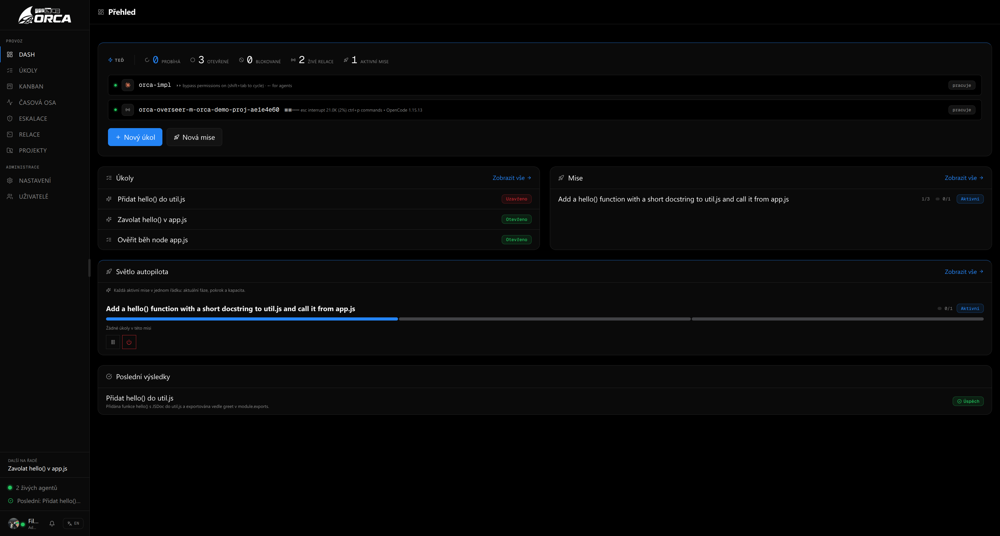

</div>

<div align="center">

**Assistant panel** — a docked, dock-left/right, resizable IDE-style side column. Watch your always-on AI assistant and a running agent next to the main view, with a model picker that shows per-provider brand icons.

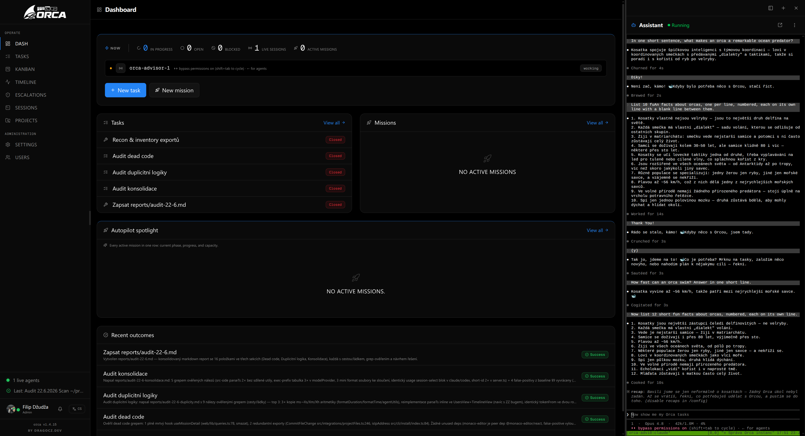

</div>

| | |
|---|---|
| **Tasks** — list + detail with live agent output and token usage. 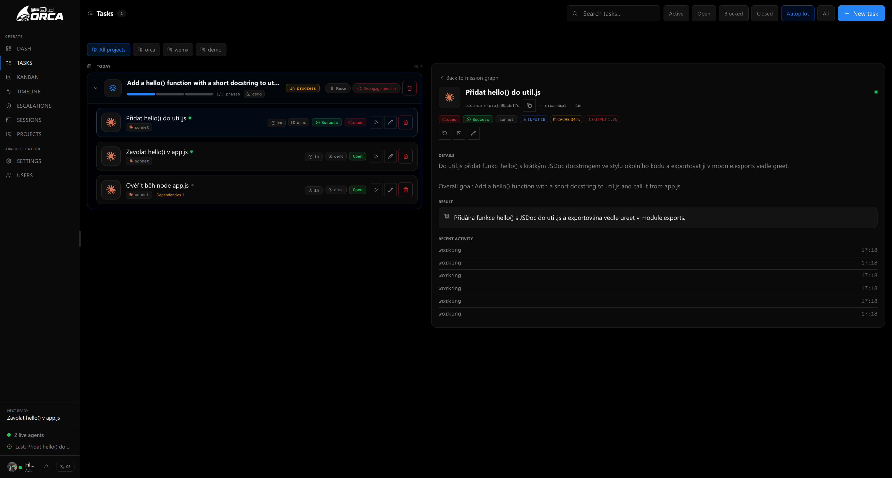 | **Kanban** — open / in-progress / blocked / closed, with mission progress and a calendar. 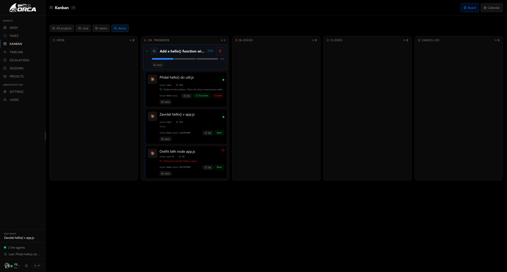 |
| **Missions** — phase graph and task flow for an autopilot run (folded into Tasks). 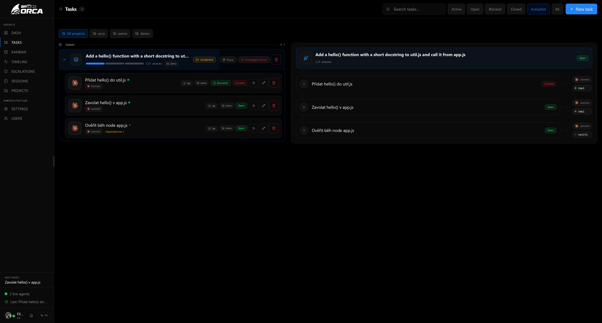 | **Timeline** — a live activity feed across tasks, missions, and signals. 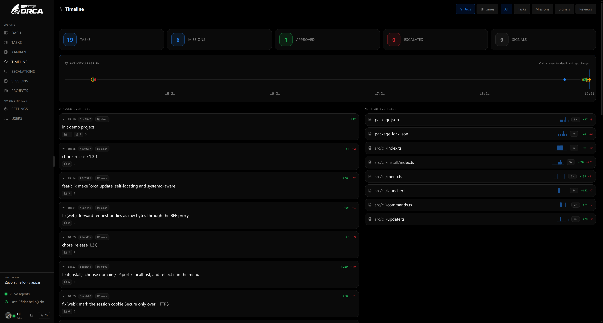 |
| **Sessions** — real-time `tmux` agent previews with one-click intervention. 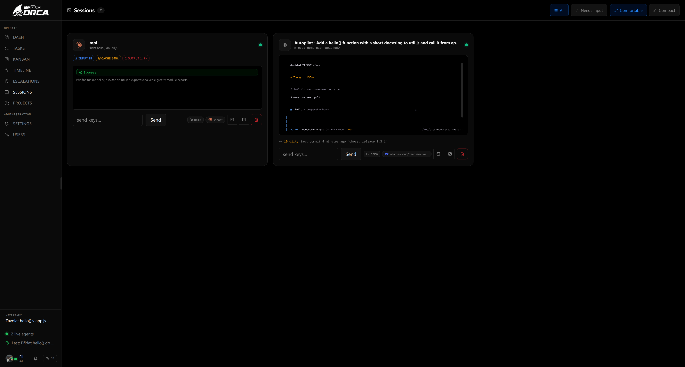 | **Terminal** — an interactive real-PTY agent terminal you type straight into, including human-in-the-loop approvals. 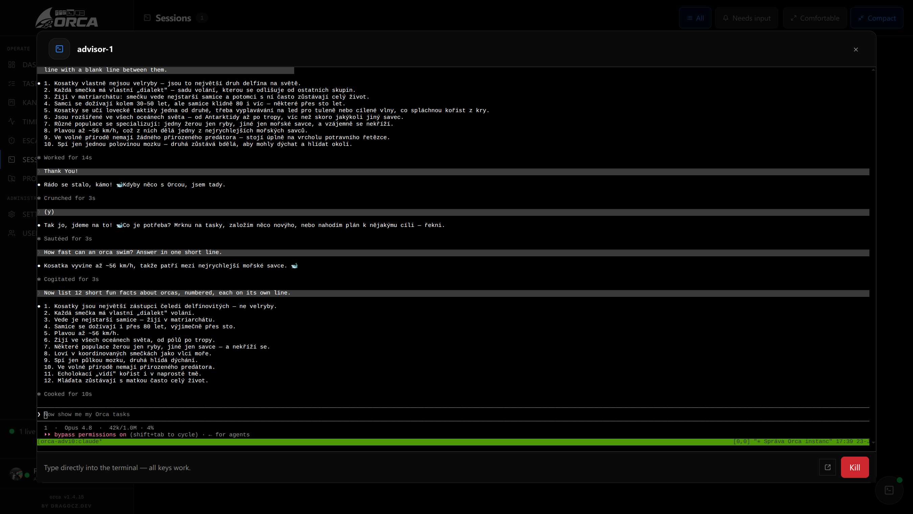 |
| **Pop-out terminal** — pull any session into its own standalone, chromeless window for focus. 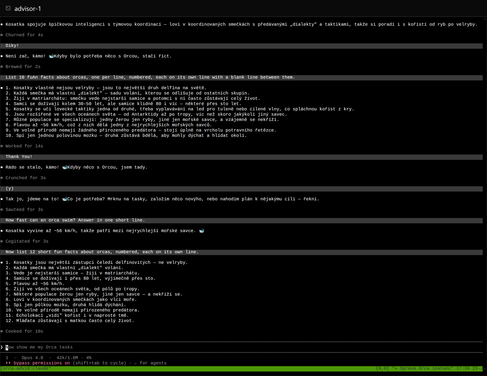 | **Settings** — per-model descriptions with brand icons, providers, autopilot, and defaults. 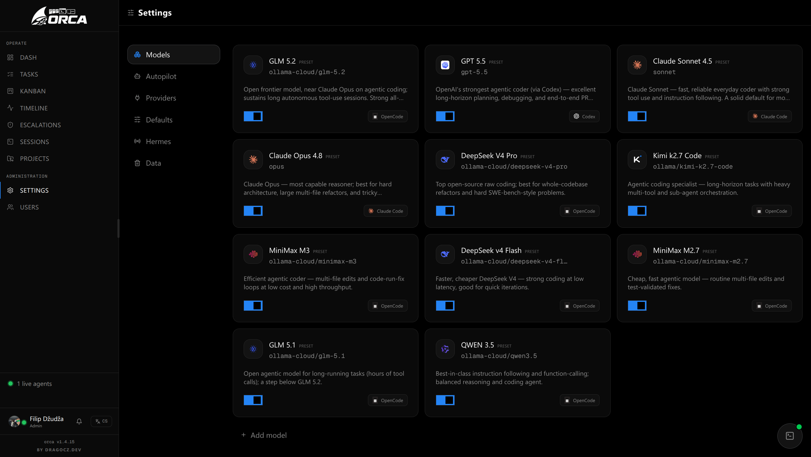 |
| **Projects** — a built-in Monaco editor with the project file tree. 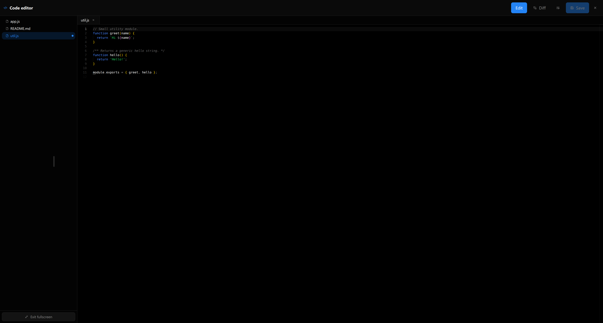 | |

<div align="center">

**Onboarding** — a first-run setup flow that needs no login until the first admin is created.

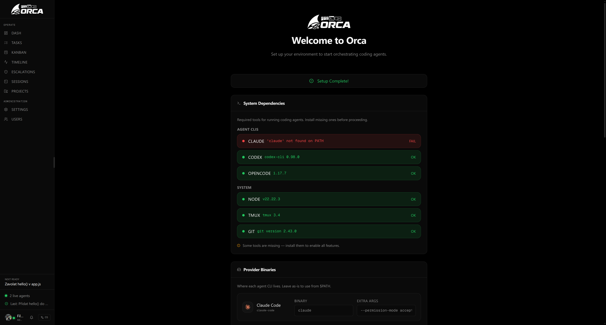

</div>

## Install

Install globally from npm — one command brings up the daemon **and** the web UI:

```bash
npm install -g orcasynth
orca            # interactive menu: start/stop · first-run setup · update · open web
```

Prefer it non-interactive? The same actions are plain subcommands:

```bash
orca up         # start the daemon (:4400) + web UI (:4500) in the background
orca status     # show what's running
orca down       # stop everything
orca update     # update to the latest release from npm
orca install    # guided provisioning wizard (domain/TLS, ports, first admin)
```

Requires **Node ≥ 22** and **tmux**. On first run, `orca` walks you through a quick
setup — admin account, LLM provider + API key, and a default model. Your data (config,
the SQLite database, and logs) lives in **`~/.config/orca/`** and survives every update.

Then open <http://localhost:4500> and sign in.

## Run from source

For development, or to run without a global install. Requires **Node ≥ 22** and **tmux**.

```bash
# 1. Daemon (REST API on :4400)
npm install
npm run build
ORCA_BOOTSTRAP_USER=admin ORCA_BOOTSTRAP_PASS=changeme node dist/daemon/index.js

# 2. Web UI (on :4500)
cd web
npm install
npm run build
npm start -- -p 4500
```

Open <http://localhost:4500> and sign in. Configure your LLM provider and models in
**Settings → Autopilot / Models**, then create a task or engage an autopilot mission.

The CLI talks to the daemon over the REST API and auto-starts it if it isn't running:

```bash
node dist/cli/index.js ls          # list tasks
node dist/cli/index.js close <id>  # close a task
```

## How it works

```
        goal
         │
         ▼
   ┌───────────┐   phases + deps    ┌─────────────┐   spawn    ┌──────────────┐
   │   Pilot   │ ─────────────────► │   Overseer  │ ─────────► │  Agent (tmux) │
   │ (planner) │                    │ (scheduler, │            │ Claude Code / │
   └───────────┘                    │  decisions) │ ◄───────── │ OpenCode /    │
                                    └─────────────┘   signals  │ Codex         │
                                          │                    └──────────────┘
                                          │ escalate
                                          ▼
                                    human-in-the-loop
```

The **Pilot** decomposes a goal into a dependency-ordered set of phases. The **Overseer**
schedules ready phases, spawns the right **Agent** for each one in its own `tmux` session,
and watches the output. A deriver reads each session and emits signals — `working`,
`needs_input`, `complete`. When an agent hits a permission prompt, the decision engine
either clears it automatically (high confidence, non-destructive, within the mission's
autonomy level) or escalates it to a human.

## Architecture

A daemon (`src/`) owns the database and the orchestration loop; the web app (`web/`)
is a thin client over the REST API + SSE event stream.

| Layer | What lives there |
|-------|------------------|
| `src/store` | SQLite stores (tasks, missions, agents, config, users, projects, events) via `better-sqlite3` |
| `src/overseer` | mission engine, planner, scheduler, decision engine, stuck-detector, janitor |
| `src/spawn` · `src/tmux` | agent command building + tmux driver |
| `src/advisor` | per-user assistant lifecycle (start/stop/autostart) + MCP config injection |
| `src/mcp` | built-in MCP server exposing Orca's toolset to the assistant agent |
| `src/terminal` | real-PTY WebSocket streaming (`node-pty` + `tmux attach`) |
| `src/deriver` | derives signals from agent output (`working` / `needs_input` / `complete`) |
| `src/integrations` | per-executor token/cost usage extraction, Hermes MCP registration, CLI detection |
| `src/api` | Hono REST server + SSE event bus |
| `src/cli` · `src/daemon` | the `orca` CLI (incl. `orca api` passthrough) and the daemon entrypoint |
| `web/modules` | feature modules (tasks, kanban, sessions, timeline, projects, advisor, settings, …) |

See [`docs/`](./docs) for the [API](./docs/API.md), [architecture](./docs/ARCHITECTURE.md),
[concepts](./docs/CONCEPTS.md), [CLI](./docs/CLI.md), and [development](./docs/DEVELOPMENT.md) guides.

## Development

```bash
npm test            # daemon tests (vitest)
npm run build       # typecheck + build
npm run lint        # ESLint (unused imports, hook deps)
npm run depcruise   # dependency-cruiser architecture checks (no cycles, layer boundaries)
cd web && npm test  # web tests
```

See [`docs/DEVELOPMENT.md`](./docs/DEVELOPMENT.md) and [`docs/TESTING.md`](./docs/TESTING.md).

## Contributing

Contributors are welcome — whether it's a bug fix, a new feature, or just an idea.

- 💡 **Have a suggestion?** Open a [feature request](https://github.com/dragocz1995/orcasynth/issues/new?template=feature_request.md) and tell us what would make Orcasynth better.
- 🐛 **Found a bug?** File a [bug report](https://github.com/dragocz1995/orcasynth/issues/new?template=bug_report.md).
- 🔧 **Want to hack on it?** Read [CONTRIBUTING.md](./CONTRIBUTING.md), open a PR, and check the [Code of Conduct](./CODE_OF_CONDUCT.md).

Star the repo if you find it useful — it helps others discover the project.

## License

[MIT](./LICENSE)
</content>
</invoke>
