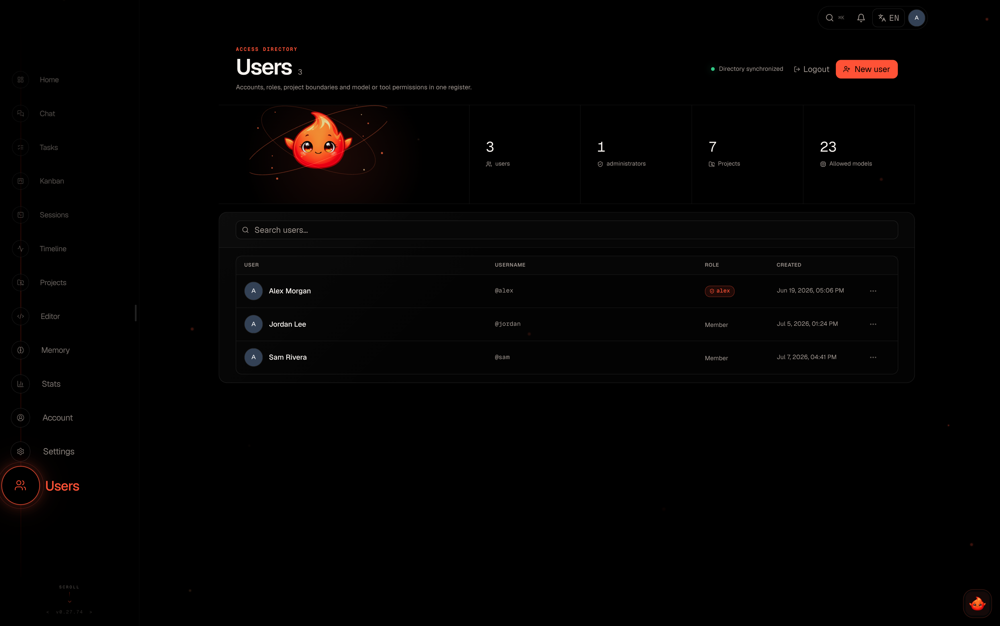
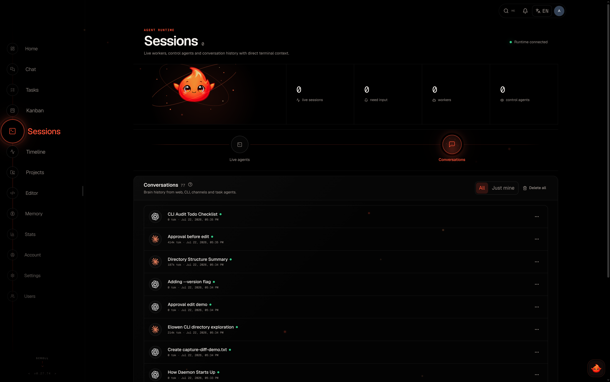

<div align="center">

# 🐋 Orca

**A personal AI agent you talk to — self-hosted, and yours.**

`Chat · Act · Automate · Extend`

Orca is a self-hosted personal AI agent. You chat with it and it acts: it reasons,
calls tools, edits files, runs shell commands, manages your work, and reaches you
wherever you are — the `orca` CLI, a web dock, Discord and WhatsApp. It sits in the
same category as agents like Claude or OpenClaw, but it runs on **your** machine,
uses **your** models, and every capability is a plugin you add or remove. No SaaS,
no lock-in.

[](https://github.com/dragocz1995/orca/actions/workflows/ci.yml)
[](./LICENSE)
[](https://nodejs.org)

</div>

---

## Talk to your agent in the terminal

The `orca` CLI puts the same agent one keystroke away — tool calls, diffs, plan
mode, permission prompts and all, without leaving your shell.

<div align="center">


</div>

```bash
npm install -g orcasynth   # installs the `orca` command
orca setup                 # guided wizard: account, project, AI provider, memory
orca                       # bare `orca` opens the chat TUI
```

| | |
|---|---|
| **Plan mode** — the agent proposes a plan before touching anything; you pick Implement or keep refining.  | **Permissions & YOLO** — every mutating tool call stops for Allow once / Always allow / Deny; `/yolo` auto-approves for the session.  |

The agent is the product. The dashboards, boards and terminals below are simply how
you **observe and steer** what it's doing — they are not the point; the agent is.

## What makes it Orca

- **Clarity** — a clean, uncluttered UI where you always see what the agent is doing.
- **Simplicity** — easy to run, easy to control, sensible defaults, low friction.
- **Fully extensible** — every capability (chat platforms, tools, memory, automation,
  security) is an add/remove-able plugin. Orca is modular to the core.
- **Lightweight, professional-grade** — one SQLite-backed daemon plus a Next.js web
  UI. Small footprint, clean, tested codebase.

## What it does

- **Chat that acts.** Talk to Orca's embedded brain from the `orca` CLI, the web
  dock, Discord or WhatsApp. It plans, calls tools, edits code and follows up — with
  a multi-provider model catalog and OAuth account connect.
- **Plan mode, sub-agents, permissions.** Switch into Plan mode to have the agent
  think through an approach before it touches anything; delegate work to sub-agents
  you can drill into live; every mutating tool call stops for your approval (Allow
  once / Always allow / Deny), or drop into `/yolo` for a fully hands-off session.
- **Built-in memory.** Orca remembers. A per-user memory engine with embeddings and
  semantic retrieval stores durable facts, recalls the relevant ones at the start of each
  turn, and self-curates to avoid duplicates — with `add`/`search` memory tools and a
  Memory module to browse, merge and purge what it knows.
- **Full RBAC, per-user tools.** Admin and member roles — and crucially, **each user
  can have a different set of tools and permissions**: per-user tool access, model
  allow-lists, visibility and per-project scoping.
- **Plugins for everything.** Bundled: Discord, WhatsApp, files, terminal, web search,
  image generation/editing, cron jobs, skills, MCP bridge, security scanning, subagent
  delegation, statusline and runtime context. Install, update and remove from a
  built-in marketplace.
- **Surfaces to watch & steer.** Dashboard, tasks, kanban board, timeline, live tmux
  session previews with real-PTY streaming, a built-in Monaco editor and per-run
  token/cost stats.
- **Personality, vision & attachments.** Per-user personality profiles shape how the
  assistant communicates (per surface); drop images and text files straight into chat.
- **Human-in-the-loop.** An escalations inbox where the agent asks structured questions
  and waits for your approve / reject / answer; long conversations auto-compact and a
  statusline shows context %, tokens and cost.
- **Autopilot & missions.** Give a goal and an LLM decomposes it into ordered phases
  with dependencies, each spawning an agent in its own tmux session. Autonomy levels
  **L0–L3** decide how much runs without asking you.
- **Agent-agnostic.** Drives Claude Code, OpenCode, Codex, Kilo Code, or the embedded
  Orca AI brain — configurable per task.
- **PR-native.** Missions work in isolated git worktrees, commit each approved phase
  and open a GitHub pull request; review feedback flows back as bounded fix phases.
- **Push notifications.** Web Push with inline action buttons (Approve, Reject, Rerun)
  when a mission needs a decision.
- **Safe self-updates.** Opt-in automatic updates install new releases and restart the
  daemon only when no mission is running, so live work is never interrupted. Your database,
  settings and installed plugins live outside the package — updates leave them untouched, and
  schema changes are applied as additive migrations.
- **Self-healing & self-hosted.** A stuck detector revives dead agents and a janitor
  cleans up finished sessions. No external services beyond your own LLM provider.

## Install

```bash
npm install -g orcasynth   # installs the `orca` command
orca setup                 # guided wizard (see below)
```

Requires **Node ≥ 22** and **tmux**.

### The setup wizard

`orca setup` gets you to a working setup in a couple of minutes — run it first, before
`orca`. Five steps, each skippable and reversible:

1. **Account** — create your admin login.
2. **Project** — point Orca at a folder to work in (the current one, another path, or an existing project).
3. **AI provider** — **sign in with Claude, GitHub Copilot or Codex / OpenAI**, paste an **API key**, or
   use a **custom OpenAI-compatible endpoint**. Already-connected accounts are offered for reuse.
4. **Memory** — turn on embeddings (reuse your provider's key, or OpenRouter) — optional.
5. **Review** — confirm, then finish.

It never blocks scripts: in a non-interactive shell (CI, Docker, a pipe) it just prints `Run: orca setup`
and exits. Re-run it any time with `orca setup` (`--reset` to start over). For a full **server** deployment
with systemd units and a reverse proxy, run `orca install` as root instead.

Then just talk to it:

```bash
orca                        # opens the chat TUI
orca run "<prompt>"         # non-interactive: one turn, streamed, then exit
orca up | down | status     # manage the daemon (:4400) + web UI (:4500)
orca update                 # update to the latest release
```

Or open `http://localhost:4500` and log in for the web UI. The full CLI reference —
every command, slash command, keybinding and flag — lives in
[`docs/site/06-cli.md`](./docs/site/06-cli.md) and at
[orca.dragocz.dev/docs/cli](https://orca.dragocz.dev/docs/cli).

## Web UI

<div align="center">

**Dashboard** — live agents, active missions, autopilot spotlight.


</div>

| | |
|---|---|
| **Plugins** — add/remove capabilities from the marketplace.  | **Users & RBAC** — per-user tools, models and projects.  |
| **Kanban** — missions across open / in-progress / blocked / done.  | **Sessions** — real-time tmux previews with PTY streaming.  |
| **Editor** — built-in Monaco with a git-aware file tree.  | **Settings** — models, providers, brain, plugins and more.  |

## Architecture

```
                  ┌──────────────┐
  Browser ───────▶│  Web (:4500) │───────┐
                  │  Next.js BFF │       │
                  └──────────────┘       │
                                          ▼
  orca chat ─────▶┌──────────────────┐ ┌──────────┐
  orca ls  ──────▶│  Daemon (:4400)  │ │ SQLite   │
  Discord  ──────▶│  REST + SSE + WS │ │ orca.db  │
  WhatsApp ──────▶└────────┬─────────┘ └──────────┘
                           │
                    ┌──────┴──────┐
                    │  tmux       │
                    │  sessions   │
                    └─────────────┘
```

One self-hosted daemon (REST + SSE + WebSocket) backed by SQLite, a Next.js web UI
that talks to it over a same-origin BFF proxy, and agents that run in isolated tmux
sessions.

## Documentation

Full user manual at **[orca.dragocz.dev](https://orca.dragocz.dev)** and in
[`docs/`](./docs): [Getting Started](./docs/site/01-getting-started.md),
[CLI](./docs/site/06-cli.md), [Agents & Autonomy](./docs/site/04-agents-autonomy.md),
[Brain & Chat](./docs/site/07-brain-chat.md), [Plugins](./docs/site/08-plugins.md),
and [Account & Security](./docs/site/11-account-security.md).

## Development

```bash
npm test               # daemon test suite
npm run build          # typecheck + build
cd web && npm test     # web test suite
cd web && npm run dev  # web dev server
```

See [`docs/DEVELOPMENT.md`](./docs/DEVELOPMENT.md) for the full contributor guide.

## Built with

Orca stands on a small, deliberately chosen open-source stack:

- **Agent core** — the embedded brain and `orca chat` are built on the **PI toolkit**
  ([`@earendil-works/pi-ai`](https://github.com/earendil-works/pi), `pi-coding-agent`,
  `pi-tui`) — a lean multi-provider LLM / agent / terminal-UI SDK. External clients plug in
  through the **Model Context Protocol** (`@modelcontextprotocol/sdk`).
- **Daemon** — [Hono](https://hono.dev) (REST + SSE + WebSocket) over
  [better-sqlite3](https://github.com/WiseLibs/better-sqlite3), with **TypeBox** + **Zod**
  for schema validation, **@clack/prompts** for the CLI wizard, and **web-push** for
  phone notifications. Agents run in isolated **tmux** sessions.
- **Chat platforms** — **Baileys** + **qrcode** power the WhatsApp plugin; the Discord
  plugin is a dependency-free gateway on Node's built-in WebSocket + fetch.
- **Web UI** — [Next.js](https://nextjs.org) + **React**, **@tanstack/react-query**, the
  **Monaco** editor, **xterm.js** for live terminals, **lucide** icons, **marked** +
  **DOMPurify** for safe Markdown, and the **Geist** typeface.
- **Quality gates** — **Vitest** (2,400+ tests), strict **TypeScript**, **ESLint**,
  **Knip** (dead-code) and **dependency-cruiser** (architecture boundaries).

See [`package.json`](./package.json) and [`web/package.json`](./web/package.json) for the
complete dependency list.

## License

[MIT](./LICENSE)
