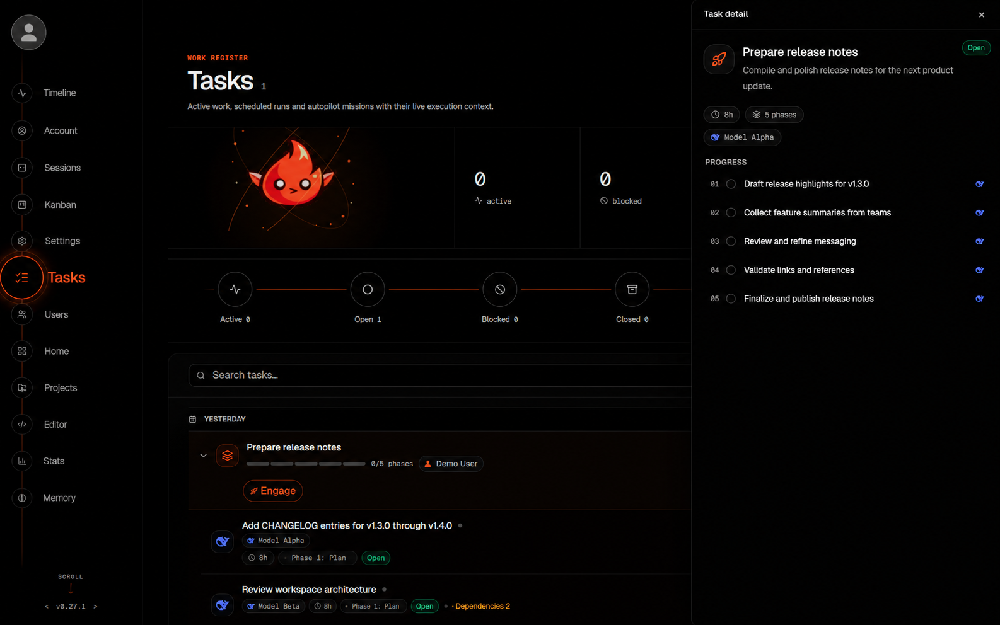

<div align="center">

<picture>
  <source media="(prefers-color-scheme: dark)" srcset="docs/brand/elowen-logo-white.png">
  
</picture>

**A self-hosted AI agent you can talk to, steer, and trust with real work.**

`Chat · Act · Automate · Extend`

[](https://github.com/dragocz95/elowen/actions/workflows/ci.yml)
[](./LICENSE)
[](https://nodejs.org)

</div>

Elowen is a personal AI agent that runs on your machine. Chat with it in the terminal, from the Web UI, Discord, or WhatsApp; it keeps the same projects, permissions, tools, and durable memory across those surfaces. It can investigate code, edit files, use a terminal, plan tasks, delegate focused work, and stop to ask when a decision belongs to you.

It is deliberately self-hosted: a Node.js daemon, SQLite, a Next.js Web UI, and plugins you can inspect, enable, or remove. Your provider accounts and project data stay under your control.

## Start here

```bash
npm install -g elowen
elowen setup
elowen
```

`elowen setup` walks through the local account, a project, an AI provider, optional memory embeddings, and code intelligence. A bare `elowen` opens the terminal chat; `elowen doctor` explains what is ready and what still needs attention.

Requirements: **Node.js 22+** and **tmux**.

```bash
elowen chat                         # interactive terminal chat
elowen run "review this repository" # one streamed, non-interactive turn
elowen status                       # daemon and Web UI health
elowen up | down                    # manage local services
```

<div align="center">


</div>

## One agent, several useful surfaces

### Terminal chat

The terminal is a full agent interface, not a thin command wrapper. It streams replies, tool calls, diffs, approvals, todos, sub-agent activity, and a telemetry rail for the current model, project, branch, context, and usage. Use `@` to attach files, `!command` for a local command whose output becomes context for the next turn, and slash commands for session control.

The terminal and Web UI share the same server-side conversation model. A queued message survives while a turn is active and is delivered after it; a long conversation can compact its older history without losing the useful tail.

### Work that stays visible

Tasks are the unit of work. A task can run with the embedded Elowen agent or a configured coding CLI. Missions group an epic and its phases so a larger objective can be planned, run, paused, reviewed, and resumed with an autonomy level and optional per-mission pilot and overseer.

The Web UI gives that work a calm operational view: Tasks, Kanban, Sessions, Timeline, Projects, Editor, Memory, Stats, Settings, and Users. Its desktop shell keeps navigation consistent; dense data pages use a wide workspace with an in-context detail drawer rather than hiding state behind a separate screen.

<div align="center">



</div>

### A brain that has context without becoming opaque

Elowen's embedded brain is an in-process, provider-agnostic agent. It exposes a per-user model catalog, configurable limits, optional reasoning, permission gates, goals, and a durable queue for mid-turn messages.

Before a normal user turn, Elowen assembles the relevant policy, memory, skills, and plugin context. Dynamic plugin context can be placed before or after the user's text, remains ephemeral, and is never written into the conversation history. That keeps time, runtime state, and other live signals fresh without treating them as durable instructions.

### Plugins, not a closed box

Bundled plugins provide files, terminal access, MCP, skills, sub-agent delegation, ask-user interactions, scheduled jobs, codebase search, formatting, chat platforms, and more. Plugins use a declared manifest and scoped registry API; their settings are rendered from the manifest and their runtime capabilities are deny-by-default.

## Architecture in one view

```text
Browser ──> Next.js Web UI ──> Elowen daemon ──> SQLite
                                      │
Terminal CLI ─────────────────────────┤
Chat-platform plugins ────────────────┤
                                      └──> tmux workers / embedded brain
```

The daemon owns state, scheduling, agent sessions, plugins, and the API. The Web UI talks through a same-origin backend-for-frontend proxy; the CLI is a client of the same daemon. See [Architecture](./docs/site/12-architecture.md) for the precise boundaries.

## Documentation

The full user guide is at [elowen.dragocz.dev](https://elowen.dragocz.dev) and in [`docs/site`](./docs/site/):

- [Getting started](./docs/site/01-getting-started.md)
- [Installation](./docs/site/02-install.md)
- [Tasks & missions](./docs/site/03-tasks-missions.md)
- [Agents & autonomy](./docs/site/04-agents-autonomy.md)
- [Web UI](./docs/site/05-web-ui.md)
- [CLI](./docs/site/06-cli.md)
- [Brain & chat](./docs/site/07-brain-chat.md)
- [Plugins](./docs/site/08-plugins.md)
- [Projects & workflow](./docs/site/09-projects-workflow.md)
- [Configuration](./docs/site/10-configuration.md)
- [Account & security](./docs/site/11-account-security.md)
- [Architecture](./docs/site/12-architecture.md)

Contributor references: [development](./docs/DEVELOPMENT.md), [plugin development](./docs/PLUGIN_DEV.md), [API](./docs/API.md), and [testing](./docs/TESTING.md).

## Development

```bash
npm test
npm run build
npm run check
cd web && npm test
cd web && npm run dev
```

## License

[MIT](./LICENSE)
