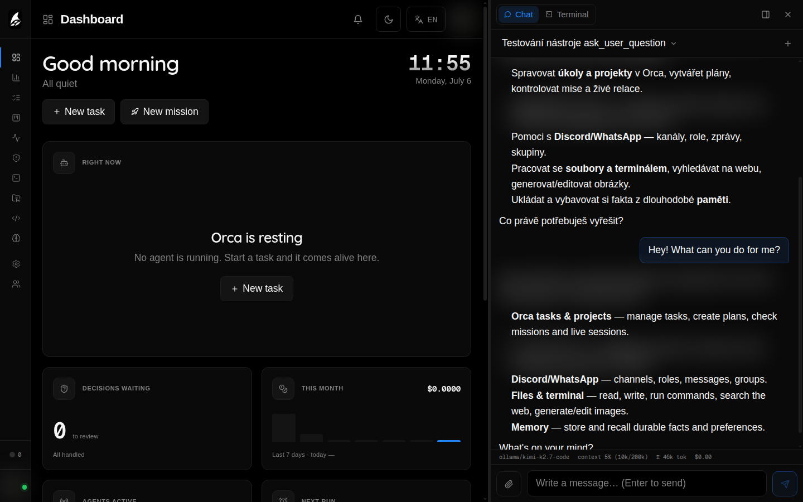

<div align="center">

# 🐋 Orca

**A personal AI agent you talk to — self-hosted, and yours.**

`Chat · Act · Automate · Extend`

Orca is a self-hosted personal AI agent. You chat with it and it acts: it reasons,
calls tools, edits files, runs shell commands, manages your work, and reaches you
wherever you are — a web dock, the `orca` CLI, Discord and WhatsApp. It sits in the
same category as agents like Claude or OpenClaw, but it runs on **your** machine,
uses **your** models, and every capability is a plugin you add or remove. No SaaS,
no lock-in.

[](https://github.com/dragocz1995/orca/actions/workflows/ci.yml)
[](./LICENSE)
[](https://nodejs.org)

</div>

---

## Talk to it, and it acts

<div align="center">



</div>

The agent is the product. The dashboards, boards and terminals below are simply how
you **observe and steer** what it's doing — they are not the point; the agent is.

## What makes it Orca

- **Clarity** — a clean, uncluttered UI where you always see what the agent is doing.
- **Simplicity** — easy to run, easy to control, sensible defaults, low friction.
- **Fully extensible** — every capability (chat platforms, tools, memory, automation,
  security) is an add/remove-able plugin. Orca is modular to the core.
- **Lightweight, professional-grade** — one SQLite-backed daemon plus a Next.js web
  UI. Small footprint, clean, tested codebase.

## What it does

- **Chat that acts.** Talk to Orca's embedded brain from the web dock, `orca chat`,
  Discord or WhatsApp. It plans, calls tools, edits code and follows up — with a
  multi-provider model catalog and OAuth account connect.
- **Built-in memory.** Orca remembers. A per-user memory engine with embeddings and
  semantic retrieval stores durable facts, recalls the relevant ones at the start of each
  turn, and self-curates to avoid duplicates — with `add`/`search` memory tools and a
  Memory module to browse, merge and purge what it knows.
- **Full RBAC, per-user tools.** Admin and member roles — and crucially, **each user
  can have a different set of tools and permissions**: per-user tool access, model
  allow-lists, visibility and per-project scoping.
- **Plugins for everything.** Bundled: Discord, WhatsApp, files, terminal, web search,
  image generation/editing, cron jobs, skills, MCP bridge, security scanning, subagent
  delegation, statusline and runtime context. Install, update and remove from a
  built-in marketplace.
- **Surfaces to watch & steer.** Dashboard, tasks, kanban board, timeline, live tmux
  session previews with real-PTY streaming, a built-in Monaco editor and per-run
  token/cost stats.
- **Personality, vision & attachments.** Per-user personality profiles shape how the
  assistant communicates (per surface); drop images and text files straight into chat.
- **Human-in-the-loop.** An escalations inbox where the agent asks structured questions
  and waits for your approve / reject / answer; long conversations auto-compact and a
  statusline shows context %, tokens and cost.
- **Autopilot & missions.** Give a goal and an LLM decomposes it into ordered phases
  with dependencies, each spawning an agent in its own tmux session. Autonomy levels
  **L0–L3** decide how much runs without asking you.
- **Agent-agnostic.** Drives Claude Code, OpenCode, Codex, Kilo Code, or the embedded
  Orca AI brain — configurable per task.
- **PR-native.** Missions work in isolated git worktrees, commit each approved phase
  and open a GitHub pull request; review feedback flows back as bounded fix phases.
- **Push notifications.** Web Push with inline action buttons (Approve, Reject, Rerun)
  when a mission needs a decision.
- **Self-healing & self-hosted.** A stuck detector revives dead agents and a janitor
  cleans up finished sessions. No external services beyond your own LLM provider.

## Install

```bash
npm install -g orcasynth   # the CLI command it installs is `orca`
orca install               # guided provisioning wizard (systemd units + first admin)
orca                       # launcher menu → "Talk to Orca"
```

Requires **Node ≥ 22** and **tmux**. Open `http://localhost:4500` and log in, or drive
it from the terminal:

```bash
orca chat                  # talk to Orca in your terminal
orca up | down | status    # manage the daemon (:4400) + web UI (:4500)
orca update                # update to the latest release
```

## Screenshots

<div align="center">

**Dashboard** — live agents, active missions, autopilot spotlight.


</div>

| | |
|---|---|
| **Plugins** — add/remove capabilities from the marketplace.  | **Users & RBAC** — per-user tools, models and projects.  |
| **Kanban** — missions across open / in-progress / blocked / done.  | **Sessions** — real-time tmux previews with PTY streaming.  |
| **Editor** — built-in Monaco with a git-aware file tree.  | **Settings** — models, providers, brain, plugins and more.  |

## Architecture

```
                  ┌──────────────┐
  Browser ───────▶│  Web (:4500) │───────┐
                  │  Next.js BFF │       │
                  └──────────────┘       │
                                          ▼
  orca chat ─────▶┌──────────────────┐ ┌──────────┐
  orca ls  ──────▶│  Daemon (:4400)  │ │ SQLite   │
  Discord  ──────▶│  REST + SSE + WS │ │ orca.db  │
  WhatsApp ──────▶└────────┬─────────┘ └──────────┘
                           │
                    ┌──────┴──────┐
                    │  tmux       │
                    │  sessions   │
                    └─────────────┘
```

One self-hosted daemon (REST + SSE + WebSocket) backed by SQLite, a Next.js web UI
that talks to it over a same-origin BFF proxy, and agents that run in isolated tmux
sessions.

## Documentation

Full user manual at **[orca.dragocz.dev](https://orca.dragocz.dev)** and in
[`docs/`](./docs): [Getting Started](./docs/site/01-getting-started.md),
[Agents & Autonomy](./docs/site/04-agents-autonomy.md),
[Brain & Chat](./docs/site/07-brain-chat.md), [Plugins](./docs/site/08-plugins.md),
and [Account & Security](./docs/site/11-account-security.md).

## Development

```bash
npm test               # daemon test suite
npm run build          # typecheck + build
cd web && npm test     # web test suite
cd web && npm run dev  # web dev server
```

See [`docs/DEVELOPMENT.md`](./docs/DEVELOPMENT.md) for the full contributor guide.

## License

[MIT](./LICENSE)
