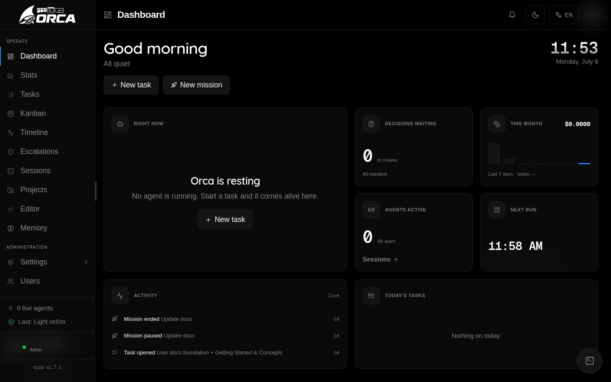
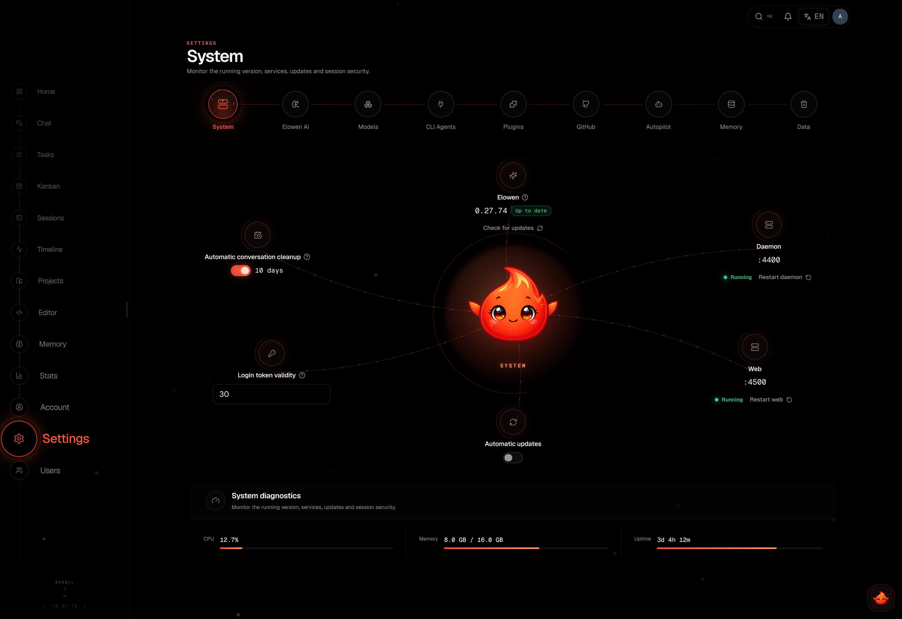
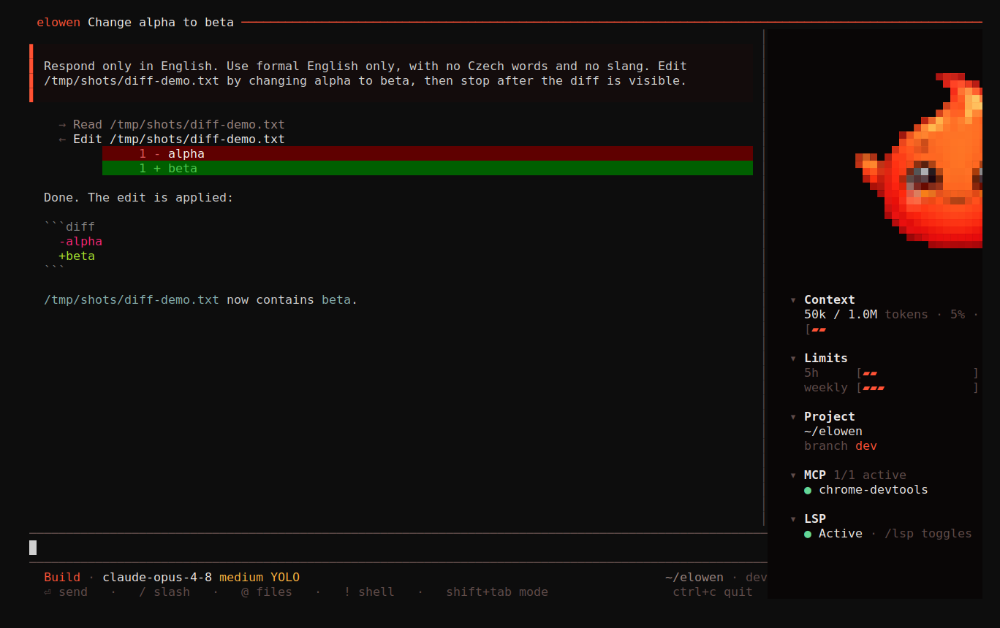
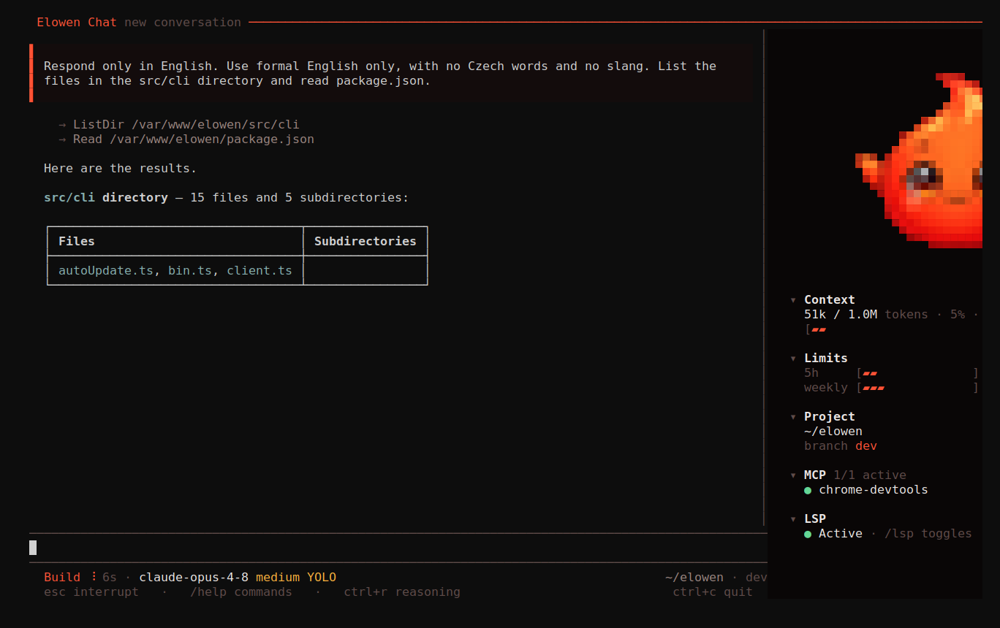
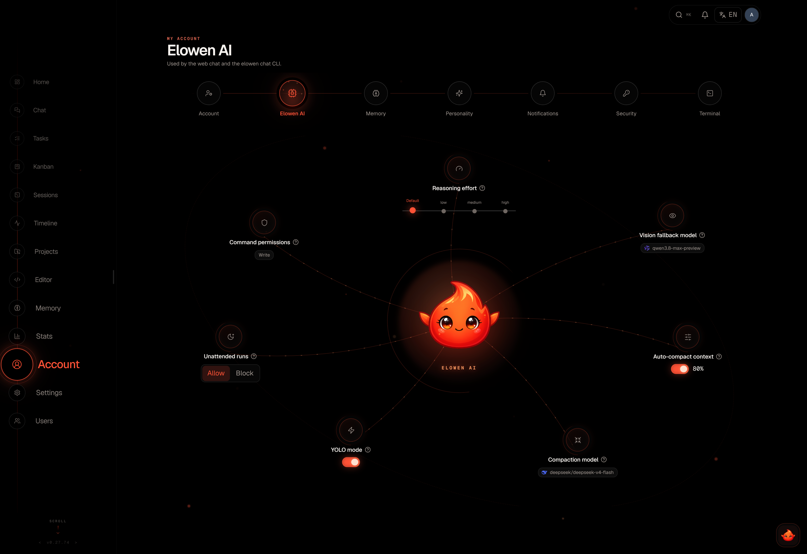
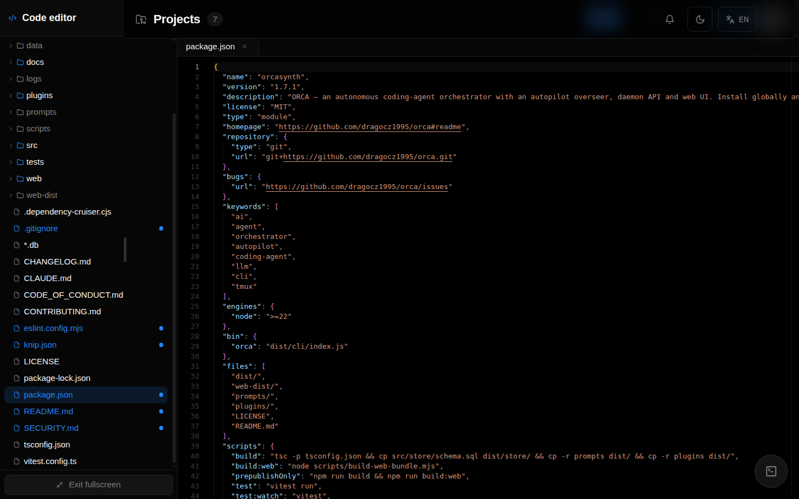
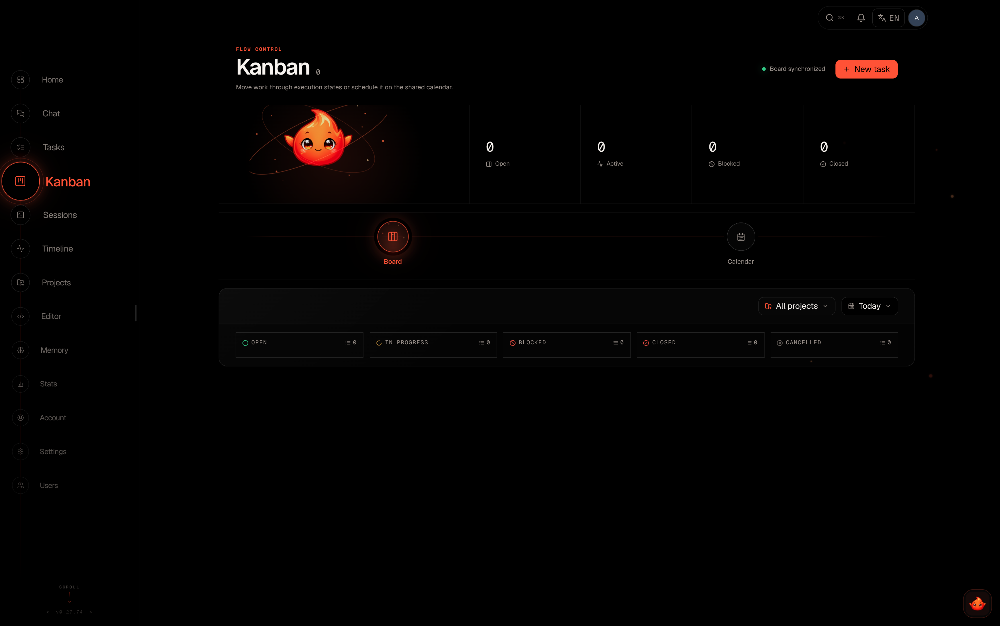
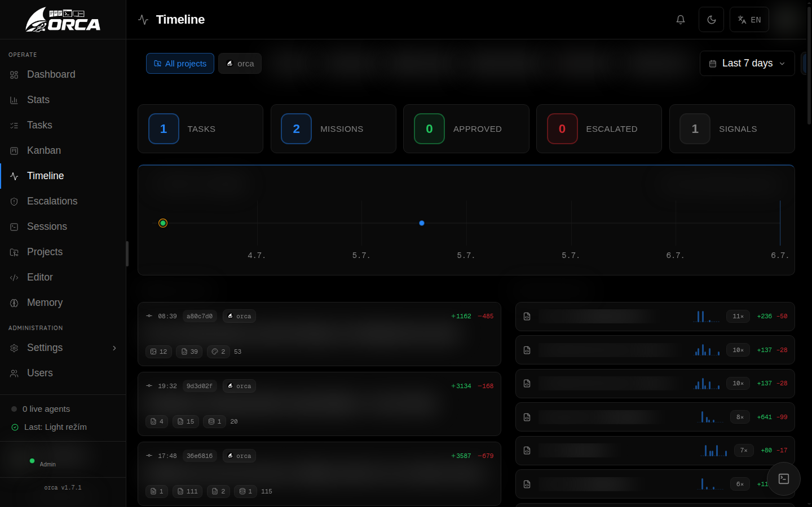
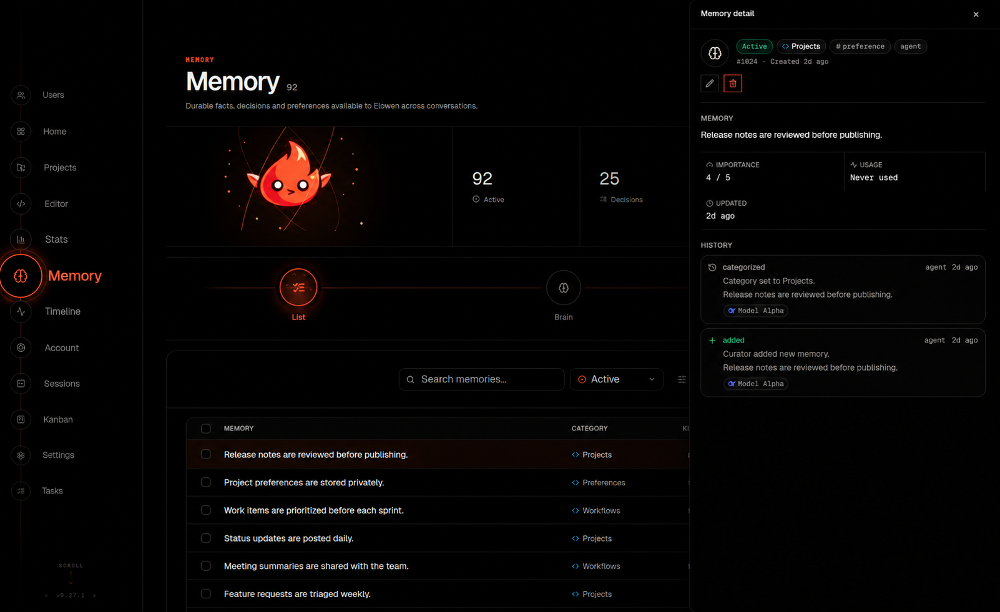

<div align="center">

<picture>
  <source media="(prefers-color-scheme: dark)" srcset="docs/brand/elowen-logo-white.png">
  
</picture>

**A self-hosted AI agent you can talk to, steer, and trust with real work.**

`Chat · Act · Automate · Extend`

[](https://github.com/dragocz95/elowen/actions/workflows/ci.yml)
[](https://www.npmjs.com/package/elowen)
[](https://www.npmjs.com/package/elowen)
[](./LICENSE)
[](https://nodejs.org)

[**Docs**](https://elowen.dragocz.dev) · [Getting started](./docs/site/01-getting-started.md) · [CLI](./docs/site/06-cli.md) · [Web UI](./docs/site/05-web-ui.md) · [Architecture](./docs/site/12-architecture.md)

</div>

---

Elowen is a personal AI agent that runs on **your** machine. Chat with it in the terminal, from the Web UI, Discord, or WhatsApp; it keeps the same projects, permissions, tools, and durable memory across every surface. It can investigate code, edit files, use a terminal, plan tasks, delegate focused work — and stop to ask when a decision belongs to you.

It is deliberately self-hosted: a Node.js daemon, SQLite, a Next.js Web UI, and plugins you can inspect, enable, or remove. Your provider accounts and project data stay under your control.

## Start here

**One-line install** — provisions a fresh box end to end (Node.js, the `elowen` package, tmux, the services, the first admin) and leaves a running daemon and Web UI:

```bash
# Linux (Debian/Ubuntu) — run with sudo access; provisions systemd services
curl -fsSL https://raw.githubusercontent.com/dragocz95/elowen/main/install.sh | bash

# macOS — run as yourself (no sudo; needs Homebrew); provisions per-user launchd agents
curl -fsSL https://raw.githubusercontent.com/dragocz95/elowen/main/install.sh | bash
```

```powershell
# Windows — installs into WSL2 (run in an elevated PowerShell)
irm https://raw.githubusercontent.com/dragocz95/elowen/main/install.ps1 | iex
```

**Already have Node.js 22+?** Install locally and onboard by hand:

```bash
npm install -g elowen
elowen setup
elowen
```

`elowen setup` walks through the local account, a project, an AI provider, optional memory embeddings, and code intelligence. A bare `elowen` opens the terminal chat; `elowen doctor` explains what is ready and what still needs attention.

> **Requirements:** Node.js 22+ and tmux. The one-line installer takes care of both (macOS additionally needs [Homebrew](https://brew.sh)); on Windows it runs inside WSL2 because tmux and systemd are Linux-only.

<details>
<summary><b>How the one-line installer works</b></summary>

The bootstrap script is deliberately thin — it does only what has to happen *before* Elowen exists on the machine, then hands the rest to `elowen install`, the project's own provisioner:

1. **Preflight** — confirms a Debian/Ubuntu (apt) system or macOS with Homebrew, and ensures `curl`.
2. **Node.js** — installs Node.js 22+ (NodeSource on Linux, Homebrew on macOS) when it is missing or too old; a suitable Node already present is left untouched.
3. **Package** — installs the global `elowen` package from npm (`ELOWEN_VERSION` pins a specific release).
4. **Provision** — hands over to `elowen install`, which sets up tmux, the services, and the first admin. The interactive wizard runs on the real terminal even under `curl … | bash`; pass `ELOWEN_INSTALL_ARGS='--unattended …'` for a fully non-interactive run.

On **Linux** the provisioner runs as root: it creates a dedicated service user, installs the systemd units (`elowen-daemon`, `elowen-web`, hourly auto-update) and can configure an optional reverse proxy with HTTPS for a public domain.

On **macOS** everything runs as *you*, with no sudo anywhere: the provisioner writes per-user launchd agents (`io.elowen.daemon`, `io.elowen.web`, plus an hourly `io.elowen.update` check) into `~/Library/LaunchAgents`, bound to localhost. They start at login and restart on failure; manage them with `launchctl` (`launchctl kickstart -k gui/$(id -u)/io.elowen.daemon`) or just run `elowen` for the menu. Logs live in `~/.config/elowen/logs/`.

It is safe to re-run: an existing install is never reprovisioned without confirmation (or `ELOWEN_FORCE=1`), and a globally-linked development checkout is refused outright so a reinstall can't detach it.

On **Windows** the PowerShell script enables WSL2, installs Ubuntu if needed, turns on systemd inside the distro, and then runs the exact same `install.sh` — a first-time WSL setup needs one reboot, after which you re-run the command. The Web UI is reachable from Windows at `http://localhost:4500`.

</details>

```bash
elowen chat                         # interactive terminal chat
elowen run "review this repository" # one streamed, non-interactive turn
elowen status                       # daemon and Web UI health
elowen up | down                    # manage local services
```

<div align="center">


</div>

## What you get

| | |
|---|---|
| **Talk anywhere** | One agent across terminal, Web UI, Discord, and WhatsApp — same projects, memory, and permissions on every surface. |
| **Persistent goals** | Give a conversation a concrete outcome, subgoals, a turn budget, and a hard safety ceiling. It pauses when it needs you and resumes with its bearings intact. |
| **Delegation** | Hand focused work to a sub-agent on a different model. Its live status, tool activity, and result stay attached to the parent conversation — never a black box. |
| **Workflows** | Let the agent decompose a job into a DAG of sub-agents and run it: independent steps in parallel, dependents waiting for what they need. The dependency tree, each node's progress and its transcript stay in the conversation — during the run and long after it. |
| **Missions** | Turn one outcome into ordered phases, with an optional dedicated pilot to plan and an overseer to judge progress and reviews. |
| **Permissions** | Per-user model ceilings and granular tool rules decide what may run, what must ask, and what is denied. Approval is a real pause in the work, not a best-effort ping. |
| **Durable memory** | Memory that carries across surfaces, and a durable queue that holds your mid-turn follow-up instead of dropping it. |
| **Worktrees & PRs** | A mission can run in an isolated Git worktree with a pull-request workflow, keeping concurrent work off a shared checkout and gating publication behind verification. |
| **Plugins** | Files, terminal, MCP, skills, scheduling, codebase search, chat platforms, and more — declared by manifest, scoped by a registry API, deny-by-default. |
| **Scheduling** | Recurring jobs and one-shot wake-ups (`daily 07:30`, `every 15m`, standard cron), read on **your** clock. |
| **Self-hosted** | A Node.js daemon, SQLite, and a Next.js Web UI. Your accounts and data stay yours. |

## One agent, several useful surfaces

| Surface | What it gives you |
|---|---|
| **Terminal** | A full agent interface, not a thin command wrapper: streamed replies, tool calls, diffs, approvals, todos, sub-agent activity, and a telemetry rail for model, project, branch, context, and usage. `@` attaches files, `!command` feeds a local command's output into the next turn, slash commands drive the session. |
| **Web UI** | A calm operational view — Tasks, Kanban, Sessions, Timeline, Projects, Editor, Memory, Stats, Settings, Users — sharing the same server-side conversation model as the terminal. |
| **Discord & WhatsApp** | Reach the same agent from your phone. Same projects, memory, permissions, and conversation state — changing surfaces never means starting your agent over. |

## A look at Elowen

<table>
<tr>
<td width="50%"><br><sub><b>Web UI — dashboard</b></sub></td>
<td width="50%"><br><sub><b>Tasks &amp; missions</b></sub></td>
</tr>
<tr>
<td width="50%"><br><sub><b>Settings — every section orbits the agent</b></sub></td>
<td width="50%"><br><sub><b>Terminal — diff &amp; approval</b></sub></td>
</tr>
</table>

<details>
<summary><b>More screenshots</b></summary>

<table>
<tr>
<td width="50%"><br><sub>Terminal — streamed tool calls</sub></td>
<td width="50%"><br><sub>Terminal — sub-agent delegation</sub></td>
</tr>
<tr>
<td width="50%"><br><sub>Web UI — account, your preferences in orbit</sub></td>
<td width="50%"><br><sub>Web UI — in-app project editor</sub></td>
</tr>
<tr>
<td width="50%"><br><sub>Web UI — kanban</sub></td>
<td width="50%"><br><sub>Web UI — timeline</sub></td>
</tr>
<tr>
<td width="50%"><br><sub>Web UI — durable memory</sub></td>
<td width="50%"><br><sub>Web UI — plugins</sub></td>
</tr>
</table>

</details>

## Built for work that lasts longer than a prompt

Elowen does more than answer the next message. A **persistent goal** gives a conversation a concrete outcome, subgoals, a turn budget, and a hard safety ceiling; it can pause when it needs you and resume with its bearings intact. While one turn is working, a **durable message queue** keeps your follow-up instead of losing it, and context compaction preserves the useful thread rather than resetting the conversation.

When one agent is not the right shape for the job, Elowen can **delegate focused work to sub-agents on a different model**. Their live status, tool activity, model, and result stay attached to the parent conversation, so delegation never becomes a black box. For larger work, **missions turn one outcome into ordered phases** and can assign a dedicated pilot to plan it and an overseer to judge progress, reviews, and uncertain decisions — each with its own executor, selected per mission rather than forced globally.

That autonomy stays deliberate. **Per-user model ceilings and granular tool rules** decide what may run, what must ask, and what is denied; approval is a real pause in the work, not a best-effort notification. A mission can also use an **isolated Git worktree and pull-request workflow**, keeping concurrent work away from a shared checkout and holding publication behind its verification gate.

### A brain that has context without becoming opaque

Elowen's embedded brain is an in-process, provider-agnostic agent. It exposes a per-user model catalog, configurable limits, optional reasoning, permission gates, goals, and a durable queue for mid-turn messages. Before a normal user turn, Elowen assembles the relevant policy, memory, skills, and plugin context. Dynamic plugin context can be placed before or after the user's text, remains ephemeral, and is never written into the conversation history — so time, runtime state, and other live signals stay fresh without being treated as durable instructions.

## Architecture in one view

```text
Browser ──> Next.js Web UI ──> Elowen daemon ──> SQLite
                                      │
Terminal CLI ─────────────────────────┤
Chat-platform plugins ────────────────┤
                                      └──> tmux workers / embedded brain
```

The daemon owns state, scheduling, agent sessions, plugins, and the API. The Web UI talks through a same-origin backend-for-frontend proxy; the CLI is a client of the same daemon. See [Architecture](./docs/site/12-architecture.md) for the precise boundaries.

## Documentation

The full user guide lives at **[elowen.dragocz.dev](https://elowen.dragocz.dev)** and in [`docs/site`](./docs/site/):

| Guide | Covers |
|---|---|
| [Getting started](./docs/site/01-getting-started.md) | First run, setup wizard, your first conversation |
| [Installation](./docs/site/02-install.md) | Requirements, providers, non-interactive setup |
| [Tasks & missions](./docs/site/03-tasks-missions.md) | Units of work, epics, phases, autonomy |
| [Agents & autonomy](./docs/site/04-agents-autonomy.md) | Goals, delegation, pilots and overseers, permissions |
| [Web UI](./docs/site/05-web-ui.md) | The operational surfaces and how they fit together |
| [CLI](./docs/site/06-cli.md) | Terminal chat, commands, session control |
| [Brain & chat](./docs/site/07-brain-chat.md) | The embedded agent, models, context assembly |
| [Plugins](./docs/site/08-plugins.md) | Bundled plugins, manifests, the registry API |
| [Projects & workflow](./docs/site/09-projects-workflow.md) | Projects, editor, Git worktrees, pull requests |
| [Configuration](./docs/site/10-configuration.md) | Settings, providers, limits, embeddings |
| [Account & security](./docs/site/11-account-security.md) | Users, roles, permissions, isolation |
| [Architecture](./docs/site/12-architecture.md) | Daemon, BFF proxy, boundaries |

Contributor references: [development](./docs/DEVELOPMENT.md) · [plugin development](./docs/PLUGIN_DEV.md) · [API](./docs/API.md) · [testing](./docs/TESTING.md).

## Development

```bash
npm test              # backend test suite
npm run build         # type-check and build the daemon
npm run check         # lint + typecheck
cd web && npm test    # web test suite
cd web && npm run dev # run the Web UI in dev mode
```

See [CONTRIBUTING](./CONTRIBUTING.md) before opening a pull request.

## Built with

Elowen is a small, self-hosted stack of stable, modern tooling — no external services required.

| Area | Technology |
|---|---|
| **Runtime** | [Node.js](https://nodejs.org) 22+ (ESM), distributed on [npm](https://www.npmjs.com/package/elowen) |
| **Agent core** | The [PI](https://www.npmjs.com/package/@earendil-works/pi-ai) SDK — `pi-ai`, `pi-coding-agent`, and the `pi-tui` terminal UI |
| **Daemon & API** | [Hono](https://hono.dev) on `@hono/node-server`, with `@hono/node-ws` for the WebSocket terminal |
| **Storage** | [better-sqlite3](https://github.com/WiseLibs/better-sqlite3) — a single SQLite file |
| **Web UI** | [Next.js](https://nextjs.org) (standalone) + React |
| **Agent execution** | [tmux](https://github.com/tmux/tmux) sessions, with [node-pty](https://github.com/microsoft/node-pty) for live PTY streaming |
| **Tools & channels** | [Model Context Protocol](https://modelcontextprotocol.io) SDK, [Baileys](https://github.com/WhiskeySockets/Baileys) (WhatsApp), `qrcode`, `web-push` |
| **Validation** | [Zod](https://zod.dev) and TypeBox for typed, validated boundaries |

## License

[MIT](./LICENSE) © the Elowen authors
