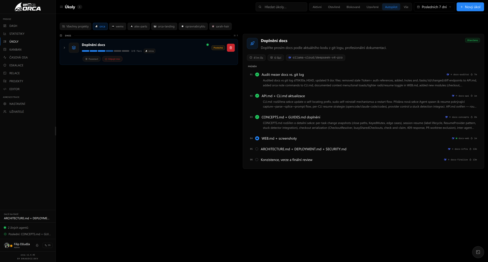
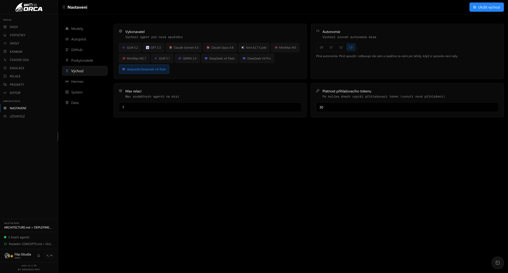
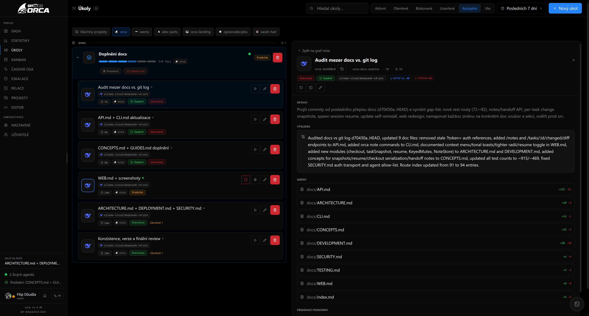

# Web UI

Next.js 16 (App Router) frontend at `web/`. React 19, Tailwind CSS 4, TanStack React Query, Xterm.js, Monaco editor.

## Routes

Every page is a thin shell in `app/<route>/page.tsx` that renders a `*View` from `modules/` inside a `ModuleShell`. All pages are `'use client'` with `export const dynamic = 'force-dynamic'`.

| Route | Module | View | Nav group |
|-------|--------|------|-----------|
| `/dash` | `dashboard/` | `DashboardView` | Operate |
| `/stats` | `stats/` | `StatsView` | Operate |
| `/tasks` | `tasks/` | `TasksView` | Operate |
| `/kanban` | `kanban/` | `KanbanBoard` + `CalendarView` | Operate |
| `/sessions` | `sessions/` | `SessionsView` | Operate |
| `/timeline` | `timeline/` | `TimelineView` | Operate |
| `/escalations` | `escalations/` | `EscalationsView` | Operate |
| `/projects` | `projects/` | `ProjectsView` | Operate |
| `/editor` | `editor/` | `ProjectEditor` | Config |
| `/terminal/[name]` | — | chromeless pop-out terminal (inline in `app/terminal/[name]/page.tsx`) | — (no chrome) |
| `/settings` | — | inline (in `app/settings/page.tsx`) | Config |
| `/users` | `users/` | `UsersView` | Config |
| `/account` | `account/` | `AccountView` | — (sidebar footer) |
| `/onboarding` | — | inline (in `app/onboarding/page.tsx`) | — (first-run) |

Module metadata (id, label, route, icon, group) is defined in each `modules/<name>/meta.ts` and registered in `modules/registry.ts` for sidebar and routing.

### Dashboard `/dash`

`DashboardView` (`modules/dashboard/DashboardView.tsx`):

- **Needs input banner** — `NeedsInputBanner` at top if any agent is waiting
- **Now section** — metric cards: open tasks, in progress, blocked, live sessions, active missions
- **Live agent lanes** — up to 6 active `orca-*` sessions with `AgentStatusDot`, `ModelIcon`, live tail snippet, activity badge
- **Quick actions** — New task, New mission links
- **Recent tasks** — last 6 non-epic tasks with status badges
- **Active missions** — list with done/total count, live session indicators, `CapacityMeter`
- **Autopilot spotlight** — every active mission: current phase, `ProgressRibbon`, pause/resume/disengage controls
- **Recent outcomes** — last 6 closed tasks with `OutcomeBadge` and result summary

Data refreshes via `useTasks` (poll 5 s), `useSessions` (poll 5 s), `useMissions`, and real-time SSE events (`useOrcaEvents`).

### Statistics `/stats`

`StatsView` (`modules/stats/StatsView.tsx`):

- **Summary cards** — 4-card grid: total cost, total tokens, cache tokens, models used
- **Cost by model** — per-model rows with `ModelIcon`, proportional bar, token count, cost label
- **Usage aggregation** — `buildUsageSummary()` in `usageBars.ts` shapes raw `/usage/by-model` data into sorted display rows with max-normalized bar widths
- **Reset usage** — admin-only `ResetUsageModal` that requires typing a sentinel word to confirm; wipes `task_usage` snapshots (CLI transcripts untouched)
- **Data sources** — `useModelUsage` (30 s polling), admin-only `useResetUsage` mutation

### Tasks `/tasks`

`TasksView` (`modules/tasks/TasksView.tsx`):

- **ModuleHeader** — title, search input, segmented filter (Active / Open / Blocked / Closed / Autopilot / All), New task button
- **Day-grouped task list** — cards grouped by today/yesterday/date, paginated (12 per page)
- **TaskCard** — compact single-row card: small model-icon bubble, title + id, live dot, status/time/project badges, quick run controls (Start/Stop/Pause), hover action menu (close/delete). Full detail (agent, usage, changes, context) opens in the detail pane on click. Checkbox for bulk select. Right-click opens a context menu with quick actions (close, delete, edit, open detail).
- **EpicGroup** — collapsible epic row that IS the mission: lifecycle pills (Engage / Pause / Resume / Disengage, plus PR link/open/merge) in their own row below the progress bar, rolled-up cost (`totalCost` from `['task-usage', id]` cache), `ProgressRibbon`, `done/total` count, `ProjectPill`. Status badge and action menu (Add phase, Delete mission) grouped together top-right, revealed on epic hover. Expanded shows child phases as `TaskCard` rows. No `overflow-hidden` on the card to avoid clipping the action menu dropdown.
- **Filters** — search by text/id, status filter, persistent in `localStorage`
- **Bulk actions** — bottom bar with close/delete for selected tasks
- **TaskDetailPane** — right-side detail drawer: description, phases, dependencies, executor, result summary + `OutcomeBadge`, launch/edit/close actions
- **TaskModal** — create/edit modal: title, details, type, priority, executor, schedule, autostart, dependencies
  - **Project picker** — row of project pills (`ProjectPill`-style buttons with `FolderGit2` icon) when the user has access to more than one project. Selection plumbed as `project_id` into `POST /tasks` and `POST /tasks/plan`. Hidden for existing tasks (project is fixed) and single-project workspaces.
  - **Form controls** — all single-choice fields use `Segmented` (type, priority) or `ExecutorPicker` (executor model pills with brand icons, alphabetical, first 5 shown with "+N more" expander). No native `<select>` dropdowns remain.
- **PlanModal** — `Autopilot · Planning` mode: goal input, autonomy (L0–L3 via `Segmented`), max sessions, PR workflow mode (`Segmented`: default/on/off), manual phase list, create & engage
  - **Project picker** — same project pills as TaskModal, plumbed as `project_id` into `POST /tasks/plan`
  - **Auto-model toggle** — when enabled (`autoModel`), the executor picker is hidden and the planner picks the best model per phase from the model descriptions in Settings. The toggle is mutually exclusive with the manual executor selector.
  - **Pilot live preview** — during agent-mode planning the `PlanJob` carries a `sessionName` (the Pilot's tmux session). When `planJob.data?.sessionName` is set, a `LiveTail` pane renders under the spinner so the user watches the planner think in real time. Relay-mode planning is synchronous and has no session, so this pane stays hidden.

Supports deep-links: `?new=1` opens create modal, `?select=<id>` opens detail pane for that task.

### Kanban `/kanban`

`KanbanBoard` (`modules/kanban/KanbanBoard.tsx`) + `CalendarView` (`modules/kanban/CalendarView.tsx`):

- **Board view** — 5 columns (Open / In progress / Blocked / Closed / Cancelled) with drag-and-drop via native HTML5
- **KanbanCard** — shows title, ID, type icon, status badge, dependent blockers count
- **KanbanEpicCard** — epic card with `ProgressRibbon` and phase expansion; phases shown as nested cards
- **Calendar view** — 3 modes: day (hourly), week (7-day), month (6-week matrix)
- **Drag & drop in calendar** — move tasks between days to update `scheduled_at`
- **Utilities** — `dayKey()`, `weekDays()`, `monthMatrix()`, `tasksByDay()` in `calendar.ts`

### Sessions `/sessions`

`SessionsView` (`modules/sessions/SessionsView.tsx`):

- **Filter** — All / Needs input (persistent via URL param `?filter=needs_input`)
- **Density toggle** — Comfortable / Compact (persistent in `localStorage`)
- **Session cards** — grid of `SessionCard` components with `AgentStatusDot`, `ModelIcon`, live tail preview, ANSI-parsed output
- **Signal-aware UI** — shows Allow/Reject buttons when deriver emits `needs_input`
- **TerminalModal** — opens full Xterm.js terminal for a session
- **Empty states** — contextual with "Go to Tasks" action

### Missions (folded into Tasks)

The standalone `/missions` route was removed in v1.1.1. Mission lifecycle is driven directly from the epic row in the Tasks view:

- **Lifecycle pills** — `ActionPill` buttons on each `EpicGroup` in their own row below the progress bar (indented under the title): Engage (one-click with configured autonomy/maxSessions defaults), Pause, Resume, Disengage, plus PR link/open/merge pills. A never-engaged epic shows only Engage; a disengaged mission is done. The pill row is only rendered when there is at least one action, so a quiet epic stays a single compact line.
- **Rolled-up cost** — each phase's agent cost (`costUsd` from `['task-usage', id]` cache) summed and shown as a green `Coins` pill on the epic row. Shares the cache with expanded phase cards, so no extra fetches.
- **AddPhaseModal** — moved to `modules/tasks/AddPhaseModal.tsx`, reachable from the epic's action menu alongside Delete mission.
- **Deleted modules** — `modules/missions/` (MissionsView, TaskFlow, ActiveMissionsBar, EngageModal, layoutPhases, missionUtils, meta) and the `/missions` route + registry entry. All `/missions` links (dashboard, timeline, command palette) repointed to `/tasks`.
- **API** — mission data still accessible via `GET /missions`, `GET /missions/:id`.

#### Mission view redesign (v1.4.45)

Clicking an epic in the task list opens a redesigned mission detail view (`MissionFlow` in `modules/tasks/MissionFlow.tsx`) rendered as a "deployment summary":

- **Hero header** — the full mission goal (epic title + description), status badge, and the finished result lifted to the top via `ResultSummary` with an accent-highlighted card. No graph — the left list already carries the mission's progress.
- **Headline metric pills** — a row of compact `Pill` chips: total cost (`Coins` icon, green), total run time (`Clock`), phase count (`Layers`), and the model(s) that ran (single `ModelIcon` + exec name, or a stack of icons for multi-model missions). Pills are hidden when their value is zero (e.g. cost stays hidden for CLIs that don't report it).
- **Phase log** — each phase rendered as a `PhaseLogRow` (`modules/tasks/PhaseLogRow.tsx`): a compact log line with index number, state glyph (green checkmark for done, red X for failed, blue dot for running, amber circle for blocked, gray circle for pending), phase title, model icon, agent name with `AgentStatusDot`, and elapsed time. The agent's note (result summary) is tucked beneath each row, line-clamped to 2 lines. Clicking a phase drills into its agent detail pane.
- **State glyphs** — mission-log-specific status icons that read "done = good" (green success), unlike the generic status palette where a closed task is red. Running phases get a pulsing blue dot with `flow-active` animation.
- **Back navigation** — a "Back to mission graph" button returns to the epic's expanded phase list in the task list.



### Escalations `/escalations`

`EscalationsView` (`modules/escalations/EscalationsView.tsx`):

- **Inbox** — every overseer rejection still awaiting human resolution, with the full rationale
- **Actions** — approve (release the review gate so downstream phases continue) or re-run the rejected phase
- **Self-clearing** — items disappear once their gated phases are released
- **Data source** — `useEscalations()` derived from review activity + task + dependency state

### Timeline `/timeline`

`TimelineView` (`modules/timeline/TimelineView.tsx`):

- **Axis view** — horizontal dot plot of events over the last 1h–1wk window
  - Dot size scales logarithmically with event frequency
  - Hover tooltip shows target, detail, and UTC time
  - Hour gridlines with UTC clock labels
  - "Now" edge with live pulse
- **Swimlanes view** — one horizontal track per target (agent/session/task), busiest-recent first
- **Feed view** — collapsible per-target event groups
  - `FeedGroup` — icon, title/exec, latest status badge, expandable event list with detail badges
  - `LiveFeedGroup` — real-time variant for running sessions: live tail pane with ANSI coloring
  - Autopilot chip on mission/task events
  - Cross-links to Tasks/Sessions/Missions
- **Filter** — All / Tasks / Missions / Signals / Reviews (persistent in `localStorage`)
- **Summary strip** — stat cards with kind counts (tasks, missions, approved, escalated, signals)
- **ProjectPill** — shown in each lane, event detail, and commit row to identify which project an event belongs to. Hidden in single-project workspaces
- **ProjectFilterPills** — "All projects" + one pill per accessible project; hidden when fewer than two projects exist
- **Date range filter** — `DateRangeFilter` component with preset ranges (hours, days, all time), persisted in `localStorage`
- **ChangesOverTime** — commit stream below the axis with roll-up of most-touched files in the window
  - `CommitRow` — compact card with hash, subject, time, file-type breakdown, added/deleted counts, `ProjectPill`
  - `Most active files` — sorts by touch count, shows sparkline of activity across the window, clickable to view file diff
  - Top-files opens `PatchView` modal with the full commit diff
  - Commit data via `useProjectsCommits` (merged time-sorted stream across projects, 60 s poll)
- Events within 5 min of same type/detail/target collapse into `×N` groups

### Projects `/projects`

`ProjectsView` (`modules/projects/ProjectsView.tsx`):

- **Project cards** — grid with slug, path, git status (branch, clean/dirty, ahead/behind), clickable to select
- **New project modal** — slug, path, pilot info notes
- **Edit project modal** — path, notes, and PR workflow toggle (`Segmented`: inherit/on/off). Slug is immutable.
- **Git section** — branches (current highlighted), recent commits with hash/subject/author/relative time
- **Open editor** — launches the Monaco code editor

#### Project Editor (`modules/projects/editor/`)

Self-hosted Monaco editor (`@monaco-editor/react`) with:

| Component | Purpose |
|-----------|---------|
| `ProjectEditor.tsx` | Root: file tree + tabs + editor split |
| `FileTree.tsx` | File tree (changed files highlighted blue, folder icons, context menu) |
| `Tabs.tsx` | Multi-file tab bar with dirty-state indicator |
| `EditorPane.tsx` | Monaco editor with `oledTheme`, word wrap, fullscreen |
| `DiffEditorPane.tsx` | Monaco diff editor for working changes vs HEAD |
| `PatchView.tsx` | Unified diff view for git commits |
| `ImagePreview.tsx` | Image preview for binary files |
| `MarkdownPreview.tsx` | Rendered markdown preview |
| `ContextMenu.tsx` | Right-click context menu for file tree |
| `dialogs.tsx` | Modal dialogs for new file/folder, rename, duplicate, delete |
| `monacoLoader.ts` | Monaco loader configuration |
| `oledTheme.ts` | OLED-friendly Monaco theme (dark, high contrast) |

- **File operations** — new file, new folder, rename, duplicate, delete, copy path
- **Git integration** — per-file working diff, commit diff view, changed files list, working changes diff
- **Tabs** — multi-file editing with dirty tracking, save via `PUT /projects/:id/file`
- **Raw file access** — authenticated URLs via `projectRawUrl()` for image previews

### Settings `/settings`

Admin-only (non-admins see a lock screen with link to My Account). Inline in `app/settings/page.tsx`. Sidebar navigation persists the active section in `localStorage`.

- **Models** — grid of executor presets + custom models with toggle switches, edit/delete, add modal
  - `ModelModal` — add/edit model: label, provider (Claude Code / OpenCode / Codex / Other), model ID
  - `ModelNoteModal` — focused editor for a single model's autopilot description. Keyed by exec, so it applies uniformly to presets and custom models. The description is stored in `config.modelNotes[exec]` and used by the autopilot model picker (`autoModel`) to let the planner choose the best model per phase. Empty descriptions are excluded from the picker. Click the description line on any model card to open the editor.
  - Presets: Claude Sonnet, DeepSeek v4 Flash, Kimi k2.7 Code, Minimax m2.7, Codex gpt-5.4
  - **Auto-save** — model toggles, adds, edits, deletes, and description edits persist immediately via `PUT /config` on every change (no separate save button). Other sections (autopilot, providers, defaults) have explicit save buttons.
- **Autopilot** — backend mode toggle (Relay / CLI Agents):
  - Relay: planner model, overseer model, API URL, API key
  - CLI Agents: pilot exec, overseer exec, review on done
  - Notes, planner prompt template with `{{goal}}` placeholder
  - Test plan button — submits dry-run, polls async plan job, shows preview
- **GitHub** — PR workflow configuration: GitHub token, default PR settings (base branch, auto-open, verify command), status banner showing `gh` auth state
- **Providers** — per-program binary paths and extra CLI args (Claude Code, OpenCode, Codex); skip-permissions toggle per provider; resume-sessions toggle per provider (when enabled, a re-spawned agent continues its prior CLI session)
- **Plugins** — every plugin discovered on disk (bundled + user-installed), grouped into "Plugins" (platforms/infrastructure) and "Tools" (pure tool packs). Each card shows an enable toggle, a live-dot when running, and provides badges (tools/skills/platforms with counts); a configurable plugin gets a gear button into `PluginDetail` — a form generated from the plugin's manifest `configSchema`, grouped into collapsible sections (Connection: secrets/endpoints/ids; Behavior: everything else), with secrets round-tripping write-only. Toggling or saving applies **live** — the brain's plugin registry hot-reloads, no restart. Plugins with data beyond simple config get a dedicated editor section:
  - **discord** — bot token, guild/thread scope, notification channel, behavior toggles (streaming replies, status reactions, mention-only vs. free response), service language, vision model for image turns, channel-history backfill limit, and a **role policies** editor (`RolePoliciesEditor`): each row maps a Discord role id → name, allowed Orca projects, an operator flag (`admin`, gates the shared per-channel `/model`/`/thinking` pickers to that role), a free-text role prompt, and a per-role tool allowlist (pills, "+N more" expander, empty = everything).
  - **cronjob** (`CronJobsEditor`) — the job list as collapsible rows: status dot, name, schedule/destination badges and last-run time in the header; expanded shows name, schedule (with a live valid/invalid check mark), active-hours window, enabled toggle, prompt, destination channel pills (`ChannelPills` — searchable once the guild has many channels, forum-post threads excluded), and a per-job model override (`ModelPills`, first 8 shown alphabetically + "+N more", the current pick always stays visible). The whole list auto-saves as one `PUT`; a job's `lastResult` shows once it has fired. A confirm dialog guards row deletion.
  - **skills** (`SkillsEditor`) — bundled and user skills as compact cards (name, source badge, description); an add form (kebab-case name, description, Markdown content) for new user skills; delete (with confirm) for user skills only — bundled ones have no delete action.
  - **memory** — mem0 endpoint, API key, and the operator's own memory user id; other senders get their own namespaced store automatically (no UI needed for that).
- **Defaults** — default executor, autonomy level, max sessions, login token TTL
  - The autonomy selector shows a contextual explainer text below the L0–L3 segmented control that updates in real time as the user switches levels. The texts (from i18n dictionaries) describe each level's behavior:
    - **L0**: "The Pilot only plans and proposes. Nothing runs until you approve it."
    - **L1**: "The Pilot runs only clear, safe steps on its own. Anything uncertain or sensitive waits for your approval."
    - **L2**: "The Pilot runs work and clears agent permission prompts itself. Ambiguous or risky situations are escalated to you."
    - **L3**: "Full autonomy. The Pilot runs and clears everything itself, reaching out only when it genuinely cannot decide."
- **Hermes** — one-click MCP-server registration for same-host Hermes integration
  - Hermes home, orca URL and token, MCP-server status indicator (registered/enabled badges)
- **System** — version info, update posture, and service health:
  - **Hero card** — Orca logo, current version (`useSystem`, 60 s poll), update available badge, Update now button
  - **Auto-update toggle** — enables automatic daemon updates on new npm releases; saves immediately via `PUT /config`
  - **Services** — live health cards for Daemon (`:4400`) and Web (`:4500`) with status dots, each with a **restart button** (`RotateCcw` icon) that opens a confirm dialog before calling `useSystemRestart` (`POST /system/restart` with `target: 'daemon' | 'web'`); disabled while a restart is in flight
  - Uses `useSystem` for version + update info, `useSystemUpdate`/`useSystemRestart` mutations for triggering updates/restarts
- **Data** — danger zone with "Delete all data" (admin-only, `ConfirmDialog` + `useCleanupAll`); wipes tasks, missions, activity; keeps projects, users, settings

### Users `/users`

`UsersView` (`modules/users/UsersView.tsx`):

- **User list** — cards with avatar, username, admin badge, created date
- **Admin actions** (admin-only):
  - Toggle admin role
  - **Project assignment** — chip toggles assigning user to projects (access boundary)
  - **Model allow-list** — chip toggles per-user model restrictions
- **Add user modal** — username + password
- **Logout** — revokes token server-side, clears `localStorage`, reloads page

### Account `/account`

`AccountView` (`modules/account/AccountView.tsx`), organized into a tabbed `SettingsLayout`
(Profile / Security / Notifications / CLI / Prompts; the active tab persists in `localStorage`):

- **Profile** — avatar (upload), name, email, admin badge when applicable, a UI scale slider
  (per-device display preference, live-preview via `useUiScale`, persisted in `localStorage`), and
  a default-model selector (radiogroup of allowed models with `ModelIcon`)
- **Security** — password change (current + new + confirm) with server-side validation
- **Notifications** — phone push toggle, per-device opt-in for mission notifications (review
  escalation, needs_input, stall, completion)
  - Checks `isPushSupported()`, queries existing subscription via `navigator.serviceWorker.getRegistration()`
  - `enablePush()` / `disablePush()` via `lib/pushClient.ts` — calls `POST /push/subscribe` / `POST /push/unsubscribe`
  - Inline action buttons in the notification (Allow/Reject, Approve/Rerun, Open)
- **CLI** (`CliSection`) — per-user settings for the embedded brain assistant (`orca chat` / the
  web chat dock), all auto-saving via `PATCH /auth/me/cli-settings`:
  - **Model** — default model override for new conversations (`ExecutorPicker`, grouped Orca AI
    catalog with provider tabs + OAuth badges); empty falls back to the configured server default
    (shown by name in the picker's default option).
  - **Vision model** — a separate fallback model used only when an image is sent to a conversation
    whose current model isn't vision-capable; the session hops onto it for that turn and back once
    text-only turns resume.
  - **Reasoning effort** — pill row for the thinking level (`minimal` / `low` / `medium` / `high` /
    `xhigh`, or "Default" to leave the model's own).
  - **Communication style** — pill row (Professional / Friendly / Concise / Detailed) that shapes
    the assistant's tone, verbosity, and Czech vykání/tykání; a hint line explains the selected style.
  - **Discord ID** — a text field linking your Discord account (numeric snowflake) to your Orca
    account, so the Discord bot recognizes you and your memories share your Orca identity instead
    of an anonymous per-platform store.
  - **Auto-compact** — toggle + a percentage slider (30–95%) for the context-fill threshold at
    which a long conversation is automatically summarized.
  - Saving restarts your live brain session so a model/settings change applies immediately;
    conversation history rehydrates, nothing is lost.
- **Prompts** (`PromptsSection`) — per-user overrides of select built-in prompt templates.

### Onboarding `/onboarding`

First-run wizard (`app/onboarding/page.tsx`). Redirected from `/` when `freshInstall.noConfigPersisted`:

- **System dependencies** — CLI agent detection (claude, opencode, codex) and system tools (node, tmux, git)
- **Provider binaries** — binary paths and extra args per provider
- **Autopilot backend** — Relay (API key + URL) or CLI Agents (pilot/overseer exec picker)
- **Users** — user list and create-first-user form
- **Hermes** — optional orca MCP-server registration

Root `/` checks `cli-status` and redirects to `/onboarding` (fresh install) or `/dash`.

## Data layer

All server communication goes through `lib/orcaClient.ts` (HTTP wrapper with Bearer token), consumed via TanStack React Query hooks.

### orcaClient (`lib/orcaClient.ts`)

Thin fetch wrapper around the daemon API. Sets `Authorization: Bearer <token>` from `localStorage`. On 401, clears token and throws `OrcaApiError`.

### Queries (`lib/queries.ts`)

| Hook | Key | Polling |
|------|-----|---------|
| `useTasks` | `['tasks']` | 5 s |
| `useSessions` | `['sessions']` | 5 s (selects names only) |
| `useSessionInfos` | `['sessions']` | 5 s (full session info with daemon-classified identity) |
| `useMissions` | `['missions']` | — |
| `useHealth` | `['health']` | 10 s |
| `useConfig` | `['config']` | — |
| `useMe` | `['me']` | 5 min stale |
| `useUsers` | `['users']` | — |
| `useActivity` | `['activity', type]` | 5 s |
| `useProjects` | `['projects']` | — |
| `useProjectGit` | `['project-git', id]` | — |
| `useProjectFiles` | `['project-files', id]` | — |
| `useProjectFile` | `['project-file', id, path]` | — |
| `useProjectFileAtHead` | `['project-head', id, path]` | — |
| `useProjectCommit` | `['project-commit', id, hash]` | — |
| `useProjectCommitFileDiff` | `['project-commit-file', id, hash, path]` | — |
| `useProjectChanged` | `['project-changed', id]` | — |
| `useProjectChanges` | `['project-changes', id]` | — (enabled flag) |
| `useMissionDetail` | `['mission', id]` | — |
| `useAllDeps` | `['tasks', 'deps']` | — |
| `useTaskUsage` | `['task-usage', taskId]` | 5 s (live), 5 min stale (finished) |
| `useSessionSignals` | `['session-signals']` | SSE-populated |
| `useHermesStatus` | `['hermes-status']` | — |
| `useCliStatus` | `['cli-status']` | 30 s |
| `usePlanJob` | `['plan-job', jobId]` | 1 s while planning |
| `useUserProjects` | `['user-projects', userId]` | — |
| `useAdvisorStatus` | `['advisor-status']` | 5 s |
| `useSystem` | `['system']` | 60 s |
| `useModelUsage` | `['usage-by-model']` | 30 s |
| `useEscalations` | derived (activity + tasks + deps) | — |
| `useGithubStatus` | `['github-status']` | 30 s |
| `useProjectsCommits` | `['project-commits', id]` × N | 60 s (combined stream) |

### Mutations (`lib/mutations.ts`)

Mutations auto-invalidate related query caches on success:

| Hook | Invalidates |
|------|-------------|
| `useSpawn` | tasks, sessions |
| `useCreateTask` | tasks |
| `useUpdateTask` | tasks |
| `useDeleteTask` | tasks |
| `usePlanTask` | tasks, missions |
| `useInsertPhases` | tasks, mission detail (epicId), missions |
| `useCloseTask` | tasks |
| `useSetTaskStatus` | tasks |
| `useSetTaskExec` | tasks |
| `useKillSession` | sessions |
| `useSendInput` | — (sends keystrokes to session) |
| `useEngage` / `usePauseMission` / `useResumeMission` / `useDisengage` | missions |
| `useDeleteMission` | tasks, missions, mission detail |
| `useCleanupAll` | all |
| `useUpdateConfig` | config |
| `useLogin` / `useLogout` | — |
| `useCreateUser` / `useDeleteUser` / `useUpdateUser` | users, me |
| `useUpdateMe` / `useUploadAvatar` | me |
| `useCreateProject` / `useUpdateProject` / `useRemoveProject` | projects |
| `useAssignProject` | user-projects |
| `useWriteProjectFile` | project-file, project-git |
| `useNewProjectFile` / `useNewProjectDir` / `useRenameProjectEntry` / `useCopyProjectEntry` / `useDeleteProjectEntry` | project-files, project-git, project-changed |
| `useHermesInstall` | hermes-status |
| `useAdvisorStart` | advisor-status, sessions |
| `useAdvisorStop` | advisor-status, sessions |
| `useResetUsage` | usage-by-model |
| `useSystemUpdate` | system |
| `useChangePassword` | — |
| `useApproveGate` | tasks, missions, activity |

### Real-time updates

Two SSE connections:

1. **Event bus** (`/events`) — global state changes via `useOrcaEvents`:
   - `task` events → invalidate tasks, mission detail, activity
   - `mission` events → invalidate missions, mission detail, activity
   - `signal` events → update `sessionSignals` cache (derived signals per agent), invalidate sessions, activity
   - `plan` events → merge into `plan-job` cache; a `planning` event carries no `sessionName` so the handler keeps the existing value (`prev?.sessionName`) to avoid blanking the live-preview pane; a `done` event invalidates tasks/missions
   - `review` events → invalidate tasks/missions/activity; fire `onReview` callback so an escalation becomes a toast

2. **Pane stream** (`/sessions/:name/stream`) — per-session terminal content for the Xterm.js component (1-second poll via `useSessionStream`)

### State handling

Every data-fetching page handles three states consistently:
- **Loading** — `LoadingState` spinner/cards
- **Error** — `ErrorState` with retry button ("orca daemon unreachable")
- **Empty** — `EmptyState` with contextual message and optional action

## Auth

- **LoginGate** (`components/auth/LoginGate.tsx`) — wraps the entire app, probes `/api/auth/me` on mount (the session lives in an httpOnly cookie the browser JS can't read). If the daemon has no `UserStore`, renders children directly.
- **LoginForm** — centered login with Orca logo, username/password
- **Token** — **httpOnly session cookie**, never in JS or `localStorage`. The browser talks only to the same-origin `/api` BFF proxy (`lib/orcaClient.ts` sets `BASE = '/api'`, `credentials: 'same-origin'`); the proxy (see `web/app/api/[...path]/route.ts`) injects the daemon bearer from the cookie on every fetch, including SSE. There is no `?token=` query param and no `localStorage` token. `NEXT_PUBLIC_ORCA_URL` is **not supported** — the BFF proxy replaces any direct browser-to-daemon communication.
- **EventBridge** — only mounted after auth (prevents 401 on SSE). Exported from `providers.tsx`
- **Logout** — `POST /api/auth/logout` expires the cookie server-side and signals the auth gate via the `orca:auth-cleared` event (`lib/token.ts`)
- **Token helper** — `getToken()`, `setToken()`, `clearToken()`, `withToken()` in `lib/token.ts`

### Role-based access

When the daemon has a `UserStore` (multi-user mode):
- **Admin** (`is_admin`) — sees and manages everything
- **Non-admin** — only sees projects they're assigned to (via `user_projects`)
- **Assignment management** — admin-only, in Users page via `ProjectChips`
- **Model allow-list** — admin can restrict which models a non-admin may run

## Progressive Web App (PWA)

Orca is installable as a standalone PWA with offline-capable push notifications.

### Service worker (`public/sw.js`)

Versioned (`SW_VERSION`), installed via `skipWaiting` + `clients.claim` for immediate activation.

- **Push handler** — receives `push` events from the daemon's `PushDispatcher` (VAPID), parses the payload, and shows a notification with inline action buttons
- **Notification click handler** — maps `notificationclick` action to one of:
  - **`approve`** — `POST /api/tasks/:id/approve-gate` (release review gate)
  - **`rerun`** — `PATCH /api/tasks/:id` (re-open) + `PATCH /api/missions/:id` (resume)
  - **`allow`** — `POST /api/sessions/:name/keys` (send Enter keystroke)
  - **`reject`** — `POST /api/sessions/:name/keys` (send Escape keystroke)
  - **default** — opens the app URL
- **Safe URL opener** — only allows same-origin or `https:` URLs; rejects `javascript:`, `data:`, off-origin redirects
- **Action-to-request mapping** mirrors `pushClient.ts:actionToRequest` — keep both in sync

### Manifest (`public/manifest.json`)

`display: standalone`, black background/theme, single 512×512 icon.

### Push subscription lifecycle

1. Browser fetches VAPID public key from `GET /push/vapid-public-key` (pre-auth, no token needed)
2. User toggles "Enable on this device" in Account → `enablePush()` subscribes via `PushSubscription` API, posts to `POST /push/subscribe`
3. Daemon stores in `user_push_subscriptions` table, scoped to the authenticated user
4. On mission events, `PushDispatcher` resolves recipients (owner + admins), fires VAPID push via `web-push`
5. `disablePush()` calls `POST /push/unsubscribe` — daemon prunes the endpoint
6. Daemon's `PushSender` prunes dead subscriptions (404/410) automatically

### Internationalization

Full Czech and English support via `lib/i18n/`:

- **Dictionaries** — `cs.ts` and `en.ts` in `dictionaries/`, keyed by namespace (`nav`, `tasks`, `missions`, `sessions`, `settings`, `projects`, `users`, `account`, `onboarding`, `dashboard`, `timeline`, `kanban`, `calendar`, `sidebar`, `agent`, `usage`, `changes`, `activity`)
- **LanguageProvider** — React context wrapping the app, persisted to `localStorage` under `orca-locale`
- **useTranslation hook** — returns `{ t, locale, setLocale }`
- **Locale type** — `'en' | 'cs'`
- Language toggle in sidebar footer; `document.documentElement.lang` synced

## Design system

Tailwind CSS 4 with CSS-first config in `globals.css`. OLED-friendly dark theme, flat (no gradients / no glows). The whole UI is scaled ~25% via `html { font-size: 125% }`.

### Colors

| Token | Value | Usage |
|-------|-------|-------|
| `bg` | `#000000` | True black for OLED |
| `surface` | `#0a0a0a` | Card/surface background |
| `elevated` | `#131313` | Elevated surfaces, hover states |
| `border` | `oklch(0.27 0 0)` | Default borders |
| `border-strong` | `oklch(0.38 0.005 256)` | Hover/active borders |
| `accent` | `oklch(0.62 0.19 256)` | Primary accent (blue) |
| `danger` | `oklch(0.55 0.20 25)` | Destructive actions (red) |
| `text` | `oklch(0.97 0 0)` | Primary text |
| `text-muted` | `oklch(0.62 0 0)` | Secondary text |
| `success` | `#22c55e` | Success states |
| `warning` | `#f59e0b` | Warning states |
| `info` | `#3b82f6` | Information |
| `approve` | `#10b981` | Approval actions |
| `cancelled` | `#6b7280` | Cancelled state |

### Typography

| Token | Size | Usage |
|-------|------|-------|
| `display` | `2rem` | Page titles |
| `h1` | `1.5rem` | Section headers |
| `h2` | `1.125rem` | Subsection headers |
| `body` | `0.875rem` | Body text |
| `caption` | `0.6875rem` | Labels, timestamps |

### Spacing & shapes

| Token | Value |
|-------|-------|
| `radius` | `0.375rem` |
| `radius-sm` | `0.25rem` |
| `radius-lg` | `0.5rem` |
| `shadow-card` | `0 1px 2px 0 rgb(0 0 0 / 0.4)` |
| `shadow-raised` | `0 4px 16px -4px rgb(0 0 0 / 0.6)` |

### Motion

| Class | Effect |
|-------|--------|
| `animate-fade-up` | Fade in + translate 6px up (260 ms) |
| `animate-pop-in` | Scale from 0.97 (180 ms) |
| `animate-route` | Opacity-only route transition (200 ms) — no transform to avoid containing-block issues |
| `animate-draw` | SVG path draw-in animation |
| `skeleton` | Pulsing skeleton loader |
| `live-dot` | Pulsing ring for live indicators |
| `tail-live` | Session tail flash on new output |
| `card-interactive` | Hover: lift 1px + border lighten + shadow raise |

All animations respect `prefers-reduced-motion`.

### Responsive design

The UI adapts across three breakpoints using standard Tailwind responsive prefixes:

| Breakpoint | Width | Behavior |
|---|---|---|
| **Mobile** | `< 768px` | Single column, collapsible sidebar overlay, no hover effects, touch-optimized |
| **Tablet** | `768px – 1023px` | Sidebar auto-collapsed, grid layouts shift to 2 columns |
| **Desktop** | `≥ 1024px` | Full sidebar, multi-column grids, hover states |

- **Sidebar** — resizable (drag handle), collapsible, auto-collapses ≤ 768px, overlay pattern on mobile
- **Font upscale** — `html { font-size: 125% }` kicks in at `768px` (md breakpoint) where there's room
- **UI scale** — per-user persistent zoom override (`useUiScale`, 80–120%, persisted in `localStorage`) via Slider in Account
- **Grids** collapse responsively: 4-column stat cards → 2 columns → single column
- **All animations** respect `prefers-reduced-motion`
- **`overscroll-behavior: none`** on body for iOS scroll stability
- **Custom scrollbars** — `scrollbar-width: thin`

### Focus & accessibility

- Accent-colored 2-tone focus ring (outer + inset) on all interactive elements via `:focus-visible`
- Thin custom scrollbars (`scrollbar-width: thin`)
- `overscroll-behavior: none` on body for iOS stability
- `no-scrollbar` utility class for horizontal scroll rows
- Keyboard navigation: CommandPalette (Ctrl+K), Segmented, modals

## Components

### UI primitives (`components/ui/`)

| Component | Purpose |
|-----------|---------|
| `Button` | Primary action with variant (accent, danger, default, ghost) and icon support |
| `IconButton` | Icon-only button for actions |
| `Input` | Text input field |
| `Toggle` | Toggle switch |
| `Segmented` | Connected segmented control / radio group — single source of truth for single-choice toggles (mode, filters, type, priority, autonomy, PR workflow). One bordered track with accent-filled active option, wraps when it can't fit. |
| `ExecutorPicker` | Executor model picker as brand-icon pills (icon + name). Shows first `limit` models alphabetically with "+N more" expander; keeps selected model visible when collapsed. |
| `Modal` | Modal dialog with title, close, backdrop, sizes (sm/md/lg/full) |
| `ConfirmDialog` | Confirmation modal with cancel/confirm |
| `Toast` | Toast notification (icon + message, auto-dismiss, rAF-based progress bar, hover pause). Dark tonal style: deep tinted fill with strong same-hue border and bright lifted accent for icon/title. |
| `Section` | Section container with title, icon, optional action |
| `Badge` | Status badge with tone (`default` / `accent` / `muted` / `danger` / `success` / `warning`) |
| `ModuleHeader` | Sticky, compact page toolbar with title, icon, optional actions |
| `Field` | Form field wrapper with label and optional hint |
| `SettingCard` | Settings section card |
| `HelpTip` | Question-mark tooltip helper |
| `ActionMenu` | Dropdown action menu with icon and tone support. Default trigger is a filled-red trash icon (solid at rest, darkens on hover). Portalled to body to escape stacking context. |
| `ContextMenu` | Floating right-click context menu (OLED styled) with optional one-level-deep submenus. Closes on outside click, Esc, scroll/resize. Shared across the file tree and the task list. |
| `Avatar` | User avatar with fallback initial |
| `Checkbox` | Checkbox input |
| `states` | `LoadingState`, `ErrorState` (with retry), `EmptyState` |
| `ModelIcon` | Brand icon for a model, resolved from exec string via lobe-icons SVG set (`public/models/`) |
| `ProjectPill` | Small muted pill showing project/repo slug (hidden in single-project workspaces by default) |
| `ProjectFilterPills` | "All projects" + one pill per accessible project; hidden when the workspace has fewer than two projects. Purely presentational — the host owns the selection and passes it via `value`/`onChange`. Used by Tasks and Kanban. |
| `AgentIdentityStrip` | Agent name, model, task ID in a compact strip |
| `AgentStatusDot` | Colored live-dot with signal-aware state (working, needs_input, idle, stalled, stuck) |
| `CapacityMeter` | `{running}/{max}` session usage bar |
| `ChangeStrip` | Git dirty count + last commit info |
| `NeedsInputBanner` | Alert banner when agents need human approval |
| `NeedsInputRow` | Compact row for a needs-input agent with inline Allow/Reject |
| `NotificationBell` | Sidebar bell with dropdown of agents awaiting input, portalled to body |
| `OutcomeBadge` | Compact ok/fail badge on closed tasks |
| `ProgressRibbon` | Segmented colored bar for phase-level progress |
| `TaskContextLine` | Executor + agent summary for a task |
| `TaskUsageBadge` | Token/cost display for a task's agent run |
| `UsageBadge` | Token/cost badge with IN / CACHE / OUT pills, hover breakdown with prices |

### Tone system

All colored components use `Tone` type: `'default' | 'accent' | 'muted' | 'danger' | 'success' | 'warning'` (`components/ui/tone.ts`).

Status-to-tone mapping for task statuses in `modules/dashboard/statusTone.ts`:
- `open` → `success`, `in_progress` → `accent`, `blocked` → `warning`, `closed` → `muted`, `cancelled` → `muted`

### Shell (`components/shell/`)

| Component | Purpose |
|-----------|---------|
| `Shell` | Root layout: sidebar + main content + `ToastProvider` + `LanguageProvider` + `CommandPalette` |
| `Sidebar` | Resizable, collapsible nav with daemon health dot, module groups, resize handle, auto-collapse ≤768px |
| `NavGroup` | Sidebar section (Operate / Configuration) |
| `NavItem` | Single nav link with icon |
| `ModuleShell` | Per-page wrapper with route transition animation |
| `CommandPalette` | Ctrl+K global command search — navigate pages, create tasks/missions |
| `OpsStatusBar` | Compact strip in sidebar footer: live agent count, needs-attention count, last outcome summary |

### Terminal (`components/terminal/`)

| Component | Purpose |
|-----------|---------|
| `StreamTerminal` | Real-PTY terminal: raw bytes stream over a WebSocket from a `tmux attach` (native cursor/scrollback), fully interactive. Falls back to `Terminal` when the stream is unavailable. Used by the advisor dock and the enlarged modal |
| `Terminal` | Xterm.js wrapper with `@xterm/addon-fit`, snapshot SSE stream, ANSI color, auto-resize. Powers grid previews and the `StreamTerminal` fallback |
| `TerminalPanel` | StreamTerminal + controls (close/kill) |
| `TerminalModal` | Modal wrapping TerminalPanel with session actions |
| `TerminalControls` | Session action buttons (Interrupt, Kill) |
| `LiveTail` | Inline live tail (for dashboard session lanes) |
| `frame.ts` | Frame compositor: cursor-home + clear + content in one `term.write()`, deduplication via `nextPane()` |

**Terminal streaming (PTY).** `StreamTerminal` opens a true PTY stream: `useTerminalStream` mints a single-use ticket via `POST /sessions/:name/ws-ticket` (same-origin BFF, cookie auth + ownership), then opens `wss://<host>/ws/terminal?ticket=…` **straight to the daemon** (nginx `/ws/` location → :4400, bypassing the BFF which cannot proxy a WS upgrade). The daemon redeems the ticket and bridges a `tmux attach` PTY (`node-pty`) to the socket — stdout → `xterm.write`, `xterm.onData` → PTY stdin, fit → resize control frame. The token never reaches the browser; the short-lived single-use ticket is the WS capability. When `node-pty` is absent or no reverse proxy fronts the daemon WS (ip/localhost deploys), the daemon closes with code `4001` and `StreamTerminal` falls back to the snapshot `Terminal`.

**Resize.** A fit produces a `{type:'resize',cols,rows}` control frame. The daemon resizes the PTY **and** the tmux *window* (`tmux resize-window`): the advisor session is created `window-size manual`, so the PTY size alone is ignored and the content won't reflow to fill the panel. `StreamTerminal` also re-pushes the size the moment the socket opens — the first fit usually runs before the WS is connected, when the resize would otherwise be dropped.

### Assistant dock (`modules/advisor/`)

The assistant (formerly "advisor") is a **docked, IDE-style side panel** (`AdvisorPanel`), not a floating box. It opens as a full-height column on the left or right (`useDockState`, persisted to `localStorage` under `advisor:dock`: open/side/width/panes/sizes). A vertical `ResizeHandle` on the inner edge resizes the panel vs. the page; the panel hosts a vertical stack of **panes** split by horizontal `ResizeHandle`s.

The dock has two modes (`Segmented`, persisted under `orca.dock.mode`, chat first):

- **Chat** — `BrainChat`, talking directly to the embedded brain over its own SSE stream
  (`GET /brain/stream`), the same engine `orca chat` and the Discord bot run on. It keeps a
  conversation picker (new / resume any past conversation) with a **debounced fulltext search**
  box (`Search` icon, ≥2 characters, 300 ms debounce, `GET /brain/search`) — matching conversations
  list with the hit snippet highlighted (`Highlight`). Supports image/text-file attachments, a
  live tool-call trace while the agent works, a statusline (model + context-usage percentage), and
  the same `/model` picker and `/compact` (manual context compaction) the CLI exposes.
- **Terminal** — each pane is an `AdvisorPane`: the user's own tmux-spawned assistant (start/stop
  lifecycle + agent picker with per-model brand icons) or, added via `SessionPicker`, a read-write
  `StreamTerminal` onto any running session — so you can watch the assistant and a worker at once.
  The advisor pane is **removable**: its header has a close control, removal persists an off
  intent, and it can be re-added from the "+" menu (`SessionPicker` shows a "Re-add advisor"
  option when the advisor pane is absent).

When no panes remain, the dock renders an empty state with a hint. When the dock is closed, a floating `AdvisorLauncher` (a dark terminal icon) reopens it.

The dock's thin global toolbar carries no pane title (each pane labels itself); running-state controls live in an overflow menu. The sidebar **mirrors to the right edge** when the dock is on the left, so the layout stays balanced whichever side you pick.

### Pop-out terminal window (`/terminal/[name]`)

Any session terminal can be popped out into its own chromeless browser window via `openTerminalWindow(name)` (`web/lib/openTerminalWindow.ts`). The route `app/terminal/[name]/page.tsx` renders a single full-viewport `StreamTerminal` with a minimal title bar (agent name + `SquareTerminal` icon) — no sidebar, no dock, no app chrome. It's still rendered inside the app's providers and auth gate (same-origin cookie), so it's authenticated like any other page. The `Shell` skips its chrome for `/terminal/*` routes. Windows are keyed by session name so re-opening focuses the existing window instead of stacking duplicates.

### Control forms (`components/control/`)

| Component | Purpose |
|-----------|---------|
| `SendInput` | Keystroke input for session interaction |

### Auth (`components/auth/`)

| Component | Purpose |
|-----------|---------|
| `LoginGate` | Root auth guard — checks token, shows LoginForm or children |
| `LoginForm` | Centered login form |

## Key patterns

### Executor/model resolution

`lib/modelProvider.ts` mirrors the daemon's `resolveExecutor`:
- `codex:<model>` → program `codex`
- `opencode:<model>` → program `opencode`
- `claude:<model>` → program `claude-code`
- contains `/` → `opencode`
- bare (e.g. `sonnet`) → `claude-code`

`lib/execPresets.ts` defines presets: Claude Sonnet, DeepSeek v4 Flash, Kimi k2.7 Code, Minimax m2.7, Codex gpt-5.4. Custom models override presets by matching exec.

### Model icons

`ModelIcon` (`components/ui/ModelIcon.tsx`) resolves a model name/exec string to a brand icon from lobe-icons SVG set (`web/public/models/` via `lib/modelIcon.ts`). Color variants preferred; mono variants inverted for OLED. Falls back to `Cpu` lucide icon.

### Real-time session tail

`useSessionStream` (`lib/useSessionStream.ts`) polls `/sessions/:name/pane` every second, returning the captured pane text. `useSessionPane` wraps it with deduplication and tail length limit.

### Session stall detection

`useSessionStall` (`lib/useSessionStall.ts`) tracks agent silence — after configurable thresholds, reports `stalled` / `stuck` states surfaced via `AgentStatusDot`.

### Task tree utilities

`lib/taskTree.ts` provides `epicChildren()`, `phaseIds()`, `epicLive()`, `epicEffectiveStatus()`, `epicCapacity()` for mission/epic phase management.

### Agent utilities

`lib/agentUtils.ts` provides `taskSessionName()`, `taskAgentName()`, `taskExec()`, `taskBlockers()`, `needsInputSessions()`, `tailSnippet()`, `taskForSession()`.

### Task type metadata

`modules/tasks/taskMeta.ts` maps task types (task, bug, feature, epic, chore) to their icons and labels.

### Persistent state and project filter

`usePersistentState<T>` (`lib/usePersistentState.ts`) — SSR-safe `useState` that mirrors its value to `localStorage`. Validates on read against a fixed `allowed` list or a predicate so stale/foreign keys can never poison state. Restores the value inside a `useEffect` (avoids SSR hydration mismatch).

`useProjectFilter(storageKey)` (`lib/useProjectFilter.ts`) — shared project-filter hook used by Tasks and Kanban. Wraps `usePersistentState` with a static shape predicate (`'all'` or a digit string), then clamps to `'all'` once the project list loads if the stored project no longer exists. Returns `{ selectedProject: number | 'all', setProject }`.

### Session live preview

`SessionCard` (`modules/sessions/SessionCard.tsx`) shows live session output inline:
- `parseAnsi()` — converts terminal escape codes to colored segments
- Signal-aware UI — Allow/Reject buttons when `needs_input`
- Live cursor animation (`skel-pulse`)
- Flash on update (`tail-live`)

### Toast system

Toast uses Context/Provider with `requestAnimationFrame`-based countdown:
- Smooth progress bar that pauses on hover
- Tone system: accent (success), danger (error)
- Usage: `const { toast } = useToast(); toast('Done');`

#### Tonal toast styling (v1.4.45)

Toasts use a dark tonal style that fits the OLED UI: a deep, clearly-tinted fill (color mixed into near-black, not a washed pale white) with a strong same-hue border and a bright lifted accent for the icon and title. This reads as a solid dark-green (success) or dark-rose (error) panel — not muddy, not pale.

- **Fill** — `color-mix(in srgb, <color> 22%, #0b0b0b)` — deep tinted background
- **Border** — `color-mix(in srgb, <color> 58%, #0b0b0b)` — strong same-hue edge
- **Accent** — `color-mix(in srgb, <color> 82%, #ffffff)` — bright lifted icon/title
- **Progress bar** — rAF-driven countdown bar at the bottom, same accent color at 55% opacity, pauses on hover
- **Dismiss** — X button in the top-right corner, or auto-dismiss after 4.5 s
- **Animation** — `toast-in` keyframe (200 ms ease-out) for entry
- **Position** — fixed bottom-right, stacked vertically with 2.5 spacing, max 28rem wide

### Task right-click context menu (v1.4.44)

Every task card and epic row supports a right-click context menu (`useTaskContextMenu` in `modules/tasks/useTaskContextMenu.tsx`). The menu is context-aware — it resolves each task's live/structural state from the query caches and builds a declarative action spec via `buildTaskMenu()` (`modules/tasks/taskContextMenu.ts`).

**Menu structure** (varies by task kind — standalone, phase, or epic):

| Group | Actions |
|-------|---------|
| Navigation | Open detail, Edit |
| Run controls | Start, Stop, Pause, Open terminal |
| Metadata submenus | Set model (executor picker with brand icons), Set priority (P0–P3), Set status (open/blocked/closed/cancelled) |
| Dependencies | Manage dependencies (opens `DepPickerModal`) |
| Lifecycle | Reopen, Approve gate (gated phases), Plan mission (standalone tasks), Close |
| Clipboard + destructive | Copy ID, Delete permanently |

**Epic-specific menu** — epics get a compact menu: Run review, Add phase, Copy ID, Delete mission.

**Submenus** — one-level-deep nested panels that open on hover (or click for touch), flipping left/up when they would overflow the viewport. Each submenu marks the currently-selected option as disabled.

**Implementation** — the `ContextMenu` component (`components/ui/ContextMenu.tsx`) is a floating OLED-styled panel (`fixed`, `z-50`, `bg-elevated`, `rounded-lg`) shared across the file tree and the task list. It closes on outside click, Esc, scroll, or resize. Position is clamped to the viewport and adjusted for the UI scale (`uiZoom()`). The menu spec is pure and unit-testable — `buildTaskMenu()` takes a plain `TaskMenuCtx` record and returns a `TaskMenuEntry[]` with no JSX or i18n.


### Pill / segmented selectors

All single-choice form controls use connected segmented controls or pill-style pickers — no native `<select>` dropdowns remain in the UI.

#### Segmented (`components/ui/Segmented.tsx`)

A connected segmented switch: one bordered track holding the options, the active one lifted with an accent fill. Single source of truth for single-choice toggles across the app:

- **Uses** — mode filters (Active/Open/Blocked/Closed/Autopilot/All), task type, priority, autonomy level (L0–L3), PR workflow mode (inherit/on/off), backend mode (Relay/CLI Agents)
- **Sizes** — `sm` for tight inline rows (e.g. manual phase lines), `md` for full form fields
- **Wrapping** — the track wraps when it can't fit, so long option sets degrade gracefully
- **Accessibility** — `role="radiogroup"` with `role="radio"` and `aria-checked` on each option

#### ExecutorPicker (`components/ui/ExecutorPicker.tsx`)

Executor model picker as brand-icon pills (icon + name). To stay compact with long allow-lists:

- Shows first `limit` models alphabetically (default 5), with a "+N more" expander button
- The currently-selected model is always kept visible, even when it sorts past the cap
- An empty `value` means "Default" — rendered as a separate pill when `allowDefault` is true
- Used in `TaskModal`, `PlanModal`, and the context menu's "Set model" submenu



### Per-task change snapshots

When a task closes, the daemon captures a frozen snapshot of the files it committed (`task.changed_files` as `CommitFileChange[]`). The `TaskChanges` component (`modules/tasks/TaskChanges.tsx`) renders this in the task detail pane:

- **File list** — each changed file as a clickable card with file-type icon, path (directory dimmed, basename bright), and `+N −M` churn counts in green/red
- **Diff viewer** — clicking a file opens a `Modal` with the full unified diff rendered by `PatchView` (the same Monaco-based diff component used in the project editor)
- **Frozen snapshot** — reads `task.changed_files`, never the live working tree, so an old task always shows its own work, not whatever the latest agent is currently doing
- **Data source** — `useTaskChangedFileDiff(taskId, path)` fetches the per-file diff from `GET /tasks/:id/changed/:path/diff`



### Inter-agent handoff notes

Handoff notes are mission-scoped messages left by agents for downstream phases. The `TaskDetailPane` renders them when present:

- **Scope** — notes are keyed by epic ID (`parent_id` for phases, own `id` for epics), so a phase shows its mission's notes and an epic shows its own
- **Data source** — `useMissionNotes(epicId)` fetches from `GET /notes?target=m-<epicId>`
- **Rendering** — each note as a bordered card with author name (bold) and body text (muted, pre-wrap). Notes are listed in chronological order
- **Empty state** — the notes section is hidden entirely when there are no notes, keeping the detail pane clean for tasks without handoff context

### Event deduplication

`TimelineView` groups identical events within 5 minutes into `×N` entries via `groupEvents()` in `modules/timeline/axis.ts`.

### Provider metadata

`modules/settings/providers.tsx` defines the three provider backends (Claude Code, OpenCode, Codex) with their ids, labels, colors, binary hints, args hints, and brand icons.

## Build & run

```bash
cd web
npm install
npm run dev          # Next.js dev server (turbopack)
npm run build        # production build (next build)
npm start -- -p 4500 # production server (next start, port 4500)
npm test             # Vitest (~469 cases, RTL + MSW)
npm run test:watch   # watch mode
```

The web app talks only to its own same-origin `/api` BFF proxy (`lib/orcaClient.ts:6`), which forwards to the daemon using the httpOnly session cookie. Set `ORCA_DAEMON_URL` (server-side, default `http://localhost:4400`) if the daemon is not on localhost — there is no browser-side `NEXT_PUBLIC_ORCA_URL`. The old `NEXT_PUBLIC_ORCA_URL` pattern is **deprecated** and **not supported** — all daemon communication goes through the server-side BFF proxy.

**Gotcha:** a stale turbopack dev server on :4500 serves broken CSS chunks. Fix by killing the :4500 pid and running `npm start -- -p 4500` (not `next dev`).

### Test setup

Tests in `web/tests/` (~469 cases) use:
- **Vitest** — test runner
- **MSW** — API mocking
- **Testing Library** — component rendering and interaction
