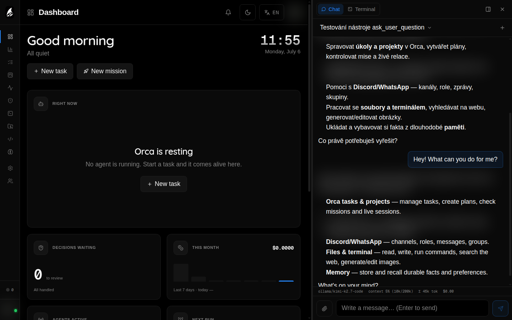

# Getting Started

**Elowen is a personal AI agent you talk to.** You chat with it and it acts: it
reasons, calls tools, edits files, runs shell commands, manages your tasks, and
reaches you wherever you are — the web dock, the `elowen` CLI, Discord, Telegram,
Microsoft Teams, or WhatsApp. It sits in the same category as coding agents like Claude Code or
OpenCode, but it's self-hosted and it's yours.

Because Elowen can run real work for you, it also gives you rich surfaces to
*watch and steer* what it's doing — a live dashboard, a kanban board, a timeline
of activity, and real terminal sessions you can jump into. Those surfaces are
how you observe and control the agent. They are not the product; the agent is.

This guide takes you from zero to your first conversation and your first task in
a couple of minutes.



## What Elowen is

- An **agent you chat with** that does the work — plans, calls tools, edits
  code, runs commands, and follows up with you.
- **Self-hosted**: a daemon (REST API on `:4400`) plus a Next.js web UI
  (`:4500`), driven by the `elowen` CLI.
- **Extensible to the core**: every capability — chat platforms, tools, memory,
  automation, security — is a plugin you add or remove.

## The four things that make it Elowen

1. **Clarity** — a clean, uncluttered UI where you always see what the agent is
   doing.
2. **Simplicity** — easy to run, easy to control, sensible defaults, low
   friction.
3. **Fully extensible** — every capability is an add/remove-able plugin. Elowen is
   modular to the core.
4. **Lightweight, professional-grade** — self-hosted, small footprint, clean
   codebase.

## Prerequisites

- **Node.js** ≥22 (ESM)
- **tmux** ≥3.x (agents run in isolated tmux sessions)
- **npm**
- A C toolchain (`python3`, `make`, `g++`) — optional, only needed when
  `node-pty` has no prebuilt binary for your platform. Terminals still work
  without it.

## Quick install

```bash
npm install -g elowen
elowen setup
```

The package is `elowen`; it installs the `elowen` command. `elowen setup` brings
the daemon and web UI up, then walks you through a ~2-minute onboarding wizard:

1. **Account** — create your first admin user
2. **Project** — point Elowen at a working directory (a git repo it can act in)
3. **AI provider** — connect a model and run a live **chat smoke-test** (a real,
   tiny completion) so you know it actually answers before you rely on it
4. **Memory** — optionally enable long-term memory so the agent remembers things
   across conversations
5. **Code intelligence** — optionally install the TypeScript language server

Standing Elowen up as a shared service instead? `elowen install` (run as root) does
the full server provisioning — a dedicated system user, the `elowen-daemon` and
`elowen-web` systemd units, a reverse proxy with optional Let's Encrypt HTTPS, and
the auto-update timer — then runs the same onboarding wizard at the end. See
[Install](install).

Run `elowen doctor` any time afterwards to see a checklist of what's working (chat, memory, platforms, plugins, and deployment prerequisites) and a hint for fixing anything that isn't.

## Start it up

`elowen setup` already brought Elowen up. To control the services yourself:

```bash
elowen up       # start the daemon (:4400) + web UI (:4500) in the background
elowen down     # stop them
elowen status   # check they're running and healthy
```

Open `http://localhost:4500` in your browser and log in with the admin account
you just created. (On a completely fresh install with no admin yet, the browser
offers a short first-run onboarding wizard instead of the login form.)

## Talk to your agent

Start with a conversation — that's the whole point of Elowen.

- In the web UI, open the **chat dock** and just type. Ask it something concrete:
  "list the files in this repo", "what changed in the last commit", or "summarize
  this Project".
- Or from your terminal:

  ```bash
  elowen chat
  ```

Watch it reason, call tools, and stream a reply back. The brain — Elowen's
embedded agent core — is what you're talking to, and it has access to whatever
tools and projects your account is allowed to use. It carries **memory** across
conversations (facts worth keeping resurface on their own) and a **personality**
you can shape — tone and style — from your Account settings. Learn more in
[Brain & Chat](brain-chat).

## Run longer work

For work that needs more than one answer, use the mechanisms built into the conversation:

- `/tasks` opens the conversation's lightweight todo checklist;
- `/goal <outcome>` runs a persistent, budgeted goal across turns;
- `Delegate` hands one focused part to an isolated sub-agent;
- `Workflow` builds a dependency graph of sub-agents and can run independent nodes in parallel.

All four use the current account's Project access, tool grants, and permission rules. They do not create a separate mission, coding-agent session, or pull-request workflow. See [Todos, Goals & Workflows](tasks-missions) and [Autonomy & Safety](autonomy-safety).

## Who can do what (RBAC)

Elowen has full **role-based access control**. There are two roles — **admin** and
**member** — and, crucially, **each user can have a different set of tools and
permissions**. An admin can grant one user the terminal and files tools, give
another only chat, choose which models each person may run, and scope each user
to specific projects.

This per-user tools-and-rights model is a headline feature, not an afterthought.
The full depth lives in [Users & Access](users-access).

## I want to…

| Goal | Go to |
|------|-------|
| Install on a server | [Install](install) |
| Run in Docker | [Docker](docker) |
| Connect a chat channel | [Channels](channels) |
| Change the model | [Brain & Chat](brain-chat) |
| Automate a recurring task | [Scheduling](scheduling) |
| Let it work unattended safely | [Autonomy & Safety](autonomy-safety) |
| See token usage | [Usage & Costs](usage-costs) |
| Add a teammate | [Users & Access](users-access) |
| Teach it my preferences | [Account & Preferences](account-preferences) |
| Fix a problem | [Troubleshooting](troubleshooting) |

[Next: Install](install)
