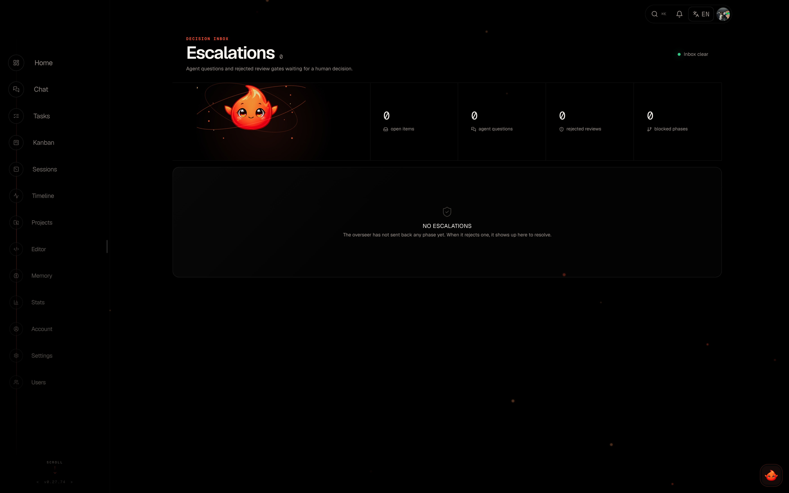

# Agents & Autonomy

Elowen is a personal AI agent you talk to — it reasons, calls tools, edits files
and runs commands on your behalf. When a job is big enough to warrant its own
coding agent, Elowen spawns one for you: a real CLI coding assistant working
inside a live session. This page explains how Elowen drives those agents and how
it governs them with graduated autonomy, so you always stay in control and can
see exactly what the agent is doing.

Autonomy is where two of Elowen's pillars meet: **clarity** — every decision an
agent makes is visible and steerable — and **simplicity** — sensible defaults
mean the agent handles the routine and only interrupts you when it genuinely
needs a human.

## Providers

Elowen can drive four external coding-agent CLIs, plus the embedded **Elowen AI**
brain that runs in-process (the agent you chat with directly). You pick a
provider per task; the model picker in chat and task creation offers whatever
you are allowed to run.

| Provider | Exec prefix | Program | Notes |
|----------|-------------|---------|-------|
| Claude Code | `claude:` | `claude-code` | Default; bare specs like `sonnet` route here |
| OpenCode | `opencode:` | `opencode` | Also the target for bare `provider/model` specs |
| Codex | `codex:` | `codex` | OpenAI's agentic coder |
| Kilo Code | `kilo:` | `kilo` | Auto-approval lives in Kilo's own config (see below) |
| Elowen AI (brain) | `elowen:` | `elowen` | Embedded — runs in-process, no external CLI spawned |

The brain uses `elowen:<provider>/<model>` specs (for example
`elowen:relay/ollama/kimi-k2.7-code`) and is bounded by your configured brain
providers rather than the CLI allow-list. See [Brain & Chat](brain-chat) for
the embedded agent, and [Configuration](configuration) for provider setup.

## Executor resolution

Every task carries an `exec:<spec>` label that tells Elowen which agent to spawn.
The daemon resolves the spec to a program like this:

- `exec:sonnet` → Claude Code with model `sonnet`
- `exec:opus` → Claude Code with model `opus`
- `exec:opencode:deepseek-v4-flash` → OpenCode with model `deepseek-v4-flash`
- `exec:codex:gpt-5.5` → Codex with model `gpt-5.5`
- `exec:kilo:<model>` → Kilo Code with that model
- `exec:ollama/deepseek-v4-flash` → a bare spec containing `/` routes to OpenCode
- **No label** → the configured fallback (default: Claude Code / `sonnet`)

A bare plain string (no prefix, no `/`) is only valid when it is explicitly
allow-listed — otherwise Elowen would silently treat it as a Claude Code model
name, so it is rejected.

Every exec must be in the daemon's `allowedExecs` list or the API rejects the
task. On top of that, non-admin users can be scoped to a **personal subset** of
execs — this is part of Elowen's per-user tools and permissions model, where each
user can have a different set of capabilities. An admin can let one user run
Opus and Codex while another is limited to a cheap OpenCode model. See
[Account & Security](account-security) for per-user `allowed_execs`.

## Provider configuration

Configure each provider in **Settings → CLI Agents**:

- **Binary path** — override where the CLI binary lives
- **Extra args** — additional flags passed on every spawn
- **Skip permissions** — bypass the CLI's own approval prompts (for example
  `--dangerously-skip-permissions` for Claude Code)
- **Resume sessions** — when enabled, a respawned agent reattaches to its prior
  CLI conversation instead of cold-starting (see [Session resume](#session-resume))

> **Kilo Code gotcha:** Kilo's skip-permissions toggle in Providers is a no-op.
> Kilo's auto-approval is controlled inside Kilo's own configuration, not by an
> Elowen flag — set it there.

## Autonomy levels

Every mission runs at one of four autonomy levels (L0–L3). The level decides how
much the agent may do without asking you, and how confident the overseer must be
before it auto-approves an action.

| Level | Name | Prompt handling | Escalation |
|-------|------|-----------------|------------|
| L0 | Recommend | All prompts → human | Never auto-approves anything |
| L1 | Assist | Overseer approves at ≥ 0.85 confidence | Uncertain or sensitive actions |
| L2 | Pilot | Overseer approves at ≥ 0.6 confidence | Ambiguous situations |
| L3 | Auto | Overseer approves at ≥ 0.6 confidence | Only when the agent is stuck |

L1–L3 spawn agents automatically and let them run. **L0 plans and proposes but
never executes without your explicit approval** — the safest setting when you
want to review everything first. You set the level per mission and can change it
at any time from the Dashboard.

## TDD mission mode

An optional guardrail that makes every autonomous worker practice strict
test-driven development. It is **off by default** and toggled globally — from
**Settings → Autopilot**, or with the `/tdd` command (bare `/tdd` reports the
current state, `/tdd on` / `/tdd off` flips it; changing it is admin-only).

When on, Elowen appends a Test-Driven-Development directive to every worker
preamble, so the agent must:

1. Write a test that captures the desired behaviour and confirm it **fails for
   the right reason** before writing any implementation.
2. Implement the minimum code to make that test pass.
3. Re-run the tests, confirm they pass, and refactor only while green.

The agent may never weaken or delete a test to make it pass, and a change with
no runtime surface (pure docs or config) is called out in its summary instead.

The directive is appended at the spawn seam — outside the prompt template, not
through a placeholder — so it reaches the worker even when you have saved a
custom worker prompt, and it applies both to CLI-spawned workers and to the
embedded Elowen AI brain worker. TDD mode is independent of the autonomy level
and of the plan/build work modes: it is a single global toggle layered on top of
whichever preamble and mode the worker runs in.

## Overseer (decision gate)

The overseer is the gate that vets every agent action before it takes effect —
task dispatch, CLI permission prompts, and post-completion reviews. It runs one
of two ways depending on whether you point it at an executor.

### Relay path (default)

When `overseerExec` is empty, decisions go through an **LLM relay** using the
`autopilot.overseerModel`. The model scores each request for confidence, and the
gate applies a simple threshold:

- **Approved** — confidence ≥ the level's threshold → the agent proceeds
- **Rejected** — confidence < threshold → the request waits for a human
- **Destructive** — always escalated; the overseer can never auto-approve it

This is the low-friction default: no extra agent to run, decisions resolve in
line.

### Agent path (parked overseer)

When `overseerExec` is set (for example `sonnet`), Elowen spawns a dedicated,
parked **overseer agent** per active mission. It runs a fully async long-poll
loop:

1. `elowen overseer poll` — absorbs heartbeats and surfaces pending decisions
2. Judges the request using the prompt in `prompts/overseer.md`
3. `elowen overseer decide --id <id> --approve --confidence 0.85` — submits its verdict

Because it is async, the mission keeps moving while the overseer thinks. There is
no fixed per-decision timeout; instead the [liveness sweep](#liveness--progress-checks)
watches the overseer's own pane. If the parked overseer dies or wedges, its
pending decisions **escalate to a human** so nothing slips through unreviewed.

## Deriver (prompt detection)

The deriver is how Elowen knows what a live agent is doing. It polls every active
agent's tmux pane **every 5 seconds** and detects state changes from the
terminal output — including the CLI's own permission prompts.

| Program | Detects | Trigger |
|---------|---------|---------|
| OpenCode | Permission | `Permission required` + Allow/Reject |
| Claude Code | Workspace trust | `Yes, I trust this folder` |
| Claude Code | Permission | `Do you want to proceed?` |
| Codex | Command approval | `Allow command?` / `Approve this command?` |

Auto-accept prompts like **workspace trust** are cleared directly by the deriver
without an overseer round-trip — there is nothing for a human to decide there.
Everything else becomes a decision on the bus.

The deriver emits signals to the SSE event bus that drive the live views across
the [Web UI](web-ui):

| Signal | Meaning |
|--------|---------|
| `working` | Agent is active, no prompt detected |
| `needs_input` | Agent is paused, waiting on a human |
| `complete` | Task is closed — final signal |

## Decision taxonomy

The overseer handles five kinds of decision, each enqueued by a different part
of the system:

| Kind | Enqueued by | Context |
|------|-------------|---------|
| `prompt` | Deriver | A CLI permission prompt from the agent |
| `review` | Close handler | Post-completion review: task title, outcome, summary |
| `question` | Deriver | A multiple-choice question from the agent |
| `message` | Agent (`elowen ask`) | Free-text Q&A with the autopilot |
| `check` | Liveness sweep | Routine progress check on a working agent |

The confidence threshold that separates approve from wait is **0.85 at L1** and
**0.6 at L2 and L3**.

## Liveness & progress checks

To make sure a wedged agent never sits silently, a liveness sweep runs every
**30 seconds** and uses one tool-agnostic signal — a `PaneActivityTracker` that
hashes each pane's content and compares it to the last look. A working agent
streams output so its pane keeps changing; a wedged or idle one goes static, and
the sweep acts:

| Check | After | Action |
|-------|-------|--------|
| Worker wedge | 5 min idle | Wake the overseer — it nudges, restarts, or (after repeated nudges) escalates |
| Routine progress | 15 min working | Ask the overseer "is this still on track?" — it may steer, never escalates a healthy agent |
| Overseer wedge | 10 min idle | Escalate its pending decisions to a human |
| Dead overseer | 90 s gone | Escalate its pending decisions (a 60 s watchdog tries to re-park it first) |
| Absolute backstop | 30 min in any state | Escalate |

## Agent Q&A (`elowen ask`)

A working agent can ask a free-text question mid-mission — to the autopilot or to
you:

1. The agent calls `elowen ask "Is this approach correct?"`
2. The autopilot answers directly, or escalates the question to a human
3. Unanswered questions surface in the **Escalations** inbox
4. You reply, and the agent receives your answer and continues

Escalations is your human-in-the-loop gate — approve, reject, or answer, all
from one place. See [Web UI](web-ui) for the full inbox, and [CLI](cli) for the
`elowen ask` command and its `--history` flag.

## Stuck detector

The stuck detector sweeps every **60 seconds** for `in_progress` tasks whose
agent session is no longer alive. It reverts a dead-agent task to `open` (up to
**2 retries**), then moves it to `blocked` to prevent an infinite crash loop.
When it reverts a task, it writes a **resume note** explaining why the task was
relaunched, so you (or the next agent) have the context. See
[Tasks & Missions](tasks-missions) for task states.

## Session resume

When **Resume sessions** is enabled for a provider, the daemon captures the
agent's CLI session id when the session closes and splices a resume flag into
the next spawn. The agent reattaches to its prior conversation instead of
cold-starting — it keeps its context, its plan, and its place in the work.

## Persistent goals (`/goal`)

The autonomy levels above govern spawned mission agents. The embedded **Elowen AI**
brain — the agent you chat with — has its own autonomous mode: a *persistent
goal*. Set one with `/goal <what you want>` and the brain works toward it turn
after turn on its own, checking its own progress, until the goal is done, it hits
a blocker, or it exhausts its turn budget.

Each goal turn follows a small sentinel protocol the brain is taught:

- `PROGRESS: …` — a one-line note of what the turn accomplished. It's carried
  forward across turns even after older messages are compacted away, so a long
  goal keeps its bearings.
- `GOAL_DONE: <evidence>` — the only way to finish. It must cite concrete
  evidence (passing tests, command output, a reviewed diff), and it's rejected if
  any subgoal is still open — so a goal can't declare itself done prematurely.
- `GOAL_BLOCKED: <reason>` — stop on an unresolvable blocker (missing
  credentials, a required decision, an unsafe step) instead of looping the budget
  away. The goal pauses for you.
- `SUBGOAL_DONE: <n>` — check off a subgoal as it lands.

Break a goal into checklist items with `/subgoal <text>` (and `/subgoal remove
<n>` / `/subgoal clear`). `/goal draft` writes a structured contract — outcome,
verification, constraints, boundaries, stop-when — for review before you commit
to running it. `/goal status`, `/goal pause`, `/goal resume` and `/goal clear`
manage a live goal; a headless run takes `--max-turns <n>` for its budget.

### Turn budget & the YOLO ceiling

Every goal carries a **turn budget** — the number of autonomous turns it may run
before it stops to check in with you. The default is **8** (configurable per
instance under **Settings → Elowen AI → Limits**, range 1–50). What happens when
the budget is spent depends on whether the session runs in YOLO:

- **Supervised (not YOLO)** — the goal **pauses** at budget with a
  `budget_reached` verdict. You confirm continuation with `/goal resume`, which
  grants a fresh budget window. This is the point where a human stays in the loop.
- **YOLO** — the goal **keeps going** past a spent budget so it can finish
  unattended, but never past an **absolute safety ceiling** (`goalMaxTurns`,
  default **64**, range 8–500). Even in YOLO the loop pauses at the ceiling, so a
  runaway goal can never burn tokens forever.

"YOLO" here is the *effective* YOLO — a session `/yolo` override layered over your
persisted permission default, resolved exactly the way tool approvals are. So
`/yolo off` supervises the goal too, pausing it at budget for your confirmation.

### Losing the driver

A persistent goal only advances while its conversation has a live driver — it's
your active conversation, or a bound CLI stream is attached to it. Switch away
and the goal **pauses** rather than running unattended in the background. And
because in-memory continuation timers don't survive a restart, a daemon reboot
pauses every active goal. Autonomous work never self-resumes — matching Elowen's
"escalation waits, nothing self-starts" rule — you bring a paused goal back with
`/goal resume`. See [Brain & Chat](brain-chat) for the embedded agent.

[Next: Web UI](web-ui)
