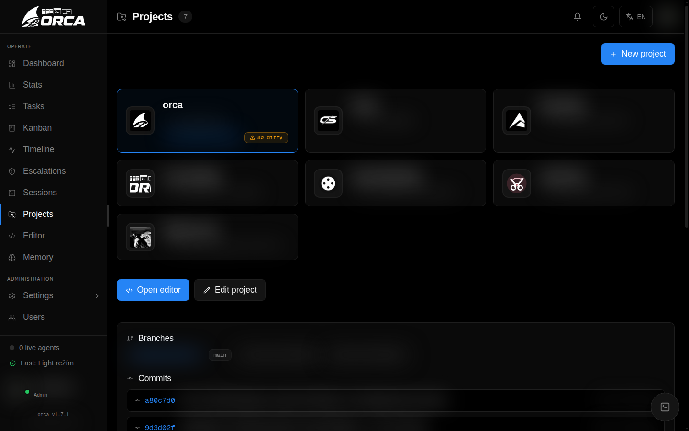

# Web UI

The Web UI is the place to observe and steer Elowen without interrupting the work. It is a Next.js client over the same daemon used by the terminal and chat-platform plugins: it does not have a second task store, conversation engine, or permission model.

Desktop navigation uses one shared spatial rail. Account and Settings use a focused section surface; operational pages use wide workspaces with dense lists, filters, and an in-context detail drawer. On smaller screens the same information becomes a linear layout with drawers rather than a compressed desktop composition.

## Workspaces

| Route | Use it for |
| --- | --- |
| `/dash` | A quick view of current agent activity and important signals. |
| `/tasks` | Creating, filtering, scheduling, and steering task work and missions. |
| `/kanban` | Seeing task state as a board and organizing work visually. |
| `/sessions` | Watching live worker sessions and opening a terminal when appropriate. |
| `/timeline` | Reviewing activity and related commit history. |
| `/stats` | Inspecting model and usage trends. |
| `/projects` | Managing the repositories Elowen may work in. |
| `/editor` | Browsing and editing project files in the built-in editor. |
| `/memory` | Curating durable memories and their categories. |
| `/settings` | Configuring the instance, models, tools, and automation. |
| `/users` | Managing users, project scope, and per-user tool access. |

The command palette keeps every module reachable even when it is not in the compact primary navigation.

## Tasks, Kanban, and Sessions

The **Tasks** workspace is the primary operational surface. Its header exposes the important action, summary, search, and filters; the main area stays wide enough for a useful list. Selecting a task opens a right-side detail drawer so you can inspect output, changes, usage, dependencies, or mission state without losing the filtered list behind it.

**Kanban** presents the same task state as columns.

**Sessions** shows live tmux-backed workers and allows you to open a terminal view when the executor supports it. Its second tab keeps the brain conversation history from every surface — web, CLI, channels, and task agents — in one place. Administrators can optionally enable **Automatic conversation cleanup** there: the hourly janitor removes only a user's old, inactive top-level conversations. It never removes running, active, channel, task, delegated-child, or child-bearing conversations.

**Timeline** and **Stats** provide the historical side: activity, commits, and usage rather than another competing task list. Stats shows tokens and model cost. A provider-reported cost is authoritative; a `~` amount is an estimate from the models.dev catalog, used for proxy or custom-model turns when the provider does not report a price.

## Projects and editor

Projects define the repositories Elowen may work in. From a project you can review Git state, commits, changed files, and related work. The built-in editor is for inspecting or making a focused change yourself; opening a commit or file from a table keeps it in a bounded modal or drawer so the original workspace remains visible.

Read [Projects & Workflow](projects-workflow) before enabling PR automation or assigning projects to other users.

## Memory and chat

**Memory** is where you inspect, search, categorize, merge, restore, or purge durable facts. It is intentionally a workspace, not a hidden prompt cache: the list and selected-memory drawer keep the current selection and surrounding results visible together.

The chat dock is available across the product. It opens the same server-side brain conversation as the terminal, including streaming activity, tool traces, model selection, queued messages, and permission questions. See [Brain & Chat](brain-chat) for conversation behavior.

## Settings and account

Settings has one ordered set of sections:

1. **System** — readiness, service state, updates, and token lifetime.
2. **Elowen AI** — provider accounts, agent identity, limits, and context windows.
3. **Models** — available executor models and their notes.
4. **CLI Agents** — installed coding-agent executors and their launch behavior.
5. **Data** — operational data maintenance.
6. **GitHub** — PR workflow defaults and repository integration status.
7. **Autopilot** — mission defaults, planning, review, and TDD behavior.
8. **Plugins** — installed capabilities, their settings, marketplace, and runtime details.
9. **Memory** — embedding and categorization configuration.

Account settings are personal: profile, security, notifications, communication preferences, memory and terminal preferences, and the user's Elowen AI choices. Routine settings save as you change them; high-impact actions such as OAuth connections, permission changes, deletion, and unattended modes retain explicit confirmation.

## Users and access

Users have roles, project assignments, allowed models, and per-user tool controls. The UI shows these as an effective-access summary, while the daemon enforces them at execution time. An administrator can inspect another user's context only through the dedicated user-management controls; ordinary users see their own permitted data.

For the security model and account-level choices, see [Account & Security](account-security).

[Next: CLI](cli)
