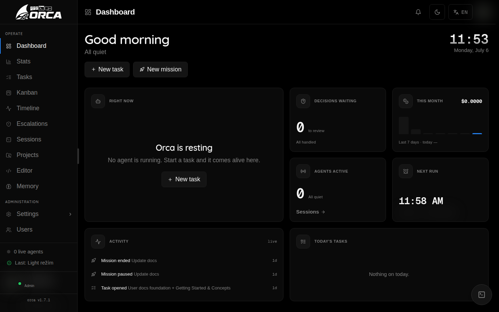

# Web UI

The Web UI is the browser interface to your Elowen daemon. After you sign in, the shell gives you one navigation rail, a shared chat dock, account controls, and a command palette. The browser and CLI operate on the same server-side conversations and account permissions.

The root URL redirects to `/dash`.

## Navigation

The core navigation is deliberately small:

| Route | What it contains |
| --- | --- |
| `/dash` | Home view with setup status, current activity, team presence, and the activity journal. |
| `/chat` | Full-page chat with conversation history, model controls, live telemetry, workflows, and sub-agents. |
| `/projects` | Projects you can access, their filesystem paths, access assignments, and Git status. |
| `/memory` | Your account's durable memories, categories, retrieval inspection, and lifecycle actions. |
| `/account` | Your profile, password, notifications, model, memory, communication, and terminal preferences. |
| `/users` | Administrator-only account and access management. |
| `/settings` | Administrator-only daemon, model, plugin, memory, and data settings. |

Your navigation layout is stored per account. You can hide or reorder destinations from the navigation menu; hidden destinations remain reachable from a direct URL or the command palette.

## Shared shell controls

The top bar provides:

- the current page title and location;
- the command palette, opened with the search button (`⌘K` is shown on desktop);
- language selection;
- your account menu and sign-out control.

On wide screens the navigation is a column or compact icon rail. On narrow screens it opens as a drawer over the page. Use `Escape` or the backdrop to close the drawer.

The advisor launcher opens the chat dock from other pages. `/chat` uses the full-page chat instead of opening a second dock. Plugin pages are hosted under `/p/<plugin>` or `/p/<plugin>/<route>` and appear only when the corresponding plugin UI is available to your account.

## Chat

Open `/chat` for the full conversation surface. It uses the same conversation controller as the chat dock, CLI, and channel adapters.

- **Composer:** send messages, use slash commands, attach files, paste content, and queue follow-ups.
- **Model controls:** choose a model, reasoning effort, fast mode, plan/build mode, and conversation-level YOLO.
- **History drawer:** search, rename, fork, export, delete, or start conversations. The register also lets you inspect available sessions and open one in chat.
- **Live work:** see todos, sub-agent progress, workflow nodes, tool calls, and background processes.
- **Telemetry:** inspect context and usage, goals, workflows, sub-agents, processes, the active Project, MCP, and LSP state.

On desktop, telemetry can stay open as a column beside the conversation. On mobile it opens as a drawer. Conversation history is loaded in pages, so older messages appear as you scroll upward.

## Projects

Open `/projects` to browse the Project roots configured for Elowen. A Project is a path boundary: access is assigned to accounts by an administrator, and members cannot register, edit, or remove Projects.

Select a Project to open its detail panel. The core overview can include:

- the Project slug, path, and notes;
- the current branch and clean/changed state;
- ahead/behind counts;
- available branches and recent commits.

Administrators also see the **Access** section for assigning non-admin accounts to the Project. Removing a Project from Elowen detaches its registration; it does not delete files from disk.

### Project plugins

Enabled plugins can add tabs to the Project detail panel. These tabs are not part of core Projects.

- **Sandbox** provides account-scoped Git worktree management. Create or select a workspace for a Project and conversation, review changes, commit explicitly selected workspace-relative paths, or remove a workspace after its loss preview and confirmation.
- **GitHub** connects your GitHub identity, maps a Project to a repository, and provides repository and pull-request views with checks, reviews, and changed files.

GitHub branch publishing requires both a verified Project repository mapping and an active Sandbox workspace for the current conversation and Project. Publishing, pull-request creation, reviews, and merges show a server-generated preview and require a one-time confirmation. The GitHub plugin's default merge method is **Squash**.

## Memory

Open `/memory` to manage durable facts belonging to your account. The workspace provides three views:

- **List** — search and filter memories by status, kind, category, and text; sort and select records for bulk actions.
- **Brain** — inspect the relationship map of your memories.
- **Retrieval** — run the real recall pipeline and inspect the scores and results that would be supplied to the assistant.

Select a memory to open its detail panel. Depending on its state, you can edit its category, merge it with other records, restore it, or permanently purge it. Personal memories are not visible across accounts.

## Account

Open `/account` for settings that belong to your account rather than the whole daemon. The profile section includes your display name, email, avatar, default Elowen AI model, interface scale, visual-effects preference, and links to your Discord, Microsoft Teams, Telegram, or WhatsApp identity where supported.

Other sections cover:

- **CLI** — personal Elowen/CLI behavior and model settings;
- **Memory** — recall and memory-saving preferences;
- **Personality** — your instructions and response style;
- **Notifications** — browser push notifications;
- **Security** — password changes;
- **Terminal** — terminal appearance and behavior.

Plugins can add account sections. For example, the GitHub plugin adds **GitHub** under Account, while Sandbox adds **Development environment** for your account HOME, execution mode, and Git identity.

## Administration

Only administrators can open `/users` and `/settings`.

`/users` manages accounts, administrator status, Project assignments, plugin grants, model access, and tool access. Select an account to inspect or change its access context.

`/settings` contains the daemon-wide sections:

- **System** — service readiness, updates, and token lifetime;
- **Elowen AI** — provider configuration, agent identity, limits, retention, runtime, and context windows;
- **Models** — visible presets and custom model entries;
- **Plugins** — installation, enable/disable state, grants, logs, and plugin configuration;
- **Memory** — embedding and categorization configuration;
- **Data** — administrative maintenance and cleanup.

Plugin settings are owned by the plugin and open in that plugin's page, not as a second copy inside core Settings. Plugin credentials stay server-side; the browser receives metadata and status, not secret values.

## Responsive and accessible behavior

The same navigation and controls work with keyboard, mouse, and touch. Lists support keyboard selection and visible focus, statuses are conveyed with text as well as color, and mobile detail panels become drawers. Destructive or external actions show a preview before confirmation; the server performs the final authorization and stale-state check.

[Next: CLI](cli)
