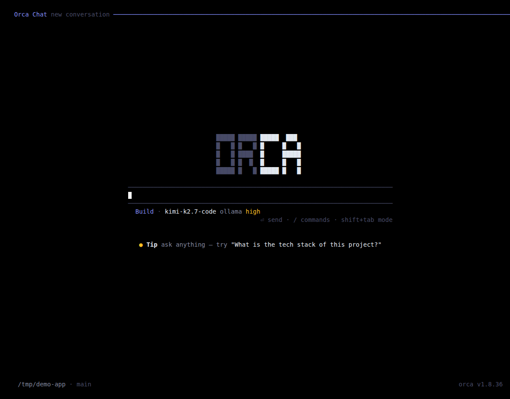
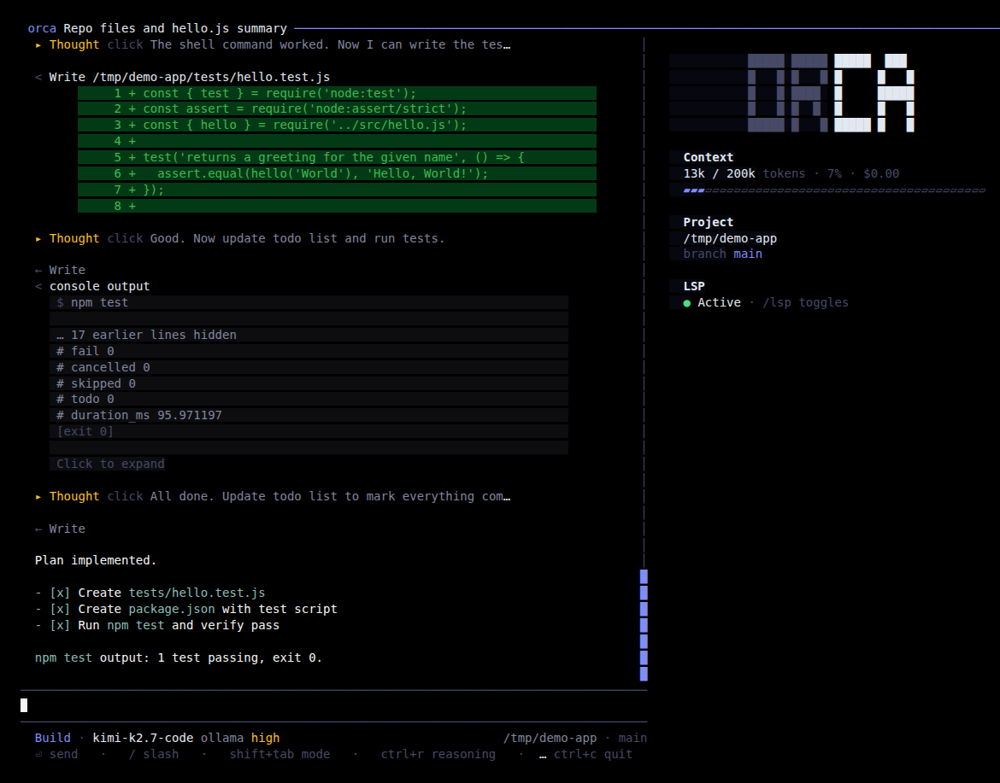
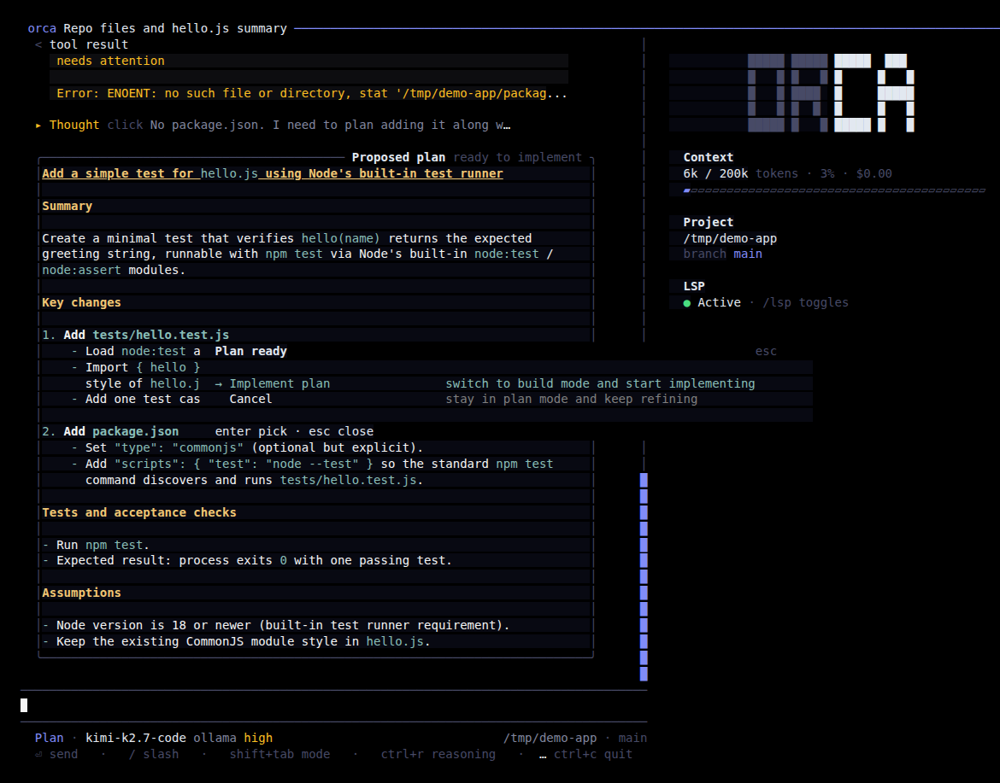
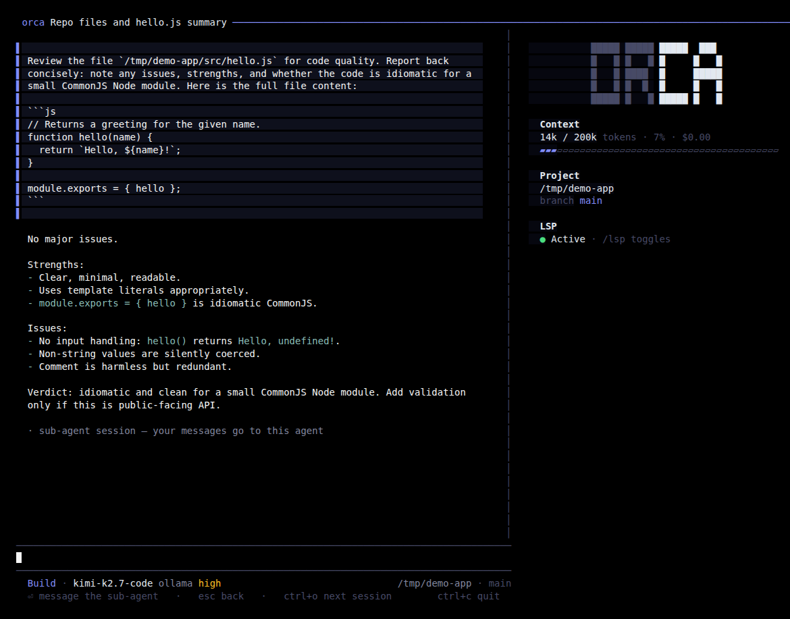
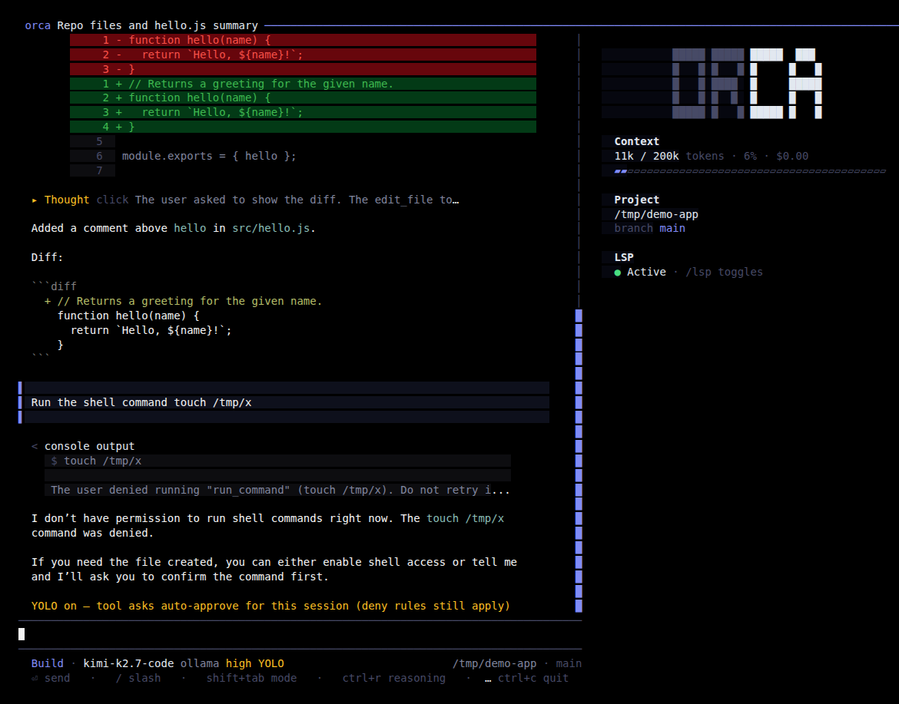

# CLI

The `orca` CLI is a second way to talk to and drive the same agent — this time from
your terminal. Everything you can do from the [Web UI](web-ui) has a command-line
counterpart: chat with the [Brain](brain-chat), inspect and close [tasks](tasks-missions),
drive [missions and autopilot](agents-autonomy), and manage the daemon. It is the
low-friction, scriptable surface of the agent — one small binary, sensible defaults,
no ceremony.


The CLI connects to the daemon over its REST API. If the daemon is not running, the
CLI auto-starts it for you (set `ORCA_AUTOSTART=0` to disable that and manage the
daemon yourself).

## Launch & login

```bash
npm install -g orcasynth   # installs the `orca` command
orca setup                 # guided wizard: account, project, AI provider, memory, LSP
orca                       # bare `orca` in a terminal opens the chat TUI
```

`orca setup` is the onboarding wizard — account, project, AI provider (sign-in or API
key), memory, and the optional TypeScript language server. It's skippable and
reversible, and safe to re-run any time (`--reset` to start over); in a non-interactive
shell it just prints `Run: orca setup` and exits rather than blocking a script. A
one-time, root-level `orca install` provisions a full **server** deployment instead —
systemd units, a reverse proxy, and the first admin account.

Once you have an account, `orca` with no arguments — in a terminal — opens the chat
TUI directly (the same as `orca chat`). The first time a terminal has no cached
token, it prompts for your username and password and caches a token at
`~/.config/orca/cli.json` (mode `0600`), so every command after that runs without
re-authenticating. Run `orca login` any time to (re)authenticate explicitly, or set
`ORCA_TOKEN` to skip the prompt entirely (handy for CI and scripts).

## Chat basics

```bash
orca chat                  # open the interactive Orca chat
orca chat --new            # start a fresh conversation
orca chat --session <id>   # resume a past conversation
orca chat --model <id>     # pick a model for this session
```

Inside the chat, you're talking to the same [Brain](brain-chat) as the web dock,
Discord and WhatsApp — same reasoning, same tools, same memory, just a different
surface. The layout is an opencode-style TUI: a scrollable transcript on the left, a
telemetry panel (context usage, project, branch, LSP status) on the right, and a
status/hint bar along the bottom.



Tool calls render **dim** — they're secondary to the assistant's answer. A finished
tool call with nothing more to show collapses to a single line (`$ <command> · done`,
or a glyph + title for reads/edits/searches); one with output shows the command echo,
a status line, and the body, with long output collapsible ("Click to expand"). File
edits render as a git-style diff with a stable line-number gutter.



The tools the agent can reach in a CLI chat are still governed by RBAC: your
account's per-user tool access and per-project visibility apply exactly as they do in
the web UI. The terminal is a different door into the same agent, not a way around
your permissions. See [Account & Security](account-security).

### Models

`/model` opens a picker of every model available to you — configured providers,
auto-fetched catalogs, and OAuth-connected accounts (Claude, GitHub Copilot,
ChatGPT/Codex) — with type-to-search and the current model floating to the top. Press
`ctrl+p` inside it to switch providers instead. See [Brain & Chat](brain-chat#model-catalog)
for how the catalog is assembled.


### Reasoning & Thought rows

When the model streams reasoning, it renders as a collapsed **Thought** row with a
truncated first line — click it to expand the full reasoning text.


- `/reasoning` opens a picker of the current model's thinking levels (`minimal` up to
  `xhigh`); `/reasoning <level>` sets one directly.
- `ctrl+r` cycles the reasoning level in place without opening a picker.
- `/reasoning show` toggles Thought rows on/off for this account. The setting is
  saved server-side (mirrored by **Account → Terminal**'s "Show reasoning in CLI"
  toggle), with a local fallback so it still works offline.

## Slash commands

Type `/` to open the command menu — arrow keys or type-to-filter, `Tab` completes the
highlighted command into the input (with a trailing space, ready for arguments),
`Enter` runs it immediately.


| Command | Description |
|---------|-------------|
| `/new` | Start a fresh conversation |
| `/stop` | Stop the running agent |
| `/status` | Session info — model, context, cost, cwd, git branch, goal status |
| `/mcp` | Inspect MCP servers, their tools and reconnect health |
| `/skills` | Inspect and manage loaded skills |
| `/goal` | Create, inspect, pause, resume or clear a persistent goal |
| `/subgoal` | Add or remove persistent-goal subgoals |
| `/tools` | Inspect active plugin tools and their owning plugin |
| `/compact` | Summarize the conversation to free up context |
| `/plan` | Switch to Plan mode — think through the approach before editing |
| `/build` | Switch to Build mode — implement changes with tools |
| `/yolo` | Auto-approve tool asks for this session (`on`/`off`, or toggle) |
| `/model` | Switch the AI model (type to search, `ctrl+p` for providers) |
| `/reasoning` | Set the reasoning effort · `show` toggles Thought rows |
| `/theme` | Switch the terminal colour theme |
| `/lsp` *(admin)* | Language diagnostics — status, install/uninstall servers, on/off |
| `/restart` *(admin)* | Restart the Orca daemon |
| `/help` | Show the available commands |
| `/sessions` | Pick a conversation to resume |
| `/resume` | Resume a conversation |
| `/delete` | Delete a conversation |
| `/quit` | Exit |

Plugins can contribute their own `/command` prompt macros (they can't shadow a
built-in name) — see [Plugins](plugins). This table is generated from the single
source of truth every surface renders from (`src/brain/slashCommands.ts`), so the CLI
menu never drifts from what's actually wired up.

## Keys

| Key | Effect |
|-----|--------|
| `Enter` | Send the message (or run the highlighted item in an open menu) |
| `shift+tab` | Toggle **Plan ↔ Build** work mode |
| `ctrl+r` | Cycle the reasoning effort in place |
| `ctrl+o` | Cycle **main conversation → sub-agent 1 → sub-agent 2 → … → back to main** |
| `ctrl+p` | Toggle the telemetry panel (context/project/branch/LSP) |
| `esc` | While streaming: interrupt the turn · inside a sub-agent view: close it, no server round-trip · inside a modal: closes/denies it · otherwise: clears the input |
| `ctrl+c` | Quit |
| `Tab` (in the slash overlay) | Complete the highlighted command into the input |
| `↑` / `↓` | Move selection in a menu, or (in the editor) recall previous inputs |
| `PageUp` / `PageDown` | Scroll the transcript |
| Mouse wheel | Scroll the transcript |
| Click a Thought row | Expand/collapse the reasoning text |
| Click a sub-agent row | Open that child session's transcript |
| Click the Todos/Sub-agents card header | Collapse/expand it |
| Drag over transcript text | Select text; releasing copies it via OSC 52 (works over SSH too) |
| Drag the panel's left edge | Resize the telemetry panel (36–68 columns) |

## Plan mode

Plan mode lets the agent think through an approach before it touches anything: the
server hides mutating tools and only allows reads, searches, diagnostics and the
todo/question tools. Switch into it with `shift+tab` or `/plan <text>`.

When the agent's reply proposes a plan, the CLI renders it as a bordered card and,
once the turn settles, opens a **"Plan ready"** picker:



- **Implement plan** — switches to Build mode and submits "Implement the plan you
  proposed above." as the next turn.
- **Cancel** — stays in Plan mode so you can keep refining the approach.

## Sub-agents

Ask the agent to delegate a piece of work and it spawns a sub-agent — a nested turn
with its own tool budget, running in its own session. Each one renders as a live
status line in the transcript (spinner while running, a checkmark once it's done,
tools/duration/tokens underneath) and, while active, in a **Sub-agents** panel above
the status bar.


Click a sub-agent's row, or press `ctrl+o`, to drill into its transcript — your
input while that view is open steers the child, not the parent. `esc` closes the
child view with no server round-trip; `ctrl+o` again cycles to the next sub-agent, or
back to the main conversation.



## Todos

When the agent tracks multi-step work, it keeps a checklist visible above the status
bar — the canonical progress view for the current conversation, alongside whatever
tool activity is happening.


`[x]` marks a completed item, `[•]` the one in progress, `[ ]` a pending one. The
card collapses automatically once every item is done. It's conversation-scoped (not
persisted per project) — the closest way to see it outside interactive chat is
`orca run -p "/status"`, whose JSON output includes the current cards.

## Permissions & YOLO

Every tool call that can change something — running a shell command, writing a file —
stops for your approval first. The prompt shows exactly what's about to run and gives
you three choices:


1. **Allow once** — run it this time only.
2. **Always allow** — approve every future call to that tool for this session.
3. **Deny** — skip this call; the agent is told it was denied and keeps going.

`1`–`9` pick an option by number, `Enter` confirms the highlighted one, and `Esc`
always resolves to **Deny** — it never aborts the turn, the tool just reports back
that it was refused.

For a fully hands-off session, `/yolo` (or `/yolo on`/`off`) auto-approves every tool
ask — deny rules still apply. It's session-scoped only: the meta line grows a
warning-toned **YOLO** chip so an unattended session is never silently unsupervised,
and the persisted default (if you want YOLO on by default) lives in web
**Account → Orca AI**.



## Theming

`/theme` opens a picker of 15 built-in colour themes (plus **Custom**, when your web
**Account → Terminal** palette is set to `custom`) — pick one and it's saved to this
machine's `~/.config/orca/cli-prefs.json`.


The terminal theme is a property of *this* terminal (dark themes read differently on
a light one), so a local `/theme` pick always wins on this machine. If you've never
picked one locally, the CLI instead follows your web **Account → Terminal** setting —
so picking a palette there is enough to theme the CLI on a machine you haven't
customized yet. `/theme <name>` applies a theme directly, skipping the picker.

## Environment reference

The CLI itself reads three environment variables day to day — the connection
settings already covered under [Launch & login](#launch-login). In a normal
single-machine setup you never touch them.

| Env var | Default | Description |
|---------|---------|--------------|
| `ORCA_URL` | `http://localhost:4400` | Daemon URL |
| `ORCA_TOKEN` | — | API token (auto-resolved via login cache) |
| `ORCA_AUTOSTART` | `1` | Set to `0` to disable the CLI's auto-start of the daemon |

A few more are read at specific moments rather than daily: `ORCA_TASK`, `ORCA_PLAN_JOB`
and `ORCA_MISSION` are injected by the daemon into a spawned agent (see
[Tasks & Missions](tasks-missions) and [Agents & Autonomy](agents-autonomy));
`ORCA_PORT`/`ORCA_WEB_PORT` override the daemon/web ports; `ORCA_ADMIN_USER`,
`ORCA_ADMIN_PASSWORD`, `ORCA_API_KEY` and `ORCA_OPENROUTER_KEY` feed a non-interactive
`orca setup --non-interactive` (from env instead of argv, so secrets never hit shell
history or `ps`). The daemon itself reads a larger set — database path, bind host,
bootstrap credentials — covered in [Configuration](configuration).

## Daemon lifecycle

The daemon is the REST API on `:4400`; the web UI runs alongside it on `:4500`.

```bash
orca up        # start the daemon + web UI
orca down      # stop them
orca status    # health check for both
orca update    # update to the latest npm release and restart in place
orca menu      # interactive launcher: start/stop/status/update in one place
orca doctor    # readiness report: what works, and how to fix what doesn't
```

`orca menu` is the interactive front door to all of the above — talk to Orca, toggle
the services, check status, open the web UI, or update, from one picker. On a box
provisioned with `orca install`, it drives `systemctl`/`journalctl` instead of
managing its own daemon process, and adds a **Recent daemon logs** entry.

`orca doctor` authenticates (prompting for admin credentials in a TTY, or reading
`ORCA_TOKEN` non-interactively) and prints a readiness report — chat, tasks,
missions, memory, platforms, plugins — with a hint next to anything that's failing.
It exits non-zero when something needs attention, so scripts and agents can branch on
the result.

## Non-interactive: `orca run`

For scripting and CI, `orca run "<prompt>"` (alias `orca -p`/`--print`) runs one turn
non-interactively and exits — no TUI, no prompts.

```bash
orca run "What changed in the last commit?"
orca run --new "Summarize this repo"          # start a fresh conversation
orca run -c "Now write a test for that"       # continue the active conversation (default)
orca run --json "List the open tasks"         # emit every event as JSONL
orca run --goal "Get the test suite green" --max-turns 20
orca run -p "/status"                         # run a slash command headlessly
```

By default `orca run` resumes the **active** conversation, so consecutive calls keep
talking to the same brain — matching the TUI. `--new` starts fresh; `--session <id>`
targets a specific one; `--list` prints your conversations (id, title, model) and
exits. `--mode plan`/`--plan` runs the turn in Plan mode. A `/slash` prompt (e.g.
`-p "/goal pause"`) dispatches that command instead of a chat turn.

Plain output streams the assistant's text to stdout; `--verbose` also prints
reasoning/tool/step lines to stderr. `--json` emits one `BrainEvent` per line to
stdout instead — a session line always goes to stderr so it never pollutes the
stream you're parsing. `--timeout <seconds>` (default 600) gives up and exits `124`.
Other exit codes: `0` ok/done, `1` error, `2` usage, `3` goal paused/hit its turn
budget, `4` goal blocked, `5` a plain turn asked a question and can't proceed without
one.

## Tasks & scripting

```bash
orca ls                          # list all tasks (JSON)
orca ready                       # list tasks ready to run (JSON)
orca sessions                    # list live agent tmux sessions (JSON)
orca send <session> "<text>"     # type into a live agent's session and submit
orca close <id> --summary "..." --outcome ok|fail
orca api <METHOD> <path> [body]  # raw authenticated REST call, e.g. `orca api GET /tasks`
```

`orca send` is your one-click intervention from the terminal: type straight into a
running agent's session without leaving the shell (`--no-enter` stages the text
without submitting it). `orca api` gives you the full REST surface for anything that
doesn't have its own command — it reads `ORCA_URL`/`ORCA_TOKEN` from the environment,
the same variables the daemon injects into every agent it spawns, so an agent can
drive any endpoint without a bespoke CLI command.

## Missions & autopilot

These are mostly **agent-facing** — commands a running agent invokes on itself, not
ones you type by hand day to day. See [Agents & Autonomy](agents-autonomy) for the
autonomy levels and the overseer this drives.

| Command | Purpose |
|---------|---------|
| `orca plan submit --phases '[...]'` | Submit an autopilot plan (needs `ORCA_PLAN_JOB`) |
| `orca overseer poll` | Long-poll for the next overseer decision (needs `ORCA_MISSION`) |
| `orca overseer decide --id <id> ...` | Submit a verdict: `--approve` / `--escalate` / `--choice <id>` / `--message "<reply>"` |
| `orca ask "<question>"` | Free-text Q&A with the autopilot (needs `ORCA_TASK`); `--history` prints past exchanges |
| `orca note add <missionId> "<text>"` | Leave a handoff note for the next phase of a mission |
| `orca note ls <missionId>` | Read a mission's handoff notes, oldest first |

To kick off an autonomous, multi-turn goal from the CLI yourself, use
`orca run --goal "<text>"` (or `/goal <text>` inside chat) — a **persistent goal** on
the brain that runs until it settles, pauses or gets blocked. That's a single-agent
mechanism, distinct from mission/epic autopilot (which is driven server-side and
exposed through the agent-facing commands above, or from the Web UI).

## Auth

```bash
orca login        # authenticate and cache a token
orca sessions      # list live tmux sessions you can attach to or intervene in
```

`orca login` caches a token at `~/.config/orca/cli.json` so subsequent commands run
without re-authenticating.

[Next: Brain & Chat](brain-chat)
