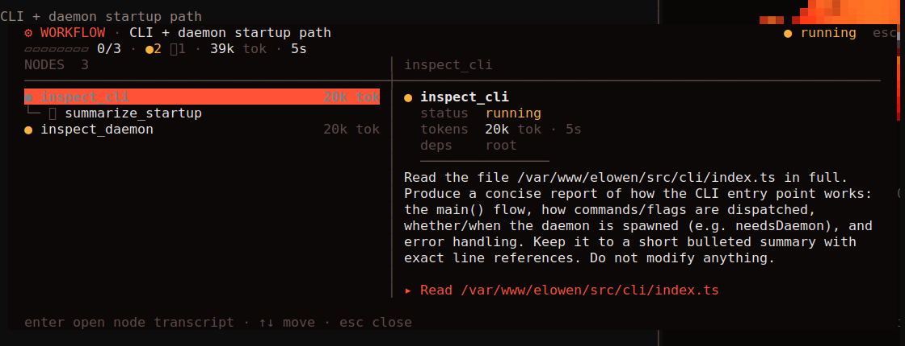

# CLI

`elowen` is the terminal home for the same agent you use in the Web UI. A bare command in an interactive terminal opens chat; the CLI also exposes setup, service control, non-interactive runs, task helpers, and a deliberately small agent-facing control interface.


## Everyday commands

```bash
elowen                       # open terminal chat (always a fresh conversation)
elowen setup                 # local onboarding wizard
elowen doctor                # diagnose readiness
elowen chat -c               # resume this directory's last conversation instead
elowen chat --session <id>   # reopen a specific conversation
elowen run "explain this diff"
elowen -p "/status"         # non-interactive slash command
elowen status                # daemon and Web UI health
```

`elowen setup` configures a local account, project, provider, optional memory embeddings, and optional language-server support. `elowen install` is the separate shared-server provisioning flow; run `elowen install --help` before using it.

## Chat

The terminal chat streams assistant text, tool calls, diffs, approvals, todos, and sub-agent state. Diffs and Markdown code fences are syntax-highlighted — token colors are composited over the add/delete/context rows using the edited file's language — so a small edit inside a long changed line stays visible. Its telemetry rail shows the current conversation's model, context, project, branch, language-server state, and usage. For any connected OAuth subscription account — ChatGPT, Claude, or Kimi — it also surfaces that provider's subscription usage windows (a 5-hour window plus weekly ones, whatever windows the provider reports), keyed to the active model's provider; a cached reading is marked when it is no longer fresh. This is live state from the daemon, not a terminal-only copy.

- Use **`@`** to attach a file through the picker. Text is attached as context; supported images remain image attachments.
- Use **`@clipboard`** to attach supported clipboard content.
- Start a line with **`!`** to run a local shell command. Its output is shown and made available to the next prompt.
- Use **`Esc`** to deny a pending approval; it does not silently abort the whole conversation.
- Use **`/cd [path]`** to show or change the CLI working directory. It affects later prompts, `!` commands, attachments, exports, and local history; it never widens the daemon's project permissions.
- Use **`/tools`** to inspect the currently available plugin tools, their owner, description, and input schema. It is an inspector, not a plugin-management screen.
- Use **`/fast`** with a ChatGPT/OpenAI OAuth model to toggle priority processing for this conversation when that model supports it.
- Use **`/model`**, **`/theme`**, and **`/keybinds`** for the corresponding pickers and preferences.
- Use **`/statusline`** for a checkbox overlay (like `/keybinds`) that picks which segments the status bar shows — context usage, total tokens, and cost. It edits the shared statusline config, so the choice also applies to the web chat dock.

While Elowen is working, the CLI shows live activity and elapsed time. A tool call that takes longer to compose shows a localized action label describing what the tool is doing. **`Ctrl+B`** moves a running foreground sub-agent or `Bash` command into the background without cancelling it; its result returns to the conversation when it completes.

The exact command menu is served by the daemon, so built-in and plugin commands remain aligned across surfaces. Type `/` in chat to browse it.

## Conversations, context, and limits

The terminal is session-bound: it resolves a conversation and keeps using that session rather than moving another surface's active conversation. You can list or resume sessions in non-interactive mode:

```bash
elowen run --list
elowen run --resume <session-id> "continue"
elowen run --new "start a clean investigation"
```

If you send a message while a turn is running, Elowen stores it in that session's durable queue and delivers it after the current turn settles. `/compact` compacts older history when needed, retaining a summary and the useful tail. Context, output, goal, and channel limits are controlled by the instance owner in **Settings → Elowen AI**.

### Background commands

`Bash(background: true)` starts a command as a tracked background process and returns its ID. The agent can inspect it with `ListProcesses`, collect output with `ProcessOutput`, or stop it with `KillProcess`. `ProcessOutput(block: true)` waits for a bounded period instead of polling. A foreground `Bash` command can also be detached with **`Ctrl+B`** from the terminal chat; it keeps running without the foreground timeout and reports its completion asynchronously.

## Modes and permissions

The chat control (`shift+tab`) cycles three working modes, and each slash command selects one directly.

**Build** is the default: the agent works the task itself, in one thread.

**Plan mode** (`/plan`) hides mutating tools while the agent works out an approach. When a plan is ready, choose whether to implement it or keep refining it. This is a real policy boundary, not just a visual label.

**Workflow mode** (`/workflow`) asks the agent to orchestrate rather than execute: decompose the request into a DAG of self-contained sub-tasks and run it, so independent work happens in parallel and each step gets a fresh, focused sub-agent. Unlike Plan mode this is a prompt bias, not a policy boundary — the agent keeps its full toolset and still does a trivial request directly rather than wrapping it in a workflow. It does not ask before running; the plan is the workflow.

Switching mode mid-conversation is recorded in the transcript, and the agent is told what changed, so it adopts the new mode on its next turn instead of carrying on as before.

Approvals remain explicit for actions the policy requires. `/yolo` can enable session-level auto-approval where the account permits it, but deny rules and hard safety boundaries still apply. Use it only when you understand the scope of the current session.

## Goals and sub-agents

`/goal` gives a conversation a persistent objective so it can continue through multiple turns until it completes, pauses, or needs help. The daemon applies the configured turn budget and hard ceiling to prevent an unattended loop from running indefinitely.

The sub-agent plugin can delegate a focused, bounded task. The parent transcript shows a live child row; open it to review the child conversation or steer it directly. Delegation inherits the caller's allowed scope rather than granting a broader set of tools.


## Workflows

A workflow is a DAG of sub-agents. The agent declares nodes — each a self-contained task with its dependencies — and the engine runs them as those dependencies clear: independent nodes in parallel, dependents waiting for what they need. Every node is a fresh sub-agent that cannot see the parent conversation, so each task is written to stand alone, and a running node can extend the DAG when the work reveals more work.

Use a workflow when subtasks have an order or a shared result (gather → analyze → write); for a handful of unrelated tasks, plain parallel delegation is simpler. Nodes inherit the caller's allowed scope and can only ever narrow it — a workflow cannot reach past what the person who started it may already do.

The transcript carries a marker with a live tally of node states, and the telemetry rail lists workflows while they run. Clicking either opens the workflow view:



The node list on the left is the dependency tree; the detail beside it belongs to the selected node — its status, model, tokens, elapsed time, dependencies, task, and the tool it is running right now. A node that waits on several others is drawn under the first of them and names the rest in its detail, since one indented list cannot show two parents.

| Key | Action |
| --- | --- |
| `↑` `↓` | Move through the tree |
| `PgUp` `PgDn` | Page through a long DAG |
| `Enter` | Open the selected node's transcript |
| `Esc` | Close |

The marker stays in the transcript after the workflow ends, so a finished DAG can be reopened and read later — including its nodes' transcripts. A workflow interrupted by a daemon restart is recorded as cancelled rather than left looking like it is still running.

## Non-interactive runs

Use `elowen run` in scripts, CI, or another agent:

```bash
elowen run "summarize the failing tests"
elowen run --json "review the task queue"
elowen run --mode plan "propose a migration"
elowen run --goal "finish the documented cleanup" --max-turns 12
```

`--json` emits JSONL events for a machine consumer. `--timeout` bounds the client wait. A slash prompt is passed through to the server command system, for example `elowen -p "/compact"`.

## Task and operator helpers

```bash
elowen ls
elowen ready
elowen sessions
elowen send <session> "please show the failing command"
elowen close <task-id> --outcome ok --summary "verified"
```

Running workers also receive a narrow, authenticated control surface through environment variables. `elowen help`, `elowen ask`, `elowen note`, `elowen plan submit`, and `elowen overseer` are intended for those workers and mission roles; they are not a replacement for the normal user workflow.

## Service lifecycle

```bash
elowen up
elowen down
elowen status
elowen update
```

API-backed commands can start a local daemon when necessary; lifecycle commands manage services explicitly. See [Configuration](configuration) for environment variables and [Architecture](architecture) for the process boundary.

[Next: Brain & Chat](brain-chat)
