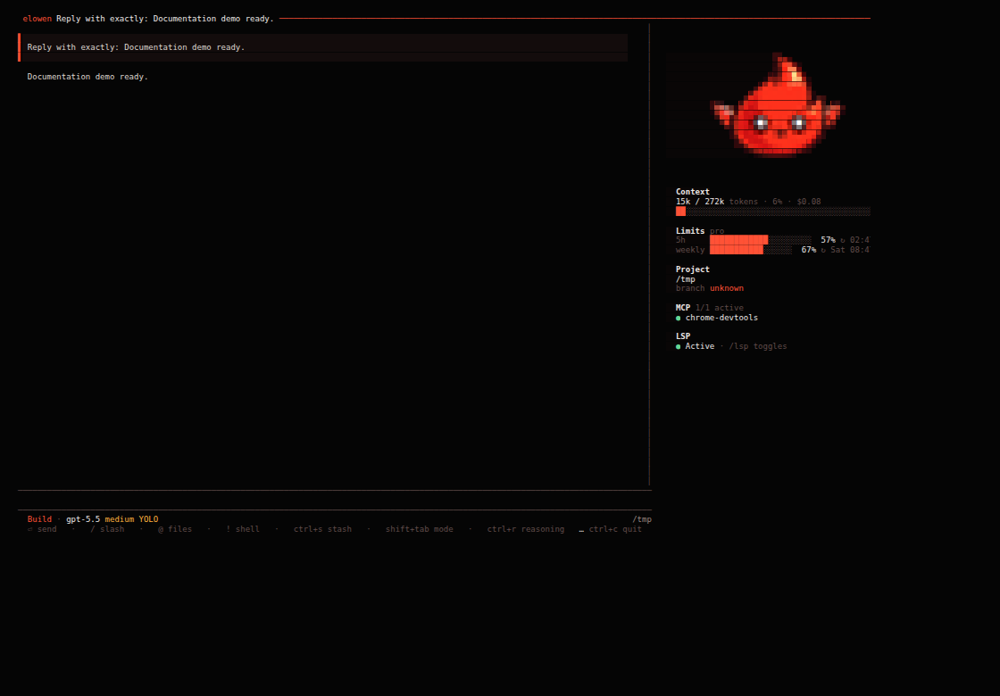
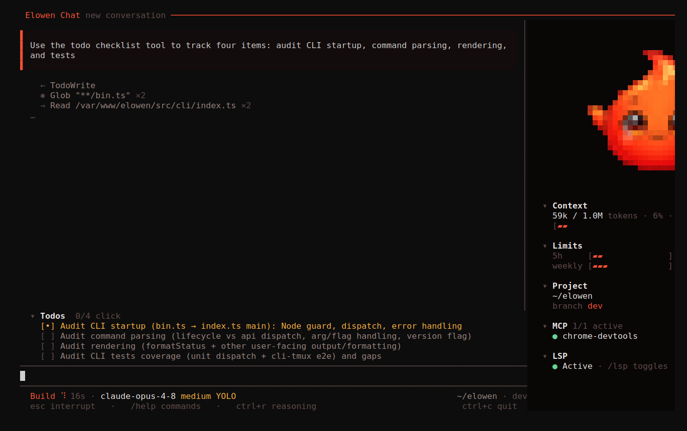
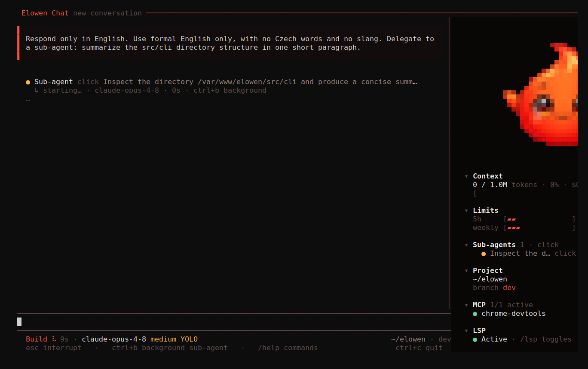

# CLI

`elowen` is the terminal home for the same agent you use in the Web UI. A bare command in an interactive terminal opens chat; the CLI also exposes setup, service control, non-interactive runs, task helpers, and a deliberately small agent-facing control interface.



## Everyday commands

```bash
elowen                       # open terminal chat
elowen setup                 # local onboarding wizard
elowen doctor                # diagnose readiness
elowen chat --new            # start a fresh conversation
elowen run "explain this diff"
elowen -p "/status"         # non-interactive slash command
elowen status                # daemon and Web UI health
```

`elowen setup` configures a local account, project, provider, optional memory embeddings, and optional language-server support. `elowen install` is the separate shared-server provisioning flow; run `elowen install --help` before using it.

## Chat

The terminal chat streams assistant text, tool calls, diffs, approvals, todos, and sub-agent state. Its telemetry rail shows the current conversation's model, context, project, branch, language-server state, usage, and—when the provider exposes them—subscription limits. This is live state from the daemon, not a terminal-only copy.

- Use **`@`** to attach a file through the picker. Text is attached as context; supported images remain image attachments.
- Use **`@clipboard`** to attach supported clipboard content.
- Start a line with **`!`** to run a local shell command. Its output is shown and made available to the next prompt.
- Use **`Esc`** to deny a pending approval; it does not silently abort the whole conversation.
- Use **`/model`**, **`/theme`**, and **`/keybinds`** for the corresponding pickers and preferences.

The exact command menu is served by the daemon, so built-in and plugin commands remain aligned across surfaces. Type `/` in chat to browse it.

## Conversations, context, and limits

The terminal is session-bound: it resolves a conversation and keeps using that session rather than moving another surface's active conversation. You can list or resume sessions in non-interactive mode:

```bash
elowen run --list
elowen run --resume <session-id> "continue"
elowen run --new "start a clean investigation"
```

If you send a message while a turn is running, Elowen stores it in that session's durable queue and delivers it after the current turn settles. `/compact` compacts older history when needed, retaining a summary and the useful tail. Context, output, goal, and channel limits are controlled by the instance owner in **Settings → Elowen AI**.

## Modes and permissions

**Plan mode** (`/plan` or the chat control) hides mutating tools while the agent works out an approach. When a plan is ready, choose whether to implement it or keep refining it. This is a real policy boundary, not just a visual label.

Approvals remain explicit for actions the policy requires. `/yolo` can enable session-level auto-approval where the account permits it, but deny rules and hard safety boundaries still apply. Use it only when you understand the scope of the current session.

## Goals and sub-agents

`/goal` gives a conversation a persistent objective so it can continue through multiple turns until it completes, pauses, or needs help. The daemon applies the configured turn budget and hard ceiling to prevent an unattended loop from running indefinitely.

The sub-agent plugin can delegate a focused, bounded task. The parent transcript shows a live child row; open it to review the child conversation or steer it directly. Delegation inherits the caller's allowed scope rather than granting a broader set of tools.





## Non-interactive runs

Use `elowen run` in scripts, CI, or another agent:

```bash
elowen run "summarize the failing tests"
elowen run --json "review the task queue"
elowen run --mode plan "propose a migration"
elowen run --goal "finish the documented cleanup" --max-turns 12
```

`--json` emits JSONL events for a machine consumer. `--timeout` bounds the client wait. A slash prompt is passed through to the server command system, for example `elowen -p "/compact"`.

## Task and operator helpers

```bash
elowen ls
elowen ready
elowen sessions
elowen send <session> "please show the failing command"
elowen close <task-id> --outcome ok --summary "verified"
```

Running workers also receive a narrow, authenticated control surface through environment variables. `elowen help`, `elowen ask`, `elowen note`, `elowen plan submit`, and `elowen overseer` are intended for those workers and mission roles; they are not a replacement for the normal user workflow.

## Service lifecycle

```bash
elowen up
elowen down
elowen status
elowen update
```

API-backed commands can start a local daemon when necessary; lifecycle commands manage services explicitly. See [Configuration](configuration) for environment variables and [Architecture](architecture) for the process boundary.

[Next: Brain & Chat](brain-chat)
