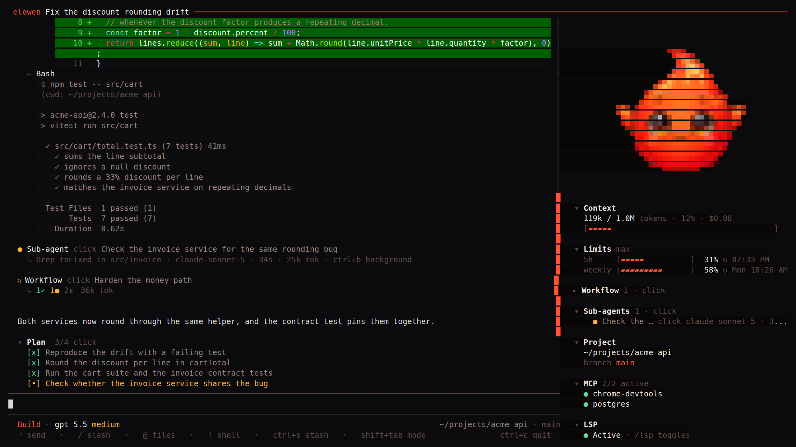
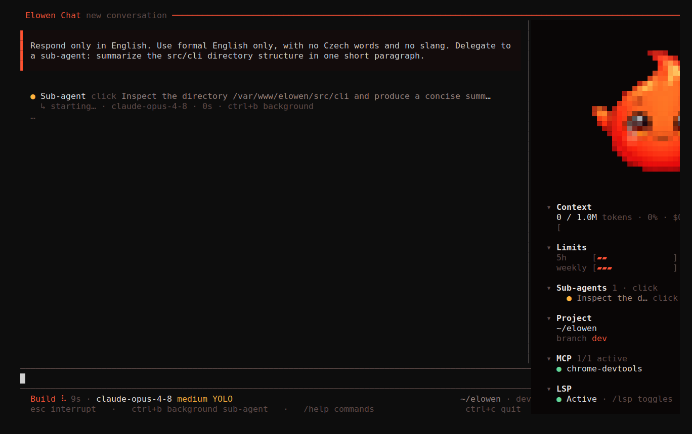

# CLI

The `elowen` command opens Elowen in an interactive terminal chat or runs a single non-interactive turn. It talks to the same daemon and conversation system as the Web UI and supported chat channels.

## Start the CLI

```bash
elowen                         # open a fresh interactive conversation
elowen chat                    # same as above
elowen chat -c                 # continue this directory's last conversation
elowen chat --session <id>     # open a specific conversation
elowen login                   # sign in and cache a CLI token
elowen setup                   # configure a local installation
elowen doctor                  # check readiness
```

Interactive chat requires a TTY. A bare `elowen` command opens chat only from a TTY; otherwise it prints help. The first interactive login asks for the Elowen username and password. A cached token is stored at `$HOME/.config/elowen/cli.json` with restrictive file permissions.

`elowen setup` is the local onboarding wizard for an account, project, AI provider, optional memory embeddings, and optional language-server support. `elowen install` is the separate shared-server provisioning flow; use `elowen install --help` before running it.

## Interactive chat

The chat TUI streams assistant text, tool activity, diffs, approvals, questions, todos, and delegated work. Type `/` to open the command menu; it is supplied by the daemon and filtered to the commands available in the current session.

The input also supports these local features:

- **`!command`** runs a shell command in the CLI's current working directory. Its output is shown in the transcript and is supplied as context to the next prompt; it is not sent as the user's message.
- **`@path`** attaches a file from the current working directory. Text files are added as context; PNG, JPEG, GIF, and WebP files are sent as images.
- **`@clipboard`** or **`/paste`** attaches an image from the system clipboard.
- Text attachments are limited to `256 KiB`; images are approximately limited to `5 MB`, with at most four images per message.
- **`/cd [path]`** shows or changes the CLI working directory. It affects later prompts, shell commands, attachments, exports, and local history, but it does not expand the daemon's project permissions.
- **`/editor`** opens `$VISUAL` or `$EDITOR` for the current draft. A non-zero editor exit keeps the original draft.



### Queue and interrupt

Only one turn runs in a conversation at a time. A message sent while the agent is working is queued and survives a daemon restart.

- Press **`↑`** with an empty input to recall prompt history. With queued messages, it recalls the last queued message for editing.
- Press **`Esc`** with a non-empty queue to inject the queued message immediately.
- Press **`leader x`** (default `Ctrl+X`, then `x`) to remove the last queued message.
- Press **`Esc`** while the agent is thinking to arm the interrupt. Press it again within the default `1.8 seconds` to abort the turn. A further escalation can kill a pinned foreground command.
- **`Ctrl+B`** moves foreground delegated work, workflows, or shell commands into the background without cancelling them. Their results return asynchronously.

See [CLI Keybinds](cli-keybinds) for configurable shortcuts and their defaults.

### Sub-agents and workflows

A delegated sub-agent has its own conversation and scoped tools. Press **`Ctrl+O`** by default to cycle between the parent conversation and its child sessions. While viewing a child, plain text steers that child; slash commands act on the parent.

Workflow mode runs a directed acyclic graph (DAG) of fresh sub-agents. Independent nodes run in parallel, and dependent nodes wait for their prerequisites. A workflow cannot exceed the permissions of the account that started it.



## Modes and permissions

Use `/plan`, `/build`, and `/workflow`, or press the mode-toggle shortcut, to choose how the next turn should be handled:

- **Build** is the default and lets the agent implement the task.
- **Plan** asks the agent to work out an approach before implementation. The full tool catalogue remains advertised for prompt-cache stability; execution policy rejects disallowed mutations, and `Write`/`Edit` are limited to the conversation's plan file. Plan-mode shell rules are non-destructive guidance, not a filesystem sandbox.
- **Workflow** asks the agent to orchestrate the request as a DAG of sub-agents. It is a prompt preference, not an additional permission boundary.

The mode is local to the CLI or Web chat session and is included with subsequent messages. It is not a channel mode.

`/yolo` can enable session-level automatic approval where the account permits it. It never overrides deny rules or hard safety boundaries.

## Conversations and context

A CLI session stays bound to the selected conversation. Use the slash commands or non-interactive flags to switch conversations:

```bash
elowen run --list
elowen run --resume <session-id> "continue"
elowen run --new "start a clean investigation"
```

Use `/compact` to summarize older history and free context. The daemon's configured context, output, goal, and channel limits apply to the CLI as well.

`/stats` opens session information, usage, model totals, and context breakdowns. The separate `/context` command in the CLI opens the same overlay directly on the context breakdown.

## Non-interactive runs

Use `elowen run` or its `-p`/`--print` aliases in scripts and CI:

```bash
elowen run "summarize the failing tests"
elowen -p "review this diff"
elowen run --json "inspect the project"
elowen run --mode plan "propose a migration"
elowen run --goal "finish the cleanup" --max-turns 12
```

Important options:

- `--model <id>` and `--provider <id>` select the model for this run.
- `-c`/`--continue` continues the active conversation (the default); `--resume <id>` selects one; `--new` starts fresh.
- `--mode plan|build|workflow` selects the mode. `--plan` is a shorthand for `--mode plan`.
- `--goal <text>` starts a persistent goal; `--max-turns <N>` sets its turn budget.
- `--list` lists conversations and exits.
- `--json` emits JSONL events. `--verbose` writes steps, tools, and usage to stderr.
- `--timeout <seconds>` sets the client timeout; the default is `600` seconds.

A prompt beginning with `/` runs a slash command, for example `elowen -p "/compact"` or `elowen -p "/goal pause"`. Headless runs cannot answer interactive questions; they report that input is needed and exit instead.

## API access

The generic API helper sends an authenticated request to the daemon:

```bash
elowen api GET /projects
elowen api GET /brain/status
elowen api POST /some/route '{"key":"value"}'
```

The request body must be valid JSON. Use routes available to the current account.

## Service lifecycle

```bash
elowen up
elowen down              # graceful stop; waits for running turns
elowen down --force      # stop immediately
elowen status
elowen update
```

`status` reports daemon and Web UI state. `down` waits for active turns and delegated work unless `--force` is supplied. `update` checks for a newer npm release and restarts the local installation in place.

## Local files and environment

The default CLI state directory is `$HOME/.config/elowen`:

- `cli.json` — cached CLI authentication token.
- `cli-prefs.json` — terminal theme, Thought-row visibility, mascot visibility, keybindings, and locale.
- `cli-history.json` — per-project prompt history; the default depth is `100` entries.
- `cli-mentions.json` — per-project file-mention frecency data.
- `plans/<slug>.md` — active conversation plans.

`ELOWEN_DB` overrides the database path. `ELOWEN_LOG_DIR` overrides the log directory. `ELOWEN_URL` selects the daemon URL for API-backed CLI commands, and `ELOWEN_TOKEN` supplies a token without using the cache.

[Next: Slash Commands](slash-commands)
