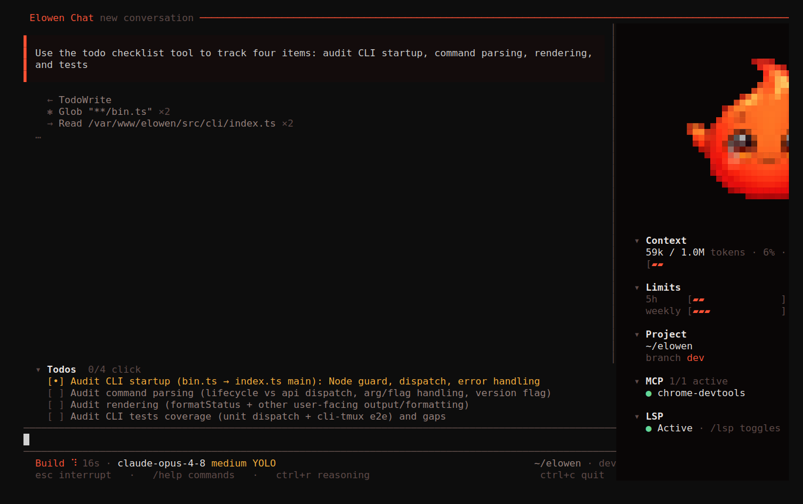
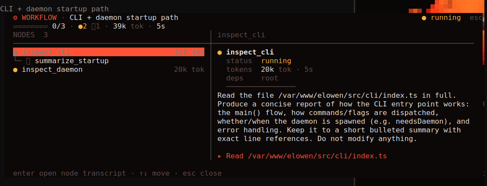

# CLI

`elowen` is the terminal home for the same agent you use in the Web UI. A bare command in an interactive terminal opens chat; the CLI also exposes setup, service control, non-interactive runs, task helpers, and a deliberately small agent-facing control interface.


## Everyday commands

```bash
elowen                       # open terminal chat (always a fresh conversation)
elowen setup                 # local onboarding wizard
elowen doctor                # diagnose readiness
elowen chat -c               # resume this directory's last conversation instead
elowen chat --session <id>   # reopen a specific conversation
elowen run "explain this diff"
elowen -p "/status"         # non-interactive slash command
elowen status                # daemon and Web UI health
```

`elowen setup` configures a local account, project, provider, optional memory embeddings, and optional language-server support. `elowen install` is the separate shared-server provisioning flow; run `elowen install --help` before using it. `elowen uninstall` removes what an install created: the systemd units (or launchd agents on macOS), the sudoers drop-in, the reverse-proxy vhost, the service user, and the install record — but only what the install record proves the install created, and never your data (`~/.config/elowen`: database, logs, config) unless you pass `--purge`. It stops the services before removing them, asks for confirmation by default, and prints the exact manual commands for any step it cannot complete; `--dry-run` previews the plan without touching anything.

## Chat

The terminal chat streams assistant text, tool calls, diffs, approvals, todos, and sub-agent state. Diffs and Markdown code fences are syntax-highlighted — token colors are composited over the add/delete/context rows using the edited file's language — so a small edit inside a long changed line stays visible. Its telemetry rail shows the current conversation's model, context, project, branch, language-server state, and usage. For any connected OAuth subscription account — ChatGPT, Claude, or Kimi — it also surfaces that provider's subscription usage windows (a 5-hour window plus weekly ones, whatever windows the provider reports), keyed to the active model's provider; a cached reading is marked when it is no longer fresh. This is live state from the daemon, not a terminal-only copy.

The exact command menu is served by the daemon, so built-in and plugin commands remain aligned across surfaces. Type `/` in chat to browse it, and see [Slash Commands](slash-commands) for the full reference. Common ones:

- Start a line with **`!`** to run a local shell command. Its output is shown and made available to the next prompt.
- Use **`/cd [path]`** to show or change the CLI working directory. It affects later prompts, `!` commands, attachments, exports, and local history; it never widens the daemon's project permissions.
- Use **`/tools`** to inspect the currently available plugin tools, their owner, description, and input schema. It is an inspector, not a plugin-management screen.
- Use **`/fast`** with a ChatGPT/OpenAI OAuth model to toggle priority processing for this conversation when that model supports it.
- Use **`/model`**, **`/theme`**, and **[`/keybinds`](cli-keybinds)** for the corresponding pickers and preferences.
- Use **`/statusline`** for a checkbox overlay (like `/keybinds`) that picks which segments the status bar shows — context usage, total tokens, and cost. It edits the shared statusline config, so the choice also applies to the web chat dock.
- Use **`/stats`** for an overlay with generation speed, cache hit rate, and the input/output token split. Press **⇄** to switch sections. The web chat opens the same data as a modal.

While Elowen is working, the CLI shows live activity and elapsed time. A tool call that takes longer to compose shows a localized action label describing what the tool is doing. **`Ctrl+B`** moves a running foreground sub-agent, workflow, or `Bash` command into the background without cancelling it; its result returns to the conversation when it completes.

### Mouse support

The chat is fully usable with a mouse when your terminal reports it:

- **Scroll wheel** scrolls the transcript history.
- **Click** expands or collapses Thought rows, tool outputs, and diffs; click a sub-agent row to open it, or a workflow row to open the DAG modal.
- **Click a rail section header** to collapse or expand that section of the telemetry rail.
- **Click a process ✕** in the rail to kill that background process.
- **Drag the rail edge** to resize it between 36 and 68 columns.
- **Drag-select transcript text** to copy it to the clipboard (OSC 52); a `Copied N lines` notice confirms it.

### Prompt history and stash

Press **`↑`** with an empty input to walk back through previous prompts. History is per-project and keeps the last 100 entries; a half-typed draft is remembered and restored when you walk back down to the bottom.

**`Ctrl+S`** stashes the current draft onto a LIFO stack (up to 10, session-local). Press **`Ctrl+S`** with an empty input to pop the most recent stash back into the input.

### Editing and attachments

- **`/editor`** composes the prompt in `$VISUAL`/`$EDITOR`. The TUI suspends while the editor runs; saving replaces the draft, and a non-zero exit keeps the draft untouched.
- **`/paste`** attaches a clipboard image.
- **`@clipboard`** attaches supported clipboard content at send time.
- **`@path/to/image.png`** attaches an image file directly (max ~5 MB, up to 4 per message). For other files, **`@`** opens the picker — text is attached as context, supported images stay image attachments.

Pending attachments appear as chips above the input; **`Esc`** drops them.

### Queue and interrupt

Sending a message while the agent is working queues it for delivery after the current turn settles:

- **`↑`** with an empty input recalls the last queued message for editing. The server reconciles — if it was already delivered, it tells you so.
- **leader `x`** drops the last queued message.
- **`Esc`** while the agent is thinking arms a 1.8-second window; a second **`Esc`** within it aborts the turn, and a third hard-kills a pinned foreground command. The abort is acknowledged immediately — the notice reads "stopping…" rather than waiting for the streamed turn to visibly end. A fast double-`Esc` that the terminal delivers as a single chunk still counts as two presses, so the stop works no matter how quickly you type it.
- **`Esc`** with a non-empty queue injects the queued message immediately instead of waiting for the turn to settle.

### Sub-agent interaction

**`Ctrl+O`** cycles focus from the main conversation through each running child sub-agent and back. While you are viewing a child, plain text you send goes directly to that sub-agent, so you can steer it without leaving the parent. The telemetry rail and todo checklist follow the agent you are looking at — drill into a child and you see that sub-agent's own checklist and context, not the parent's. **`Esc`** returns focus to the parent.

## Conversations, context, and limits

The terminal is session-bound: it resolves a conversation and keeps using that session rather than moving another surface's active conversation. You can list or resume sessions in non-interactive mode:

```bash
elowen run --list
elowen run --resume <session-id> "continue"
elowen run --new "start a clean investigation"
```

The message queue is durable per session, and the same recall works in the web chat dock. `/compact` compacts older history when needed, retaining a summary and the useful tail. Context, output, goal, and channel limits are controlled by the instance owner in **Settings → Elowen AI**.

### Background commands

`Bash(background: true)` starts a command as a tracked background process and returns its ID. The agent can inspect it with `ListProcesses`, collect output with `ProcessOutput`, or stop it with `KillProcess`. `ProcessOutput(block: true)` waits for a bounded period instead of polling. A foreground `Bash` command can also be detached with **`Ctrl+B`** from the terminal chat — the same chord that backgrounds a running sub-agent or workflow; it keeps running without the foreground timeout and reports its completion asynchronously.

## Modes and permissions

The chat control (`shift+tab`) cycles three working modes, and each slash command selects one directly.

**Build** is the default: the agent works the task itself, in one thread.

**Plan mode** (`/plan`) hides mutating tools while the agent works out an approach. When the agent produces a plan, a decision modal opens: **Implement plan** switches the conversation to build mode and starts the work, or **Cancel** keeps refining in plan mode. This is a real policy boundary, not just a visual label.

**Workflow mode** (`/workflow`) asks the agent to orchestrate rather than execute: decompose the request into a DAG of self-contained sub-tasks and run it, so independent work happens in parallel and each step gets a fresh, focused sub-agent. Unlike Plan mode this is a prompt bias, not a policy boundary — the agent keeps its full toolset and still does a trivial request directly rather than wrapping it in a workflow. It does not ask before running; the plan is the workflow.

Switching mode mid-conversation is recorded in the transcript, and the agent is told what changed, so it adopts the new mode on its next turn instead of carrying on as before.

### Approvals and questions

When the policy requires approval, the ask renders as a numbered dock:

| Key | Action |
| --- | --- |
| `1` | Allow once |
| `2` | Always allow |
| `3` | Deny |
| `Esc` | Deny (the turn continues) |

When the agent needs an answer rather than a permission, a content question renders as a checklist dock: **Space** toggles options, **Enter** submits, and wide terminals get a preview pane beside the list.

`/yolo` can enable session-level auto-approval where the account permits it, but deny rules and hard safety boundaries still apply. Use it only when you understand the scope of the current session.

### Model picker extras

Inside `/model`, **`Ctrl+P`** opens provider management: add a provider from the presets or a custom OpenAI-compatible URL, paste the API key, and choose the wire API — without leaving the chat.

## Goals and sub-agents

`/goal` gives a conversation a persistent objective so it can continue through multiple turns until it completes, pauses, or needs help. The daemon applies the configured turn budget and hard ceiling to prevent an unattended loop from running indefinitely.

The sub-agent plugin can delegate a focused, bounded task. The parent transcript shows a live child row; open it to review the child conversation or steer it directly (see Sub-agent interaction above). Delegation inherits the caller's allowed scope rather than granting a broader set of tools.




## Workflows

A workflow is a DAG of sub-agents. The agent declares nodes — each a self-contained task with its dependencies — and the engine runs them as those dependencies clear: independent nodes in parallel, dependents waiting for what they need. Every node is a fresh sub-agent that cannot see the parent conversation, so each task is written to stand alone, and a running node can extend the DAG when the work reveals more work.

Use a workflow when subtasks have an order or a shared result (gather → analyze → write); for a handful of unrelated tasks, plain parallel delegation is simpler. Nodes inherit the caller's allowed scope and can only ever narrow it — a workflow cannot reach past what the person who started it may already do.

The transcript carries a marker with a live tally of node states, and the telemetry rail lists workflows while they run. Clicking either opens the workflow view — a spatial DAG canvas that lays nodes out as a directed graph rather than a flat list:



Nodes are positioned by their dependency edges; the detail panel beside the canvas belongs to the selected node — its status, model, tokens, elapsed time, dependencies, task, result or error, and the tool it is running right now. Aborting the parent turn (Esc / Ctrl+C) cancels the entire running workflow rather than letting orphaned nodes continue.

| Key | Action |
| --- | --- |
| `↑` `↓` | Move through the tree |
| `PgUp` `PgDn` | Page through a long DAG |
| `Enter` | Open the selected node's transcript |
| `Esc` | Close |

The marker stays in the transcript after the workflow ends, so a finished DAG can be reopened and read later — including its nodes' transcripts. A workflow interrupted by a daemon restart is recorded as cancelled rather than left looking like it is still running.

## Start screen and footer

A fresh conversation opens on a welcome screen: the mascot and wordmark, a few hint lines, the current project and branch, and the version. Once the conversation has content, the footer takes over — its hints adapt to the state (idle, thinking, or viewing a child sub-agent) and to the terminal width, so narrow windows keep the most useful keys.

## Non-interactive runs

Use `elowen run` in scripts, CI, or another agent:

```bash
elowen run "summarize the failing tests"
elowen run --json "review the task queue"
elowen run --mode plan "propose a migration"
elowen run --goal "finish the documented cleanup" --max-turns 12
```

`--json` emits JSONL events for a machine consumer. `--timeout` bounds the client wait. A slash prompt is passed through to the server command system, for example `elowen -p "/compact"`.

## API helper

`elowen api METHOD /path [json]` sends an authenticated request to the daemon. Use current core or enabled-plugin routes; for example:

```bash
elowen api GET /projects
elowen api GET /brain/status
```

## Service lifecycle

```bash
elowen up
elowen down            # graceful: waits for running turns to finish, then stops
elowen down --force    # stop immediately, abandoning in-flight work
elowen status
elowen update
```

API-backed commands can start a local daemon when necessary; lifecycle commands manage services explicitly. `elowen down` sends the daemon a graceful stop: it finishes running turns and sub-agents first, so a restart or deploy does not discard in-flight work; undelivered delegated results get a ten-second window and are otherwise left to the durable outbox, which delivers them after the restart. `--force` skips the wait entirely. `status` and `down` only ever signal a process whose identity is verified as an elowen service (its entry script and the `ELOWEN_SERVICE` environment marker) — a live process that merely reused a pid is never touched. See [Configuration](configuration) for environment variables and [Production & Updates](production-updates) for the service layout.

[Next: Slash Commands](slash-commands)
