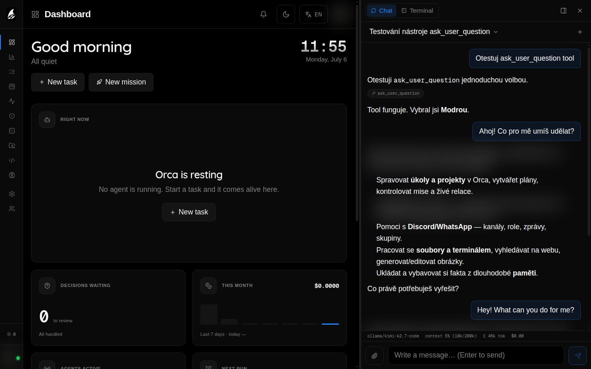

# Brain & Chat

The brain is Elowen's embedded, in-process agent runtime. It is what you talk to in the terminal, Web UI, and supported chat platforms. Tasks may use a separate coding CLI in tmux, but a brain conversation is a server-side agent session with its own history, tools, policy, model choice, and live event stream.

## One conversation model across surfaces

The Web UI chat dock, terminal chat, Discord, and WhatsApp all call the same daemon service. They differ only in how they identify and present a conversation:

- **The Web UI** follows the user's active conversation and exposes chat alongside the current workspace.
- **The CLI** binds to a resolved session, so using a second terminal does not unexpectedly move another surface.
- **Platform adapters** maintain channel-scoped conversations and apply the mapped user's project, tool, model, and role policy.

Every conversation is checked against the authenticated user's access at the daemon. A UI control cannot grant a model, project, or tool that the server has not allowed.

## Turns that stay coherent

Only one turn runs in a conversation at a time. If you send a message while the agent is working, it is accepted into a durable queue and delivered as a follow-up after the current turn. Queued items are visible to connected clients and survive a daemon restart.

Long conversations are managed in three complementary ways:

- **Compaction** summarizes older history while retaining the useful tail. The compaction marker and summary are persisted, so the saved tokens are not lost on a later reload.
- **Image pruning** strips historical image attachments from the model context once they are no longer in the active window, curbing token bloat without losing the surrounding text.
- **Idle rollover** can start a fresh session after a configured idle period, when continuing an old prompt cache would be wasteful. The previous conversation stays available to browse.
- **Limits** bound agent steps, tool-output previews, memory recall, goal turns, elicitation waits, and channel-session capacity. Instance owners configure these in **Settings → Elowen AI**.

## Models and reasoning

Elowen supports configured OpenAI-compatible and Anthropic providers, plus OAuth-backed **Claude**, **ChatGPT**, **GitHub Copilot**, and **Kimi** accounts. A provider's model catalog is used by the chat pickers and can also feed tasks and plugins that request a model field. OpenRouter's zero-cost `:free` catalog variants are filtered out at the source, so every listed model has metered, reported pricing.

Select a model for the current conversation where your surface provides a picker. Reasoning options are shown only when the chosen model exposes them. ChatGPT OAuth models can additionally use priority processing through `/fast` in the CLI when the selected model supports it. The daemon preserves provider credentials and returns only safe configuration metadata to the Web UI.

Connected **ChatGPT**, **Claude**, and **Kimi** accounts expose their subscription usage limits, which Elowen polls and maps into shared 5-hour and weekly windows. In **Settings → Elowen AI**, each connected OAuth account row carries a slim per-account subscription usage bar. It is reported independently of the active model and colored by pressure: accent normally, warning at about 70%, then danger at about 90%.

Use the provider connection flow in **Settings → Elowen AI**. It can test a configured provider before you rely on it for normal chat or automation. In the same connected-accounts list, an unused, disconnected OAuth account type can be hidden and later restored from a **+** menu. This is a display filter only — credentials and provider entries are untouched, and a type that is actually connected is never hidden.

## Context is assembled per turn

Elowen builds a normal turn from the user's message plus the current policy, selected tools, relevant memory, skills, and plugin contributions. Dynamic context is sampled for the current turn only, so time-sensitive information does not become a stale system prompt or a stored user message.

Plugins may request their dynamic context before or after the user's text. Both placements are explicitly framed as ephemeral context, are not persisted in the transcript, and are skipped for raw plugin prompt commands. This lets a plugin add live facts such as the current date or runtime state while preserving the user's original message and conversation history.

## Memory

Memory is per user and durable. Before a turn, Elowen retrieves a small, relevant set of memories; semantic retrieval is used when an embedding model is configured, otherwise it falls back to keyword retrieval. Retrieved text is framed as context rather than executable instruction.

After an owner exchange, optional curation can extract durable facts in a capped background operation. You can inspect, create, edit, categorize, merge, restore, or purge memories in the [Memory workspace](web-ui#memory).

Configure embeddings and categorization in **Settings → Memory**. An API-key or OpenAI-compatible Elowen AI provider can be reused without storing a duplicate key. OAuth-only accounts do not expose an embedding endpoint, so semantic memory needs a supported embedding provider; without one, recall remains available through keyword matching.

## Tools, approvals, and output

Tools come from the core and enabled plugins. Per-user policy narrows the visible and executable tool set, and execution-time checks remain authoritative. A tool's successful output is hidden unless its built-in or plugin declaration explicitly opts into transcript display; failures and important annotations remain visible.

Approval questions are part of the conversation lifecycle. Depending on your account and the operation, the agent can wait for a decision, an overseer can handle a routine mission decision, or the work is escalated to a human. See [Agents & Autonomy](agents-autonomy) for the autonomy model.

[Next: Plugins](plugins)
