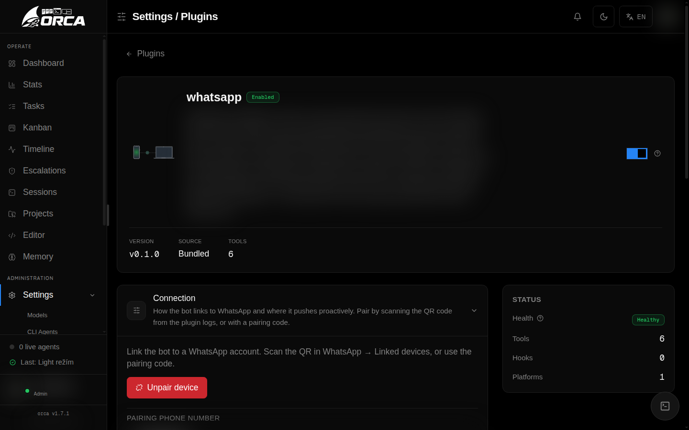

# Plugins

Orca is a personal AI agent you chat with — and almost everything that agent can
*do* arrives as a plugin. Chat platforms, tools, skills, memory, automation,
security checks, even the little status line under the chat: each is a
self-contained module you can add or remove. Orca is modular to the core.

That is the third pillar in practice. The agent's capabilities are not baked in;
they are composed. You decide which platforms it answers on, which tools it may
call, and which extras it loads — and you can change your mind without touching
the codebase.


## Everything is a plugin

Plugins register their capabilities with the brain (the embedded agent core you
talk to — see [Brain & Chat](brain-chat)) at runtime. In the web UI they are
grouped by category so you can see, at a glance, what your agent is made of:

| Category | What it adds |
|----------|--------------|
| **platforms** | Chat surfaces the agent lives on (Discord, WhatsApp) |
| **tools** | Actions the agent can take (files, terminal, mcp, subagent, askuser) |
| **memory** | Long-term recall of events and facts |
| **automation** | Scheduled and recurring work (cronjob) |
| **ui** | Chat surface extras (statusline, runtime-context) |
| **security** | Advisory safety checks (security-scan) |
| **development** | Authoring capabilities (skills) |

Manage them all in **Settings → Plugins**. Every plugin has a toggle, its own
config form, and — for the ones you installed yourself — an uninstall button.

## The marketplace

Bundled plugins ship with Orca, but you are not limited to them. Orca includes a
**plugin marketplace**: a curated registry you browse from **Settings →
Plugins** to install, update, and uninstall extra plugins.

- **Browse** — the catalog lists each plugin with its name, category, a short
  description, and how much it *provides* (counts of tools, skills, and
  platforms), so you know what you're adding before you add it.
- **Install** — one click pulls the plugin into your user plugins and loads it
  live.
- **Update** — when a newer version is published, the entry shows
  *update available*; updating swaps it in place.
- **Uninstall** — removable plugins can be removed again from the same screen.

Bundled plugins are marked as such and can't be uninstalled — the marketplace
only offers install/update on plugins it owns, never on the built-ins. Installs
are allowed only for names the registry publishes, so the trust surface is
simply "do you trust this registry", the same posture as the Orca package
itself. If the registry can't be reached (offline, for example), the UI tells
you the marketplace is unavailable rather than pretending the catalog is empty.

## Plugin anatomy

A plugin is a directory with a manifest and an ESM entry point:

```
plugins/<name>/
├── orca-plugin.json    # name, version, apiVersion, entry, provides, configSchema
└── index.mjs           # exports register(ctx) — ESM only
```

### Manifest fields

| Field | Required | Description |
|-------|----------|-------------|
| `name` | ✓ | Plugin identifier (kebab-case) |
| `version` | ✓ | Semver, used for update detection |
| `apiVersion` | ✓ | Plugin API version (`1`) |
| `entry` | ✓ | Entrypoint relative path (e.g. `index.mjs`) |
| `provides.tools` | | Tool names this plugin registers |
| `provides.platforms` | | Platform names this plugin acts as |
| `provides.skills` | | Skill identifiers |
| `configSchema` | | Field schema that renders the settings form |
| `requires.config` | | Config fields required before the plugin activates |

## Registry API (`ctx`)

The `register(ctx)` function receives a context object — the plugin's entire
contract with the agent:

| Method | Purpose |
|--------|---------|
| `ctx.registerTool(tool)` | Add a tool to the brain's toolset |
| `ctx.registerPlatform(platform)` | Add a chat platform adapter |
| `ctx.registerSkill(skill)` | Register an inline skill |
| `ctx.registerTurnContext(fn)` | Inject per-turn context |
| `ctx.dataDir()` | Writable per-plugin data directory |
| `ctx.config` | Current config values |
| `ctx.logger` | Plugin-scoped logger |
| `ctx.isAdminSession()` | Is the current user an admin? |
| `ctx.assertPathAllowed(path)` | Security path guard for file access |

## Hot-reload

You don't restart the daemon to reconfigure your agent. Enabling, disabling, or
saving a plugin's config triggers a **hot-reload** — the change applies to
running conversations immediately. This keeps the second pillar honest: changing
what the agent can do is low-friction and low-risk.

## Platforms: Discord & WhatsApp

Platform plugins are where you actually meet the agent. You write; it answers
from Orca AI, streams its work, and pushes to you proactively.

### Discord


A full Discord bot (no external client library — it uses Node's native
WebSocket and fetch against the v10 Gateway). Mention it in a configured channel
and it responds.

- Slash commands: `/model`, `/new`, `/help`
- Per-channel model picker (operator-gated)
- Streamed replies with a live todo checklist and tool-call trace
- Status reactions (👀 → ✅ / ❌)
- Image attachments → vision input; voice messages → transcription + TTS replies
- Proactive cron/tick pushes into a channel
- A large **server toolset** for admin sessions — channels, roles, members,
  threads, pins, and messages

Each Discord role maps to a set of allowed Orca projects and a role prompt, so
who can reach which project is policy, not luck. Members with no mapped role are
silently ignored. Configure in **Settings → Plugins → discord**.

### WhatsApp



Talk to Orca from WhatsApp, powered by Baileys. Write a message and it answers
from Orca AI.

- Text commands: `/model`, `/new`, `/help`
- Per-chat model menu — a numbered list you reply to with a number
- Edit-in-place streaming replies with the agent's tool trace
- Status reactions and a small runtime footer
- Proactive pushes (cron/tick results, escalations, restart notices) to a chat
  you nominate
- **Group tools** for admin sessions — list and inspect groups, create groups,
  add/remove members, and send to any chat

Each sender — a phone number, a JID, or a whole group — maps to allowed projects
and a role prompt, and a policy can further restrict which tools the bot may use
for it. Pair the bot by scanning a **QR code** from the plugin logs, or set a
`phoneNumber` to get an 8-character **pairing code** instead. Configure in
**Settings → Plugins → whatsapp**.

## Tools: files, terminal, mcp, subagent, askuser

Tools are the verbs of your agent. Which ones a given user's agent may call is
governed by RBAC — an admin can grant one user the terminal and files tools and
give another only chat, per user, via `disabled_tools`. See
[Account & Security](account-security).

### files

File-system access scoped to your Orca projects:

| Tool | Purpose |
|------|---------|
| `read_file` | Read file contents |
| `write_file` | Write or overwrite a file |
| `edit_file` | Targeted edit with a diff display |
| `list_dir` | List directory contents |

Every path is guard-checked against the user's allowed project roots — the agent
can't wander outside repos you gave it.

### terminal

Shell execution, scoped to the accessible repo:

| Tool | Purpose |
|------|---------|
| `run_command` | Run a foreground command (CWD = repo) |
| `list_processes` | List background processes |
| `read_process_output` | Read a background process's output |
| `kill_process` | Kill a background process |

Foreground commands show output inline; background processes persist across
turns. In shared-channel platforms (like Discord) these tools are owner-only.

### mcp

Bridge external **MCP servers** into the agent's toolset. Add servers in the
plugin config and choose a transport per server: **stdio** launches a local
process (e.g. `npx …`), while **HTTP** or **SSE** connect to a remote URL. stdio
servers run in their own process group and are cleaned up as a group on reload,
so child processes are never orphaned. Their tools appear alongside the built-in
ones.

### subagent

| Tool | Purpose |
|------|---------|
| `delegate` | Spawn a fresh, isolated sub-agent for a focused subtask |

The sub-agent inherits exactly the caller's access — never more — and returns
its result to the parent. Good for keeping a long task's context clean.

### askuser

| Tool | Purpose |
|------|---------|
| `ask_user_question` | Pose a multiple-choice question and wait for the answer |

When the agent needs a decision from you, it asks — offering predefined options
you pick in the chat (CLI/web) or via Discord buttons — and resumes the turn
with your choice.

## Automation: cronjob


Scheduled work for the agent (admin-only). Cron jobs are prompts that run as the
brain's *own* conversations — the agent wakes up, does the work, and reports.

**Schedule formats:**

| Pattern | Example | Recurring |
|---------|---------|-----------|
| Every N minutes | `every 30m` | ✓ |
| Every N hours | `every 2h` | ✓ |
| Daily at time | `daily 07:30` | ✓ |
| Weekly on day | `weekly mon 09:00` | ✓ |
| In N minutes | `in 15m` | One-shot |
| At time today | `at 18:30` | One-shot |

- **Active-hours window** — a guard like `5-21` or `22-5` (overnight wrap)
- **Per-job model override** — run a job on a different model than the default
- **Guard command** — a cheap shell gate that skips the LLM unless output matches
- **Silent replies** — a `NOTHING_TO_REPORT` result is suppressed, no noise
- **Target channel** — route results to a specific chat/thread

Configure in **Settings → Plugins → cronjob**.

## Security: security-scan

An advisory static scanner — the safety-conscious pillar in a small package.

| Tool | Purpose |
|------|---------|
| `scan_code` | Scan files for dangerous patterns |

It flags patterns like `eval`, `pickle.load`, `shell=True`, unpinned
deserialization, and hardcoded secrets, classifying findings as `danger` or
`warn`. It **reports** — it never executes anything.

## Development: skills

Loads Markdown **skills** from disk and exposes them to the agent so it can pull
in focused, reusable know-how on demand.

- **Bundled skills** ship with Orca and are read-only
- **User skills** are created with the `create_skill` tool or the Settings editor
- **Format** — Markdown with YAML frontmatter (`name`, `description`)
- **Hot-reload** — new or changed skills apply to new conversations immediately

Configure in **Settings → Plugins → skills**.

## UI: statusline & runtime-context

Small surface extras that keep the chat honest and grounded — the clarity
pillar.

**statusline** prints a footer under the chat with what you choose to show:

| Metric | Description |
|--------|-------------|
| Model | Current model name |
| Context | Context-window fill percentage |
| Tokens | Total tokens used this session |
| Cost | Running cost estimate |

**runtime-context** injects the current date, time, weekday, and timezone into
every turn, so the agent never guesses about "now". It's cache-safe — it rides
the user message, not the system prompt. Set the timezone in its config (default
`Europe/Prague`).

## Memory

Long-term memory — the agent remembering events and facts across conversations
— is a capability you configure under **Settings → Memory** (and the related
plugin controls). For how automatic recall, conscious save, and the "glass
brain" view work in a chat, see [Brain & Chat](brain-chat). For the settings
themselves, see [Configuration](configuration).

---

Which plugins your agent runs, and which of their tools each *user* may call, is
exactly the kind of thing Orca's RBAC lets you tune per person. To see the whole
agent from the outside — dashboards, sessions, and the Plugins screen — read
[Web UI](web-ui).

[Next: Projects & Workflow](projects-workflow)
