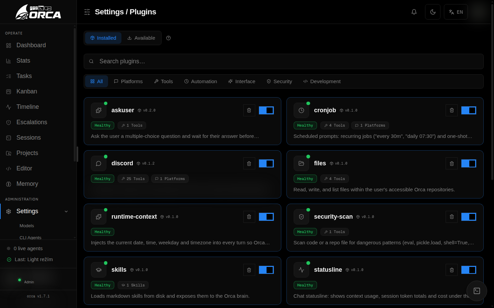
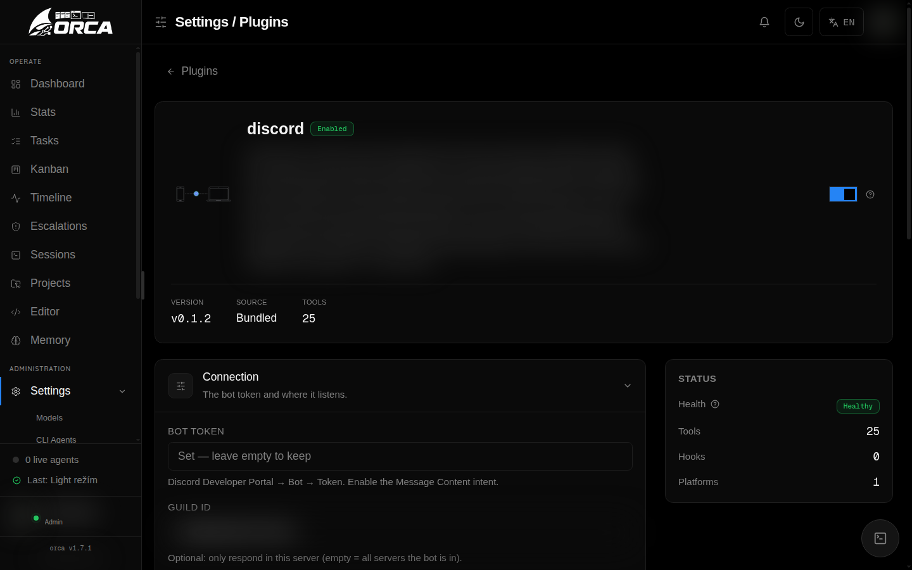
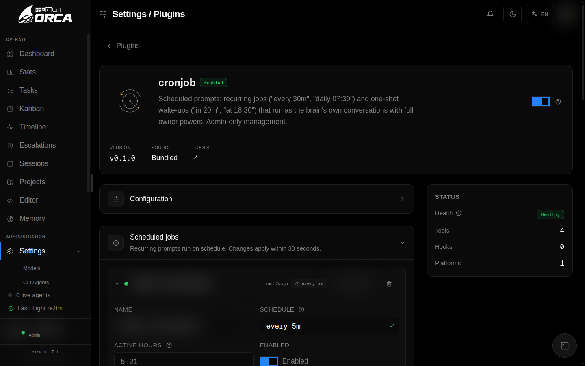

# Plugins

Plugins extend the brain with new tools, chat platforms, skills, and context
providers. They are self-contained ESM modules that register their capabilities
with the brain at runtime.



## Plugin system

Every plugin has a `orca-plugin.json` manifest and an entry point that exports
a `register(ctx)` function:

```
plugins/<name>/
├── orca-plugin.json    # name, version, apiVersion, entry, provides, configSchema
└── index.mjs           # exports register(ctx) — ESM only
```

### Manifest fields

| Field | Required | Description |
|-------|----------|-------------|
| `name` | ✓ | Plugin identifier (kebab-case) |
| `entry` | ✓ | Entrypoint relative path |
| `apiVersion` | ✓ | Plugin API version (`1`) |
| `provides.tools` | | Tool names this plugin registers |
| `provides.platforms` | | Platform names this plugin acts as |
| `provides.skills` | | Skill identifiers |
| `configSchema` | | JSON Schema for settings UI |
| `requires.config` | | Config fields required for activation |

### Registry API (`ctx`)

| Method | Purpose |
|--------|---------|
| `ctx.registerTool(tool)` | Add a tool to the brain's toolset |
| `ctx.registerPlatform(platform)` | Add a chat platform adapter |
| `ctx.registerSkill(skill)` | Register an inline skill |
| `ctx.registerTurnContext(fn)` | Inject per-turn context |
| `ctx.dataDir()` | Writable per-plugin data directory |
| `ctx.config` | Current config values |
| `ctx.logger` | Plugin-scoped logger |
| `ctx.isAdminSession()` | Current user is admin? |
| `ctx.assertPathAllowed(path)` | Security path guard |

### Hot-reload

Enabling, disabling, or saving a plugin's config triggers a hot-reload —
the change applies to running conversations immediately. No daemon restart
needed.

## Discord



A full Discord bot (no external dependencies — uses Node's native WebSocket
and fetch). Connects via the v10 Gateway API and responds to @mentions in
configured channels.

**Capabilities:**

- Slash commands: `/model`, `/thinking`, `/new`, `/help`
- Live streaming replies with tool-call trace
- Status reactions (👀 → ✅/❌)
- Image attachments → vision input (capped at 4 images / 5 MB)
- Generated-image uploads as real file attachments
- Voice message transcription (Whisper) + TTS replies
- Proactive cron/tick notifications to Discord
- Per-channel model picker (operator-gated)

**Role policies —** map Discord roles to Orca projects, system prompt
fragments, tool allow-lists, and admin flags. Members without a mapped role
are silently ignored.

Configure in **Settings → Plugins → discord**.

## Cron



Recurring or one-shot prompts for the brain. Persists in `jobs.json`; a
scheduler ticks every 30 seconds.

**Schedule formats:**

| Pattern | Example | Recurring |
|---------|---------|-----------|
| Every N minutes | `every 30m` | ✓ |
| Every N hours | `every 2h` | ✓ |
| Daily at time | `daily 07:30` | ✓ |
| Weekly on day | `weekly mon 09:00` | ✓ |
| In N minutes | `in 15m` | One-shot |
| At time today | `at 18:30` | One-shot |

**Features:**

- **Active-hours window** — guard like `5-21` or `22-5` (overnight wrap)
- **Per-job model override** — different model than the brain's default
- **Guard command** — cheap shell command gate: skip the LLM when output
  matches a pattern
- **Silent replies** — `NOTHING_TO_REPORT` → message is suppressed
- **Target channel** — route results to any Discord channel/thread

Configure in **Settings → Plugins → cronjob**.

## Skills

A bundled reference plugin that loads Markdown skills from disk and exposes
them to the brain.

- **Bundled skills** — ship with Orca, read-only
- **User skills** — created via `create_skill` tool or the Settings editor
- **Hot-reload** — new/changed skills apply to new conversations immediately
- **Format** — Markdown with YAML frontmatter (`name`, `description`)

Configure in **Settings → Plugins → skills**.

## Files

File system tools scoped to your Orca projects:

| Tool | Purpose |
|------|---------|
| `read_file` | Read file contents |
| `write_file` | Write or overwrite a file |
| `edit_file` | Targeted edits with diff display |
| `list_dir` | List directory contents |

All paths are guard-checked against the user's allowed project roots.

## Terminal

Shell command execution:

| Tool | Purpose |
|------|---------|
| `run_command` | Execute a foreground command (CWD = repo) |
| `list_processes` | List background processes |
| `read_process_output` | Read output of a background process |
| `kill_process` | Kill a background process |

Foreground commands show output inline; background processes persist across
turns. Owner-only in shared-channel platforms (Discord).

## Web

Web research tools:

| Tool | Purpose |
|------|---------|
| `web_search` | Search via Tavily API |
| `web_fetch` | Fetch a URL as readable text |

Features private IP guard (SSRF protection), DNS resolution check, and rate
limiting.

Requires a Tavily API key in Settings.

## Image generation

Generate images via the OpenAI Images API (default model `gpt-image-1`):

| Tool | Purpose |
|------|---------|
| `generate_image` | Create an image from a text prompt |

Generated images display inline in chat. Requires an OpenAI provider.

## Image editing

Edit existing images via text instructions:

| Tool | Purpose |
|------|---------|
| `edit_image` | Image-to-image edit |

Supports source images from repo paths or public URLs.

## Subagent

Delegate work to a fresh, isolated sub-agent:

| Tool | Purpose |
|------|---------|
| `delegate` | Spawn a sub-agent for a focused subtask |

The sub-agent inherits exactly the caller's access — never more. Returns the
result synchronously.

## Security scan

Static pattern scanner for dangerous code:

| Tool | Purpose |
|------|---------|
| `scan_code` | Scan files for dangerous patterns |

Detects: `eval`, `pickle.load`, `shell=True`, hardcoded secrets, dangerous
imports, and more (15+ rules with `danger`/`warn` classification). Advisory
only — never executes anything.

## Statusline

Chat footer showing runtime stats:

| Metric | Description |
|--------|-------------|
| Model | Current model name |
| Context | Context window fill percentage |
| Tokens | Total tokens used in this session |
| Cost | Running cost estimate |

Togglable in Settings.

## Runtime context

Injects current date, time, day of week, and timezone into every turn. Cache
safe — runs per turn, not in the system prompt.

Configure timezone in Settings (default: `Europe/Prague`).

[Next: Projects & Workflow](projects-workflow)
