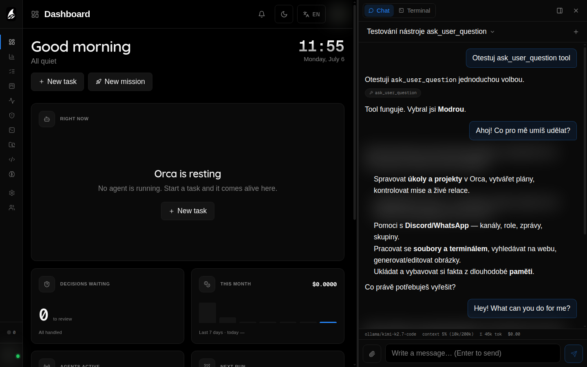
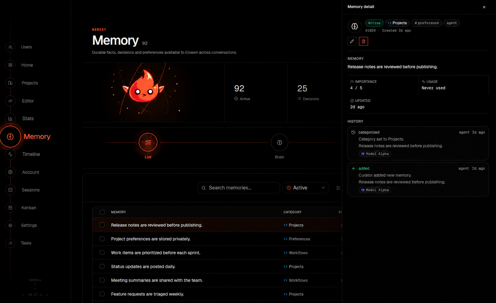

# Brain & Chat

Elowen's **Brain** is the embedded, server-side runtime behind chat. It keeps the conversation history, selected model, tools, permissions, memory context, and live output stream together for each conversation.

It is not a separate tmux coding agent. Terminal commands may use the terminal plugin, but the chat turn itself runs in the daemon and streams its response to the connected client.



## Where you can chat

The same Brain service powers:

- **Web chat** in the Elowen web interface.
- **CLI chat**, started with `elowen` or `elowen chat`.
- **Discord, Telegram, Microsoft Teams, and WhatsApp** channel conversations.

The interface changes, but the daemon remains authoritative. A client cannot grant itself a model, project, tool, or permission that the server has not allowed.

## Conversations and queued messages

Only one turn runs in a conversation at a time. If you send another message while Elowen is working, the daemon accepts it into the conversation's pending queue and delivers it after the current turn. Connected clients receive the queue state from the server.

You can manage pending messages without interrupting the active turn:

- In the CLI, press **↑** with an empty composer to recall the newest queued message.
- Use the CLI queue-remove keybind to remove the newest pending message.
- In web chat, use the remove control shown beside a queued message.

The **Web** and **CLI** surfaces can select a conversation, rename it, and start a fresh one. The `/new` command starts a fresh conversation. `/clear` clears the current Web or CLI conversation while keeping its conversation identity.

## Chat commands

The command menu is generated from the daemon's command catalog, so the available commands depend on the surface and your permissions. The main conversation controls are:

| Command | Purpose | Surfaces |
|---|---|---|
| `/new` | Start a fresh conversation | All chat surfaces |
| `/clear` | Clear the current conversation and start with an empty context | Web, CLI |
| `/stop` | Stop the running turn | All chat surfaces |
| `/stats` | Show model, context, and usage information | All chat surfaces |
| `/compact` | Summarize the conversation now | Web, CLI, chat platforms |
| `/model` | Choose a different AI model | Web, CLI, chat platforms |
| `/reasoning` | Choose the reasoning effort supported by the active model | Web, CLI, chat platforms |
| `/fast` | Set the durable account Fast preference | Web, CLI, chat platforms |
| `/plan` | Plan the approach before editing | Web, CLI |
| `/build` | Implement changes with tools | Web, CLI |
| `/workflow` | Orchestrate the task as a DAG of sub-agents | Web, CLI |

`/status` is not a current Brain command; use `/stats` for session information. Surface-specific commands, such as CLI session selection and keyboard settings, are listed in the command menu.

## Context windows and compaction

A conversation's context window contains the recent transcript plus the instructions, tools, memory, and other context needed for the current turn. When the context grows, Elowen compacts it by summarizing older messages and retaining the useful recent context.

### Automatic compaction

Automatic compaction is enabled by default and runs at **80%** of the model's context-window capacity. Change it in **Account → Elowen AI**:

- Turn automatic compaction on or off.
- Set the global threshold from **30% to 95%**.
- Configure a separate threshold for individual models in the per-model threshold editor.

The setting applies to live conversations as well as new ones. Channel conversations keep proactive compaction enabled; their threshold follows the composing account's setting.

### Compaction model

You can select a separate model for summarizing in **Account → Elowen AI → Compaction model**. It may use a different provider from the chat model. If you leave it empty, most providers compact with the selected chat model; ChatGPT OAuth may use its configured default model when the selected model is a different catalog entry.

### Manual compaction

Run `/compact` when you want to free context immediately. In Web and CLI chat, you can add text to steer what the summary should preserve, for example:

```text
/compact Keep the deployment decisions and the files changed so far.
```

A conversation that has nothing to compact returns a harmless no-op. After a real compaction, the transcript shows a `context compacted` divider. The compaction summary is persisted with the conversation, and long-term memory is stored separately, so compaction does not delete your memories.

## Models, reasoning, and images

### Choosing a model

The default model is configured per account in **Account → Elowen AI**. You can also switch the active conversation from the model picker or with `/model`. The model catalog is assembled from the providers enabled by the instance operator, including configured OpenAI-compatible and Anthropic providers and supported OAuth accounts:

- OpenAI Codex / ChatGPT OAuth
- Claude OAuth
- GitHub Copilot OAuth
- Kimi OAuth

Changing the model keeps the conversation and switches the live session to the new model. The selected provider must still be configured; Elowen does not silently substitute another provider when one is missing.

### Reasoning effort

Reasoning controls are model-specific. Elowen only shows levels the active model and provider support; an unknown custom model does not receive a guessed reasoning parameter. Set the level in the model picker or with `/reasoning`. The effective level is saved to your account settings.

`/fast` stores one preference on the account. Every existing or new conversation and sub-agent reads it before each provider request. A route that does not support Fast keeps the preference enabled but receives no Fast wire field.

### Vision fallback

Set an optional **Vision model** in **Account → Elowen AI**. When a message contains an image and the current model is not known to support images, Elowen temporarily switches to the configured vision model. It switches back to the normal model on a later text-only turn.

A model already known to support images is not replaced by the fallback. If no vision model is configured, Elowen keeps using the current model and the provider determines whether the image can be processed.

### Subscription usage

Usage indicators are available for connected ChatGPT, Claude, and Kimi OAuth accounts when their provider exposes usage data. Elowen reports the provider's limits; it cannot increase or reset them. GitHub Copilot does not have a subscription usage rail in Elowen.

## Context assembled for each turn

Before sending a normal message, Elowen combines:

- Your message and the current conversation context.
- The active model and reasoning setting.
- The applicable tool and permission policy.
- Relevant personal or project-scoped memories.
- Loaded skills and enabled plugin context.
- The current working directory and other runtime context where the surface provides them.

Dynamic plugin context is ephemeral: it is used for the current turn and is not added to the visible transcript as a user message.

## Memory during chat

Turn-start recall searches from the message you send. When the work later moves through files, tools, and errors, Elowen can search again using the work already done in that turn. This **recall while working** is non-blocking: the model continues, and a result that arrives is available on a later model call.

Both automatic recall and recall while working are enabled by default for user conversations. Change the personal switches in **Account → Memory**. Operators configure the recall budgets in **Settings → Elowen AI → Limits**.

In shared channel conversations, memory is scoped to the verified account associated with the sender. An unlinked sender does not recall that account's personal memories, and one sender's memories are not exposed to another sender. See [Memory & Embeddings](memory) for retrieval, categories, retention, and project scope.



## Tools, approvals, and safety

Tools come from Elowen core and from enabled plugins. The server applies the account's project, tool, and permission rules before execution; the client cannot widen them.

Some tools require approval. An interactive chat can pause while it waits for your answer. Unattended work uses its captured non-interactive permission boundary and fails closed when it cannot obtain the required authority.

The **YOLO** setting can auto-approve eligible tool requests for a session, while explicit deny rules still apply. Configure its account default, unattended-ask behavior, and granular permission rules in **Account → Elowen AI**. Use `/yolo` in the CLI for the active conversation only. Read [Autonomy & Safety](autonomy-safety) before enabling automatic approval.

## Plan, build, and workflow modes

Web and CLI chat can stamp each outgoing turn with a mode:

- **Plan** (`/plan`) asks Elowen to work out the approach before editing and applies the plan-mode tool policy.
- **Build** (`/build`) is the normal implementation mode.
- **Workflow** (`/workflow`) asks Elowen to orchestrate the work as a dependency-aware DAG of sub-agents.

The mode applies to following messages; changing it does not send a message by itself. See [Projects & Workflow](projects-workflow) and [Autonomy & Safety](autonomy-safety) for the operating details.

## Related pages

- [CLI](cli) — start chat, select sessions, and use the terminal interface.
- [CLI keybinds](cli-keybinds) — keyboard controls for queueing, interrupting, and editing prompts.
- [Memory & Embeddings](memory) — memory storage, recall budgets, categories, and embeddings.
- [Account & Preferences](account-preferences) — model, personality, memory, and permission settings.
- [Configuration](configuration) — instance-level providers, models, limits, and runtime settings.
