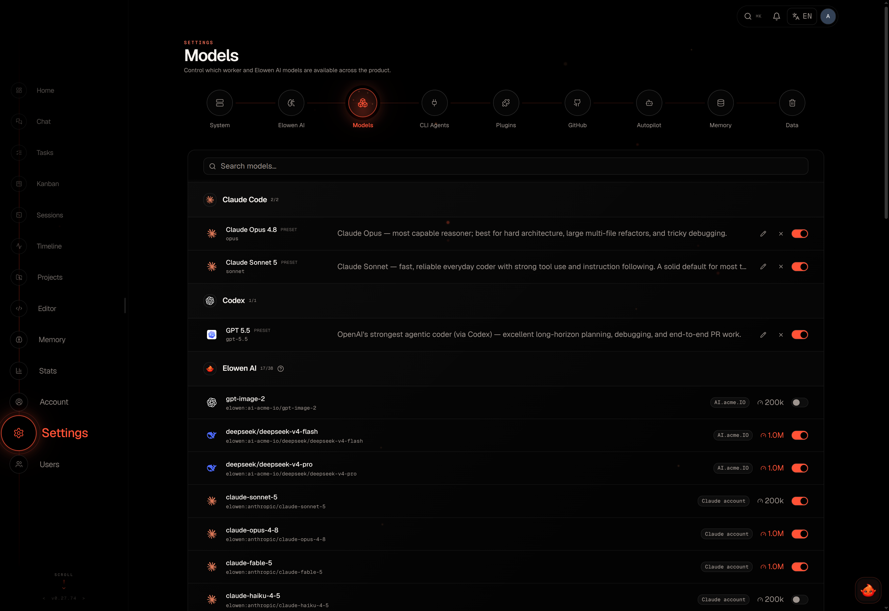

# Configuration

Elowen keeps startup configuration separate from runtime settings. Environment variables establish the local process boundary; the Settings workspace persists operational choices and saves normal changes as you make them. Secrets are never returned to the browser after storage.

## Startup environment

Set environment variables before starting the relevant process. The defaults below are intentionally local-first.

| Variable | Default | Purpose |
| --- | --- | --- |
| `ELOWEN_URL` | `http://localhost:4400` | Daemon URL used by CLI clients. |
| `ELOWEN_TOKEN` | — | Auth token for non-interactive CLI/API calls. |
| `ELOWEN_AUTOSTART` | `1` | Set `0` to stop API-backed CLI commands from starting a local daemon. |
| `ELOWEN_DB` | `~/.config/elowen/elowen.db` | SQLite database path. |
| `ELOWEN_PORT` | `4400` | Daemon HTTP port. |
| `ELOWEN_HOST` | `127.0.0.1` | Daemon bind address; expose deliberately if needed. |
| `ELOWEN_PROJECT` | `elowen` | Initial project slug. |
| `ELOWEN_PROJECT_PATH` | current directory | Initial project path. |
| `ELOWEN_RELAY_URL` | — | Optional relay endpoint. |
| `ELOWEN_RELAY_KEY` | — | Optional relay credential. |
| `ELOWEN_RELAY_MODEL` | `gpt-4o-mini` | Optional relay model. |
| `ELOWEN_BOOTSTRAP_USER` | — | Initial administrator username. |
| `ELOWEN_BOOTSTRAP_PASS` | — | Initial administrator password. |
| `ELOWEN_ALLOW_OPEN` | — | Set `1` only for an intentionally open deployment. |
| `ELOWEN_LOG_LEVEL` | `info` | Logging verbosity. |
| `ELOWEN_LOG_DIR` | data-directory logs | Log directory. |
| `ELOWEN_DAEMON_URL` | `http://localhost:4400` | Daemon target for the Web UI proxy. |
| `ELOWEN_WEB_PORT` | `4500` | Local Web UI port. |
| `ELOWEN_CLI` | `elowen` | CLI command used for spawned workers. |

`elowen setup` is the preferred way to configure a local installation. Use `elowen doctor` to check the resulting daemon, provider, memory, and task readiness.

## Settings sections

The Settings surface follows one stable order. It is administrator-controlled; user-level preferences and access live under Account and Users.

| Section | What it controls |
| --- | --- |
| **System** | Version/readiness, service controls, automatic updates, and login-token lifetime. |
| **Elowen AI** | Agent name, provider accounts, model context windows, max steps, runtime limits, and stale-conversation auto-cleanup. |
| **Models** | Enabled executor presets, custom entries, and model notes for planning. |
| **CLI Agents** | External coding CLI binary, arguments, permission behavior, and resume behavior. |
| **Data** | Explicit administrative maintenance and destructive cleanup. |
| **GitHub** | Write-only credentials and PR-workflow defaults. |
| **Autopilot** | Mission defaults, planning/review roles, TDD mode, and PR defaults. |
| **Plugins** | Installed capabilities, marketplace, and plugin-owned configuration. |
| **Memory** | Embedding and categorization models. |

## Elowen AI and limits

Elowen AI providers can be OpenAI-compatible or Anthropic API-key entries, or supported OAuth accounts. The Web UI shows provider/model metadata and whether a secret exists; it never reads a stored API key back into the client.

The same section contains guarded runtime limits for tool-output display, elicitation waits, memory recall, autonomous goals, and live channel sessions. Values are validated and clamped by the daemon, so a stale or malformed client cannot persist an unsafe bound.

## Models and CLI agents

**Models** is the workspace catalog for task executors. It controls which known presets are visible, custom model entries, and notes that help planning select a suitable executor. Per-user allowed executors only narrow this workspace-wide ceiling.

**CLI Agents** configures the external programs Elowen can spawn. For each configured program, adjust the executable, arguments, permission behavior, and whether a restarted task should resume the prior external session. The embedded Elowen brain is configured in **Elowen AI**, not as an external binary.

## Autopilot and GitHub

Autopilot holds mission-wide defaults: worker executor, autonomy, maximum concurrent sessions, planner/overseer choices, optional completion review, TDD mode, and PR behavior. A new mission can override its pilot and overseer without changing the global setting.

GitHub settings keep credentials write-only and define the PR workflow defaults: enabled state, base branch, auto-open behavior, and an optional verification command. Project and mission settings can override the PR enabled state. See [Projects & Workflow](projects-workflow).

## Plugins and Memory

Plugins render their own config from `elowen-plugin.json`; use their documentation and help affordances for specialized fields. The Memory section chooses the embedding and categorization models. API-key and OpenAI-compatible providers can supply those credentials without duplication; OAuth-only accounts cannot, because they do not expose an embedding endpoint.

Leaving embeddings unconfigured keeps memory usable with keyword retrieval. Reindexing or recategorizing performs a deliberate background operation; it is not a hidden side effect of changing the visual UI.

## Accounts and permissions

Account preferences are personal. Users and their project/model/tool access are managed separately. A setting being visible does not override the daemon's authorization checks; permissions and destructive actions retain confirmation boundaries.

[Next: Account & Security](account-security)
