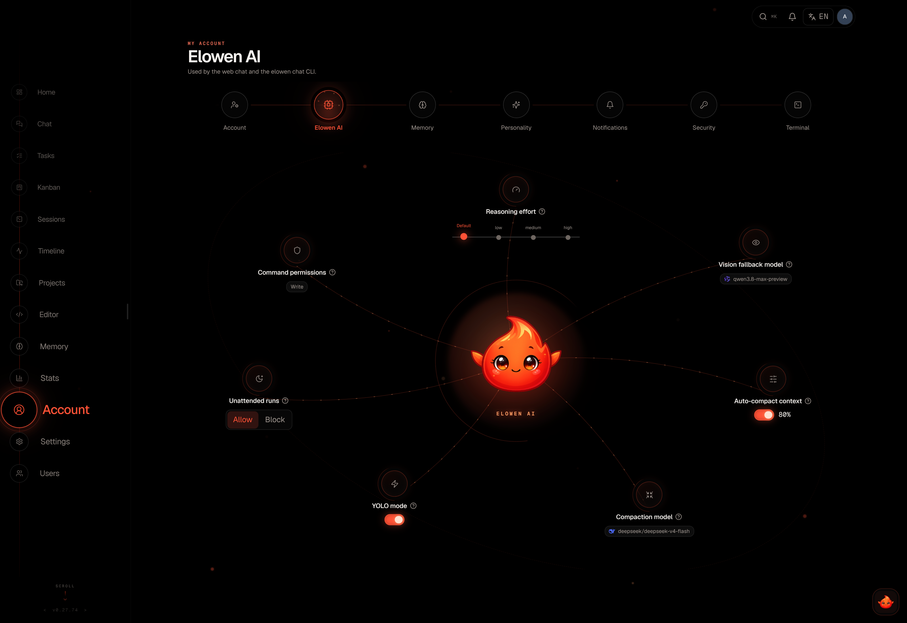

# Your Account & Preferences

Elowen remembers you — not just facts about your work, but how you like the
assistant to sound, which model should run your conversations, and how the app
should look on your screen. Everything on the **Account** page is personal to
you: it travels with your login no matter where you sign in, and none of it
affects anyone else's account. This page walks through what you can tune.

## Your models and default worker

**Account → Elowen AI** holds two independent model choices:

- **The chat model** — which model your brain conversations run on.
- **The Default worker** — the executor that runs your tasks when a task does
  not name one. Any executor you may run is selectable here, including an
  **Elowen AI** model enabled in [Settings → Models](configuration): the daemon
  then runs the task in-process as an embedded brain worker, with no external
  coding CLI installed. The two pickers never overwrite each other — the worker
  choice sets the task engine, not your chat model.

## Thinking level

**Account → Elowen AI** also lets you set the **reasoning effort** your chat
model spends before answering. The options are model-specific — each model
offers the levels it actually supports, and leaving the picker empty means the
model's own default applies. If you switch to a model that doesn't support the
level you picked, the setting clears itself automatically.

Turn it up for harder problems where depth is worth waiting for; turn it down
for quick everyday questions where you'd rather have a fast, cheap answer.
Higher levels mean more latency and more tokens billed — see
[Usage & Costs](usage-costs) for how that shows up.

## Vision model

Right next to the chat model in **Account → Elowen AI** you can pick a separate
**vision model** — the one that reads images and screenshots you paste into
chat. Leave it empty and the server default is used.

Set this when you want a different price/quality point than your chat model:
a cheap vision model if you mostly share simple screenshots, or a stronger one
if the agent regularly has to read dense diagrams, error dialogs or scanned
documents.

## YOLO mode

The **YOLO mode** toggle in **Account → Elowen AI** tells the agent to stop
asking for permission and just run everything. Turning it on requires an
explicit confirmation of the risk, because from that moment the agent executes
commands, edits files and calls tools without pausing to check with you. Deny
rules still apply — YOLO only skips the prompts, it doesn't override what
you've forbidden.

For daily use, granular permission rules (below) are the safer way to cut down
on prompts: allow the commands you trust, keep asking for the rest. YOLO is for
sessions where speed matters more than caution. See
[Autonomy & Safety](autonomy-safety) for the full picture.

## Unattended asks

Also in **Account → Elowen AI**: the **unattended asks** switch decides what
happens when the agent needs input while you're away — during a cron run, delegated turn, or other unattended execution where nobody is there to answer.

- **Allow** (default) — the agent proceeds with the default answer and keeps
  going.
- **Deny** — the ask is refused and the agent works around it or stops and
  waits for you.

Allow is the historical default, so background work gets finished rather than
stalled. Switch to Deny if an unattended default could do something you'd want
to veto.

## Permission rules

**Account → Elowen AI** hosts your personal **permission rules** — allow, ask
and deny patterns for bash commands and tool names, edited in a side drawer.
Rules are evaluated in order and the **last match wins**, so put broad allows
first and specific denies after them.

You don't have to write rules by hand: when an approval prompt offers
**Always allow**, accepting it saves a rule that lands in this list, where you
can later edit or remove it. [Autonomy & Safety](autonomy-safety) explains how
rules interact with autonomy levels and YOLO mode.

## Compaction

Long conversations are automatically compacted — summarized so they keep
fitting the model's context window. **Account → Elowen AI** exposes the knobs:

- **Auto-compact** toggle — turn automatic compaction on or off.
- **Threshold** — how full the context gets before compaction kicks in.
- **Per-model overrides** — a different threshold for specific models.
- **Compaction model** — which model writes the summary, so you can use a
  cheaper one than your chat model.

[Brain & Chat](brain-chat) explains what compaction does to a conversation and
how to trigger it by hand.

## Agent instructions & communication style

Each account controls how Elowen communicates and works with that user, without
affecting anyone else's account.

**Communication style** is the always-on layer, set in **Account → Personality**
as a single pick: **Professional** (default), **Friendly**, **Concise** or
**Detailed**. It adjusts the assistant's register everywhere your brain runs.

**Agent instructions** are a free-form Markdown field in **Account →
Personality**. Use it for any standing direction about how Elowen should behave
and collaborate with you — tone, priorities, workflows, constraints or things
to avoid. It is empty by default and autosaves as you type.

There is no per-platform split and no named or activatable profile. The same
instructions apply in web chat, `elowen chat`, Discord, Telegram, Microsoft
Teams, WhatsApp and scheduled cron turns. Runtime knobs stay in the Elowen AI
section, so instructions and mechanics remain separate.

## Your profile & identity links

**Account → Profile** is the personal side of the page: your display name, email
and avatar.

Two fields here are more than cosmetic — they **link an external identity to
your Elowen account**, which is what lets the owner persona and per-user memory
work off-web:

- **Discord user ID** — maps your Discord user to this account, so your Discord
  messages resolve to you (and, for the channel owner, drive the Discord
  persona).
- **WhatsApp number** — the same mapping for WhatsApp.

Both live in your personal settings and autosave as you type.

## Language

The language switcher in the **sidebar footer** flips the whole Web UI between
**English**, **Čeština** and **Slovenčina**. It's a per-device setting stored in
your browser, so each device keeps its own choice. It changes the interface
text only — the assistant's conversation language follows whatever language you
write in.

## Visual effects

**Account → Profile** has a **motion** control with four levels:

| Level | Behaviour |
|-------|-----------|
| **Auto** | Follows your operating system's reduced-motion setting |
| **Full** | All animations and effects on |
| **Reduced** | Motion toned down |
| **Off** | Animations disabled entirely |

The setting is per device. Lower it if animations distract you, make the app
feel heavy on older hardware, or trigger motion sensitivity; Auto is the right
default for most people since it respects the OS preference you already set.

## UI scale

The **UI scale** slider in **Account → Profile** zooms the whole app from
**80 % to 150 %** in 5 % steps — per device, like the language.

The zoom you actually get has two factors: an **automatic base** that shrinks
the interface proportionally once the window is narrower than 1900 px (never
below 70 %), multiplied by your slider value. When the two differ, the control
shows both numbers so you can see why the result isn't exactly what you dragged
to. Push the slider up on a small laptop screen to claw the zoom back, or down
on a large monitor to fit more on screen.

## Terminal appearance

Every web terminal — the advisor dock, session cards, the pop-out — honours a
per-user look set in **Account → Terminal**, with a live preview and autosave:

- **Font** — size and family (System, Menlo, IBM Plex, Courier).
- **Cursor** — block / bar / underline, with optional blink.
- **Theme** — `auto` follows the app theme, or `custom` unlocks a full
  21-colour palette (with ready-made presets).
- **Scrollback** — how much history each terminal keeps.
- **Show thinking in CLI** — whether the agent's reasoning is streamed in the
  terminal.

## Push notifications

Because the agent runs autonomously, you want to know the moment it needs you.
Elowen supports **PWA push notifications** over the VAPID protocol.

1. **Subscribe** — Account → Notifications → enable on this device. Subscription is per device, so each phone or laptop opts in on its own.
2. **Events** — turn completion and plugin-owned notifications selected by the sender.
3. **Clicks** — every notification action opens its authenticated app or HTTPS deep-link.
4. **Service worker** — a bundled service worker handles incoming push events and safe navigation.

The service worker does not call retired task, mission, review, or coding-session APIs. Authorization and mutations stay inside the normal authenticated application flow.

## Memory

The embedded brain can remember across conversations, and **Account → Memory**
puts both halves of that under your control as per-user toggles (both on by
default):

- **Auto-recall** — before each reply, your most relevant durable memories are
  injected under your message, so the assistant already knows your standing
  context.
- **Auto-save** — after a turn, a curator persists genuinely new, reusable facts
  to *your* account.

They're read fresh each turn, so flipping one applies to your very next message,
and they cover web chat, `elowen chat` and your own verified Discord messages.
For the deep dive on what gets remembered, embeddings, and searching your store,
see [Memory & Embeddings](memory).

[Next: Todos, Goals & Workflows](tasks-missions)
