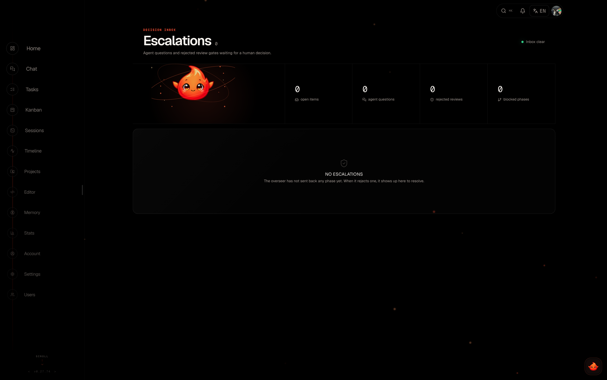

# Autonomy & Safety

Elowen can run [agents](agents-providers) unattended — for minutes or for
hours. Autonomy is how you stay in control while it does: every mission runs at
an explicit level that decides how much the agent may do without asking, an
overseer vets every action before it takes effect, and a stack of watchdogs
makes sure a wedged or runaway agent always ends up in front of a human. This
page walks through each layer, so you can pick the level of supervision that
fits the job.

Two principles hold everywhere: **clarity** — every decision an agent makes is
visible and steerable — and **nothing self-starts** — when something needs a
human, it waits for one.

## Autonomy levels

Every mission runs at one of four autonomy levels (L0–L3). The level decides
how much the agent may do without asking you, and how confident the overseer
must be before it auto-approves an action.

| Level | Name | Prompt handling | Escalation |
|-------|------|-----------------|------------|
| L0 | Recommend | All prompts → human | Never auto-approves anything |
| L1 | Assist | Overseer approves at ≥ 0.85 confidence | Uncertain or sensitive actions |
| L2 | Pilot | Overseer approves at ≥ 0.6 confidence | Ambiguous situations |
| L3 | Auto | Overseer approves at ≥ 0.6 confidence | Only when the agent is stuck |

L1–L3 spawn agents automatically and let them run. **L0 plans and proposes but
never executes without your explicit approval** — the safest setting when you
want to review everything first. You set the level per mission and can change
it at any time from the Dashboard.

## TDD mission mode

An optional guardrail that makes every autonomous worker practice strict
test-driven development. It is **off by default** and toggled globally in
**Settings → Autopilot** (the agents plugin's `tddMode` setting; changing it is
admin-only).

When on, Elowen appends a Test-Driven-Development directive to every worker
briefing, so the agent must:

1. Write a test that captures the desired behaviour and confirm it **fails for
   the right reason** before writing any implementation.
2. Implement the minimum code to make that test pass.
3. Re-run the tests, confirm they pass, and refactor only while green.

The agent may never weaken or delete a test to make it pass, and a change with
no runtime surface (pure docs or config) is called out in its summary instead.

The directive applies to every worker — CLI-spawned and the embedded Elowen AI
brain alike — even when you have saved a custom worker prompt. TDD mode is
independent of the autonomy level and of the plan/build work modes: it is a
single global toggle layered on top of whichever mode the worker runs in.

## Overseer (decision gate)

The overseer is the gate that vets every agent action before it takes effect —
task dispatch, CLI permission prompts, and post-completion reviews. It runs one
of two ways.

### Relay path (default)

By default, decisions go through an **LLM relay**: a model scores each request
for confidence, and the gate applies a simple threshold:

- **Approved** — confidence ≥ the level's threshold → the agent proceeds
- **Rejected** — confidence < threshold → the request waits for a human
- **Destructive** — always escalated; the overseer can never auto-approve it

This is the low-friction default: no extra agent to run, decisions resolve in
line.

### Agent path (parked overseer)

Optionally, Elowen spawns a dedicated, parked **overseer agent** per active
mission — a real coding agent whose only job is judging requests. It works
asynchronously, so the mission keeps moving while the overseer thinks. If the
parked overseer dies or wedges, its pending decisions **escalate to a human**
so nothing slips through unreviewed.

## Deriver (prompt detection)

The deriver is how Elowen knows what a live agent is doing. It polls every
active agent's terminal every few seconds and detects state changes from the
output — including the CLI's own permission prompts, such as Claude Code's
"Do you want to proceed?" or Codex's "Allow command?".

Auto-accept prompts like **workspace trust** are cleared directly by the
deriver without an overseer round-trip — there is nothing for a human to
decide there. Everything else becomes a decision in the queue.

The deriver also drives the live status you see across the [Web UI](web-ui):

| Signal | Meaning |
|--------|---------|
| `working` | Agent is active, no prompt detected |
| `needs_input` | Agent is paused, waiting on a human |
| `complete` | Task is closed — final signal |

## Decision taxonomy

The overseer handles five kinds of decision, each raised by a different part of
the system:

| Kind | Raised by | What it is |
|------|-----------|------------|
| `prompt` | Deriver | A CLI permission prompt from the agent |
| `review` | Task close | Post-completion review: outcome and summary |
| `question` | Deriver | A multiple-choice question from the agent |
| `message` | Agent (`elowen ask`) | Free-text Q&A with the autopilot |
| `check` | Liveness sweep | Routine progress check on a working agent |

The confidence threshold that separates auto-approve from wait-for-human is
**0.85 at L1** and **0.6 at L2 and L3**.

## Liveness & progress checks

To make sure a wedged agent never sits silently, a liveness sweep runs
continuously and watches one tool-agnostic signal: whether the agent's terminal
keeps changing. A working agent streams output; a wedged or idle one goes
static, and the sweep acts:

| Check | After | Action |
|-------|-------|--------|
| Worker wedge | 5 min idle | Wake the overseer — it nudges, restarts, or escalates |
| Routine progress | 15 min working | Ask the overseer "is this still on track?" |
| Overseer wedge | 10 min idle | Escalate its pending decisions to a human |
| Dead overseer | 90 s gone | Escalate its pending decisions |
| Absolute backstop | 30 min in any state | Escalate |

A healthy agent is only ever nudged or steered — the routine progress check
never escalates work that is genuinely moving.

## Agent Q&A (`elowen ask`)

A working agent can ask a free-text question mid-mission — to the autopilot or
to you:

1. The agent calls `elowen ask "Is this approach correct?"`
2. The autopilot answers directly, or escalates the question to a human
3. Unanswered questions surface in the **Escalations** inbox
4. You reply, and the agent receives your answer and continues

Escalations is your human-in-the-loop gate — approve, reject, or answer, all
from one place. See [Web UI](web-ui) for the full inbox, and [CLI](cli) for the
`elowen ask` command and its `--history` flag.

## Stuck detector

The stuck detector sweeps every minute for `in_progress` tasks whose agent
session is no longer alive. It reverts a dead-agent task to `open` (up to **2
retries**), then moves it to `blocked` to prevent an infinite crash loop. When
it reverts a task, it writes a **resume note** explaining why the task was
relaunched, so you (or the next agent) have the context. See
[Tasks & Missions](tasks-missions) for task states.

## Session resume

When **Resume sessions** is enabled for a [provider](agents-providers), the
daemon captures the agent's CLI session id when the session closes and splices
a resume flag into the next spawn. The agent reattaches to its prior
conversation instead of cold-starting — it keeps its context, its plan, and its
place in the work.

## Persistent goals (`/goal`)

The autonomy levels above govern spawned mission agents. The embedded **Elowen
AI** brain — the agent you chat with — has its own autonomous mode: a
*persistent goal*. Set one with `/goal <what you want>` and the brain works
toward it turn after turn on its own, checking its own progress, until the goal
is done, it hits a blocker, or it exhausts its turn budget.

Each goal turn follows a small reporting protocol the brain is taught:

- `PROGRESS: …` — a one-line note of what the turn accomplished, carried
  forward across turns so a long goal keeps its bearings.
- `GOAL_DONE: <evidence>` — the only way to finish. It must cite concrete
  evidence (passing tests, command output, a reviewed diff), and it's rejected
  if any subgoal is still open — so a goal can't declare itself done
  prematurely.
- `GOAL_BLOCKED: <reason>` — stop on an unresolvable blocker (missing
  credentials, a required decision, an unsafe step) instead of looping the
  budget away. The goal pauses for you.
- `SUBGOAL_DONE: <n>` — check off a subgoal as it lands.

Break a goal into checklist items with `/subgoal <text>`. `/goal draft` writes
a structured contract — outcome, verification, constraints, boundaries,
stop-when — for review before you commit to running it. `/goal status`,
`/goal pause`, `/goal resume` and `/goal clear` manage a live goal.

### Turn budget & the YOLO ceiling

Every goal carries a **turn budget** — the number of autonomous turns it may
run before it stops to check in with you (default 8, configurable under
**Settings → Elowen AI → Limits**). What happens when the budget is spent
depends on whether the session runs in YOLO:

- **Supervised (not YOLO)** — the goal **pauses** at budget. You confirm
  continuation with `/goal resume`, which grants a fresh budget window. This is
  the point where a human stays in the loop.
- **YOLO** — the goal **keeps going** past a spent budget so it can finish
  unattended, but never past an **absolute safety ceiling** (default 64 turns).
  Even in YOLO the loop pauses at the ceiling, so a runaway goal can never burn
  tokens forever.

### Losing the driver

A persistent goal only advances while its conversation has a live driver — it's
your active conversation, or a bound CLI stream is attached to it. Switch away
and the goal **pauses** rather than running unattended in the background. A
daemon restart pauses every active goal too. Autonomous work never self-resumes
— you bring a paused goal back with `/goal resume`. See [Brain &
Chat](brain-chat) for the embedded agent.

[Next: Projects & Workflow](projects-workflow)
