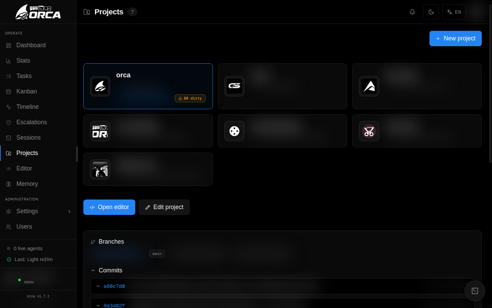

# Projects, Sandbox & GitHub

Elowen separates three parts of repository work:

- **Projects** define which repository or working directory an account may access.
- **Sandbox** creates account-owned Git worktrees for isolated changes.
- **GitHub** connects an account's GitHub identity to a Project and publishes committed Sandbox branches.



## Projects are the access boundary

Open **Projects** in the main navigation and select a Project to inspect it. An administrator registers a stable slug and filesystem path, with optional notes and a project icon. Assign Projects to members from **Users** or the Project's **Access** section. An account cannot use a Project merely because another account can see it.

The Project overview is read-only. It shows the checkout's current branch and `HEAD`, upstream and ahead/behind counts, dirty and untracked counts, sanitized remotes, local branches, and recent commits. Registering or removing a Project does not delete the repository files on disk.

Core Projects does not create worktrees, store GitHub credentials, publish branches, or manage pull requests. Those operations belong to the Sandbox and GitHub plugins below.

## Work in an account-scoped Sandbox

The **Sandbox** plugin provides a persistent account `HOME` and real Git worktrees. This lets one account work on several branches without changing the source Project checkout.

### Open the Sandbox settings

- **Users → select an account → Development environment** shows the account `HOME`, execution mode, confinement probe, active processes, and Git author name and email to administrators. It also provides **Reset HOME**; this removes account-scoped Git, npm, and tool configuration but preserves workspaces. Active processes block the reset.
- **Project → Sandbox** lists workspaces for that Project. The account-wide Sandbox view can search and filter all accessible Projects.

Fresh configuration confines non-operator commands by default. The Sandbox mounts only the account's accessible Projects, its workspaces, and its account `HOME`; network access remains available. If the live bubblewrap probe fails, required confinement is refused. An operator can deliberately disable `sandbox.confineNonOperators`, which lets granted non-operators run commands directly on the host; workspace-scoped execution remains confined.

### Create and activate a workspace

1. In **Project → Sandbox**, choose **Create workspace**.
2. Select a Git Project, enter a label, and enter a base ref. The form starts with `main`; the base ref may be an existing branch, tag, or commit.
3. Select **Create**. Elowen creates a real worktree and a unique generated branch in the form `elowen/u<account>/<label>-<id>`. The label is for display; it is not used as the Git ref verbatim.
4. Choose **Use** and bind the workspace to a conversation.

There is one active workspace per conversation and Project. Once active, relative file operations and `Bash` commands resolve to that worktree. Explicit paths are still checked against the account's Project access. The workspace detail shows its path, branch, changed and untracked files, ahead/behind counts, active processes, and working patch.

A workspace can be created only from a Git Project. Workspace ownership is account-scoped, and every activation, commit, execution, and delegated assignment is checked against the account's current Project access. If access to the source Project is revoked, the workspace remains owned but cannot be activated, committed, or used; if the Project is removed or the worktree path disappears, it becomes **orphaned** and cannot be activated or committed. A workspace reference identifies both its workspace and Project; it cannot be replaced with a sibling worktree or widened back to the whole Project.

### Commit and remove changes

**Commit selected paths** accepts a Git commit message and a list of workspace-relative paths, one per line. Only those paths are staged; Sandbox never runs `git add -A`. Repository hooks are disabled for this operation, and unselected changes remain in the workspace.

A clean workspace with no untracked files, commits ahead of its base ref, or active process leases can be removed directly. For a workspace containing changes or commits, the browser first shows a loss preview; discarding requires the exact displayed phrase. Active processes always block removal.

## Connect GitHub and publish a branch

GitHub is account-scoped. Go to **Account settings → GitHub** and choose **Connect GitHub** to complete the device login. Each account keeps its own GitHub identity and credentials. If GitHub reports an expired authorization, reconnect the account; Elowen does not silently refresh it.

### Map a Project

Open **Project → GitHub** and use **Detect** to inspect the Project's Git remotes, or enter the mapping manually. A mapping has:

- a **Base repository**, used for the pull request target;
- a **Push repository**, used to publish the branch.

The two repositories may differ, which supports a fork workflow. Mappings belong to the account and Project, and every operation starts from a Project the account can currently access.

### Publish, review, and merge

The normal flow is:

1. Create or activate a Sandbox workspace for the Project.
2. Make changes and commit the required paths.
3. In **Project → GitHub**, choose **Publish branch**. Publishing requires a connected GitHub account, a verified repository mapping, an active Sandbox workspace for this conversation and Project, and a committed `HEAD`.
4. Choose **Create pull request**, then inspect the pull request's changed files, reviews, and checks.
5. Submit a review or merge the pull request after reviewing the external-action confirmation.

Creating a pull request reuses an existing open pull request with the same base and head instead of creating a duplicate. Checks are reported as `pending`, `success`, `failure`, or `action_required`. Merge methods are **Squash**, **Merge commit**, and **Rebase**; the default is **Squash**.

A merge is accepted only when the pull request is still open and non-draft, its head matches the expected commit exactly, checks are successful, no current review requests changes, and the repository supports the selected method. Branch force-push, automatic branch deletion, and auto-merge are not available.

GitHub never creates or removes Sandbox worktrees. It consumes the active workspace selected for the conversation.

## CLI and agent tools

There is no dedicated Sandbox or GitHub CLI command. The generic authenticated API passthrough can read their routes:

```bash
elowen api GET /plugins/sandbox/api/overview
elowen api GET /plugins/github/api/status
```

The corresponding agent tools are `SandboxListWorkspaces`, `SandboxCreateWorkspace`, `SandboxUseWorkspace`, `SandboxCommit`, `SandboxRemoveWorkspace`, and the GitHub read and write tools exposed by the GitHub plugin. GitHub mutations require an interactive confirmation; delegated, scheduled, and unattended contexts remain read-only.

For access rules, see [Users & Access](users-access). For plugin configuration, see [Plugins](plugins).

[Next: Scheduling](scheduling)
