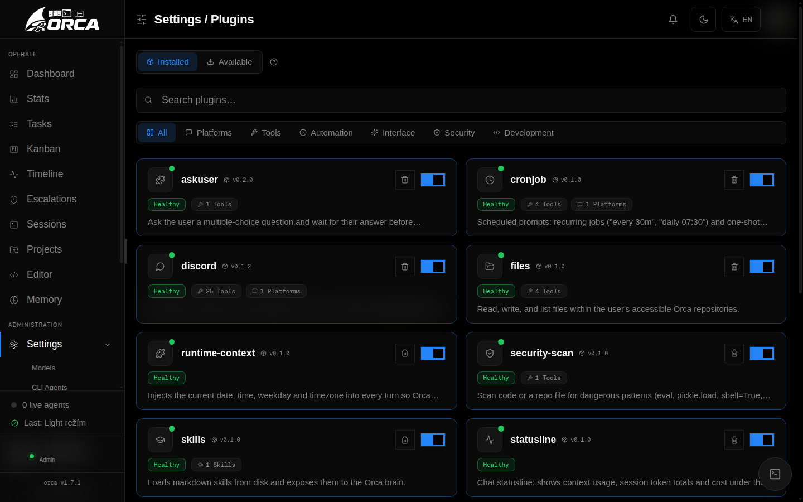

# Plugins

Plugins add optional capabilities to Elowen. A plugin can provide tools, skills, chat-platform adapters, scheduled automation, repository integrations, pages in the Web UI, or plugin-specific settings.

## Open the plugin manager

An administrator manages plugins from **Settings → Plugins**. The page has two views:

- **Installed** lists bundled plugins and plugins installed from the marketplace. Use the toggle to enable or disable a plugin, open its details, update it, or remove it.
- **Available** lists plugins from Elowen's curated plugin registry. Select **Install** to download one. Search and category filters narrow either view.

Settings is the source of truth for the plugins available on your deployment. A fresh installation enables the core toolkit:

- `files`
- `sandbox`
- `terminal`
- `askuser`
- `runtime-context`
- `subagent`
- `elowen-docs`
- `statusline`
- `mcp`

Other capabilities are installed deliberately. Examples include Discord, Telegram, Microsoft Teams, WhatsApp, GitHub, skills, scheduling, codebase indexing, and editor or other product integrations.

The marketplace is curated: only plugins present in its registry can be installed. Elowen does not install a plugin from an arbitrary URL or local folder through this screen.

## Install and enable a plugin

1. Open **Settings → Plugins → Available**.
2. Find the plugin and select **Install**.
3. If Elowen asks you to acknowledge capabilities, review the listed powers and confirm them before enabling the plugin.
4. Configure any required fields in the plugin's detail view.
5. Enable the plugin from **Installed**.

Installation first places the plugin on disk while it is disabled. This keeps an unreviewed plugin from becoming active automatically. Enabling a plugin that declares mutation capabilities may require consent for one or more of `tools`, `memory`, `events`, `workflow-dag`, and `users`.

If Elowen is handling active work, applying an install, update, or enable/disable change can be deferred until that work settles. The UI reports the pending state; do not repeat the operation.

## Configure a plugin

Select an installed plugin to open its detail view. The available tabs are:

- **Setup** — required fields and initial configuration.
- **Behavior** — normal plugin settings.
- **Capabilities** — tools, hooks, and the permissions the plugin declares.
- **Activity** — recent plugin health and log activity.
- **Advanced** — advanced fields and the plugin's stored data summary.

Plugin settings are schema-driven, so the fields depend on the plugin. They can include provider or model selectors, booleans, numbers, text areas, enumerations, multi-selects, JSON, code, prompts, MCP server settings, and project or tool selectors. Settings are saved by the plugin settings form; a daemon restart is normally not required.

Secret fields are write-only. Elowen stores credentials in its encrypted secret store and shows only whether a secret is set. It does not send the secret value back to the Web UI, including to administrators.

Some plugins expose **per-account settings** rather than one instance-wide configuration. When available, sign in and open the plugin's panel under **Account**. Each account has its own values, and a plugin cannot read another account's values.

## Control access for individual users

Some plugins are marked as grantable per user. For those plugins, non-admin users have no access until an administrator grants it:

1. Open **Users**.
2. Select the user.
3. In **Granted plugins**, choose **Manage**.
4. Select the plugins the user may use and save.

An empty selection means that the user receives none of the grantable plugins. Administrators always retain access. Plugins that are not marked grantable remain available to authenticated users according to the normal account and tool permissions.

A grant is separate from the plugin's own configuration. For example, granting a plugin makes its tools or pages reachable for that user, while the plugin's settings determine how the integration operates.

## Inspect what is active

The plugin detail view shows the plugin's declared capabilities and its current activity. In chat, run **`/tools`** to list the tools currently available to your account, including each tool's plugin owner, description, and input schema.

If a plugin is enabled but its tools or pages are missing, check these items in order:

1. The plugin is enabled in **Settings → Plugins → Installed**.
2. Your account has the required per-user grant, if the plugin is grantable.
3. Required configuration fields and credentials are complete in the plugin detail view.
4. The plugin's **Capabilities** and **Activity** tabs do not report an error.
5. Run **`/tools`** again in a new turn.

## Update, disable, remove, and restore

- **Update** a marketplace plugin from its Installed card when an update is shown. Updates are taken from the curated registry.
- **Disable** a plugin to stop loading its tools, pages, and other contributions. The change applies to future turns; it does not rewrite work that is already running.
- **Remove** a bundled plugin to hide it and stop loading it. It remains restorable from **Available**.
- **Uninstall** a marketplace plugin to remove its files and persistent plugin data. This is different from disabling it and cannot be undone from the UI.

Plugin changes are applied live when the registry reload completes. A normal enable, disable, update, or bundled-plugin restore does not require restarting the daemon.

## Safety and trust

Plugins run as part of the Elowen installation and are not isolated browser sandboxes. Install only plugins you trust; the marketplace limits the source to the curated registry, but a plugin can still add tools, network integrations, pages, and other runtime behavior. Review the capability list before enabling a plugin, especially when it requests access to tools, memory, events, workflows, or users.

For account-level tool and model restrictions, see [Users & Access](users-access). For the general settings layout, see [Configuration](configuration).

[Next: Skills](skills)
