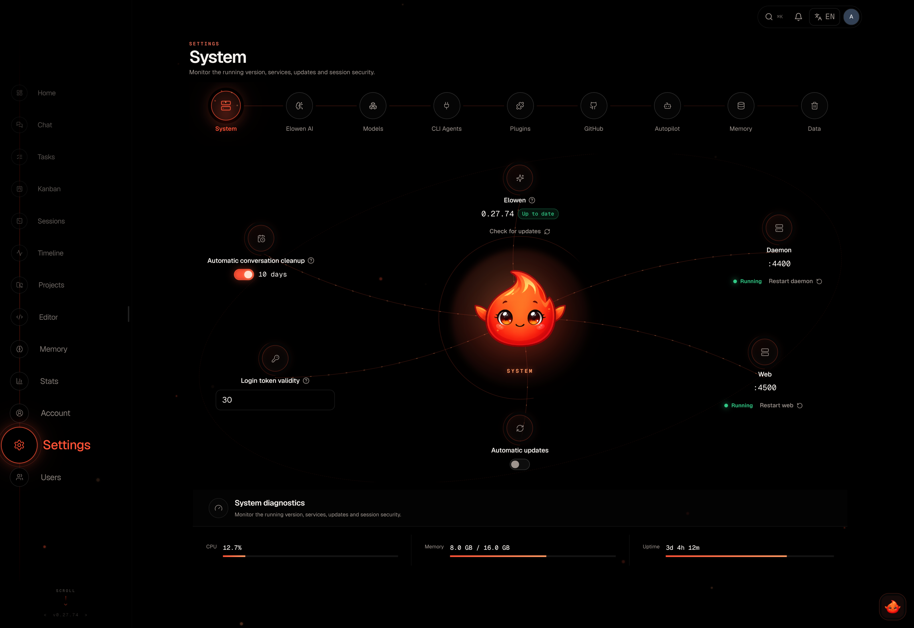
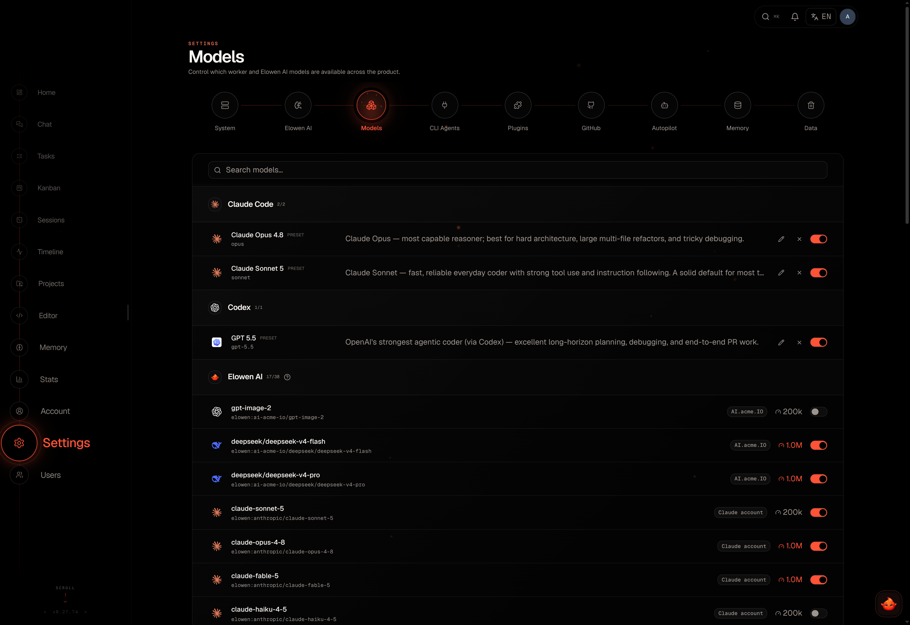

# Configuration

Elowen has three configuration layers:

- **Startup environment** controls where the daemon runs, which port it binds to, and where it stores state.
- **Settings** persists administrator choices such as AI providers, models, plugins, runtime limits, and retention.
- **Account** stores each user's model, reasoning, compaction, vision, and permission preferences.



## Where configuration is stored

The core configuration is stored as JSON in SQLite, not in a human-edited `config.json` file:

```text
~/.config/elowen/elowen.db
SQLite table: settings, id = 1
```

The default state directory is `~/.config/elowen`. It also contains, depending on the features you use:

```text
logs/                 daemon and web logs
plugin-secrets.key    key for encrypted plugin secrets
brain/                provider and OAuth credentials
plugins/              installed plugin data
plugins-data/         plugin-owned runtime data
plans/                conversation plan files
chat-images/          uploaded or generated chat images
tool-results/         large tool results spilled to disk
```

If `ELOWEN_DB` points to another database, `plugin-secrets.key` is stored beside that database; other state directories still follow the data directory above. Keep the database and this key together. A database alone cannot decrypt encrypted plugin secrets.

## Startup environment

Set these variables before starting the relevant process. The defaults keep a local installation bound to the machine running it.

| Variable | Default | Purpose |
| --- | --- | --- |
| `ELOWEN_HOST` | `127.0.0.1` | Daemon bind address. |
| `ELOWEN_PORT` | `4400` | Daemon HTTP port. |
| `ELOWEN_DB` | `$HOME/.config/elowen/elowen.db` | SQLite database path. |
| `ELOWEN_LOG_DIR` | `$HOME/.config/elowen/logs` | Daily daemon and web log files. |
| `ELOWEN_LOG_LEVEL` | `info` | Minimum file and console log level. |
| `ELOWEN_PROJECT` | `elowen` | Default project name. |
| `ELOWEN_PROJECT_PATH` | `$PWD` | Default project path; the daemon falls back to its working directory. |
| `ELOWEN_DAEMON_URL` | `http://localhost:4400` | Daemon URL used by the web process and launcher. |
| `ELOWEN_URL` | `http://localhost:4400` | Default URL used by the CLI. |
| `ELOWEN_AUTOSTART` | `1` | Set to `0` to disable CLI auto-start. |
| `ELOWEN_BOOTSTRAP_USER` | unset | Optional initial administrator username; used only when the password is also set. |
| `ELOWEN_BOOTSTRAP_PASS` | unset | Optional initial administrator password; used only when the username is also set. |

The packaged launcher uses `ELOWEN_WEB_PORT` with a default of `4500`. The Next.js web server itself reads the standard `PORT` and `HOSTNAME` variables. Starting the daemon does not start the web UI; they are separate processes. The former browser terminal and its direct WebSocket port are no longer part of the product.

`elowen setup` is the preferred way to configure a local installation. Use `elowen doctor` to inspect daemon, provider, memory, and plugin readiness.

## Settings sections

Open **Settings** as an administrator. Changes normally save automatically; controls show the effective value when the daemon clamps an out-of-range value. Revision-backed forms send the version they loaded with each write. If another tab or API client saved first, the stale write receives HTTP `409`; Elowen adopts the canonical current revision while preserving the editable draft, so a deliberate retry does not repeat the same conflict. Plugin schema forms also offer explicit reload or merge choices.

| Section | What it controls |
| --- | --- |
| **System** | Version and update status, daemon/web status, restart actions, automatic updates, push contact, CLI token lifetime, and conversation retention. |
| **Elowen AI** | Assistant name, AI provider accounts, per-run step limit, brain limits, runtime limits, tool loading, compaction, sub-agent execution, and memory retention. |
| **Models** | Enabled model entries, custom models, model notes, and context-window overrides. |
| **Memory** | Embedding and categorization models, embedding tests, reindexing, and recategorization. |
| **Plugins** | Installed plugins, enable/disable state, marketplace installation, updates, removal, and plugin-specific settings. |
| **Data** | Provider request diagnostics and log viewing. |

## AI providers

Go to **Settings → Elowen AI**.

### API-key providers

Add an API-key provider with:

- a label and provider ID;
- provider type: **OpenAI-compatible** or **Anthropic**;
- endpoint URL;
- API key;
- optional model list;
- optional OpenAI wire API selection: automatic, Responses, or Chat Completions;
- optional Chat Completions compatibility overrides (developer role, long cache retention, streaming usage, strict mode, store, reasoning effort, and the token-limit field);
- optional temperature from `0` to `2` (leave it unset to omit the field from requests).

For an OpenAI-compatible endpoint, Elowen probes `/models` when possible. If the endpoint does not expose a usable catalog, enter model IDs manually. An empty model list for a successfully discovered OpenAI-compatible endpoint means that Elowen can use the discovered catalog. Automatic wire selection uses Responses for `api.openai.com` and Chat Completions for other compatible endpoints; explicit selection wins. Compatibility defaults are conservative, so enable an extension only when the endpoint documents it.

API keys are write-only from the browser: the UI reports whether a key is stored, but never sends the secret back to the client.

### OAuth accounts

Supported OAuth connections are **Anthropic**, **OpenAI Codex**, **GitHub Copilot**, and **Kimi**. Start or disconnect them from the provider cards in **Settings → Elowen AI**. Some flows open a provider authorization page or ask you to paste a code back into Elowen.

Usage rails are available for the OAuth providers that expose a supported usage endpoint: Anthropic, OpenAI Codex, and Kimi. The rail is cached for 60 seconds, warns at 70%, and shows danger at 90%. GitHub Copilot can be connected and used, but it has no Elowen subscription-usage rail.

## Models

**Settings → Models** is the workspace model catalog.



Use it to:

- enable or disable model entries available to users;
- add, edit, or remove custom model entries;
- attach notes to a model;
- set a context-window override for an Elowen AI model when its endpoint does not report a reliable value.

The model catalog is an administrator-controlled ceiling. A user's account settings can select a model only from the models available to that account and workspace.

## Account-level AI preferences

Users manage their own defaults in **Account → Elowen AI**. These settings do not change the instance-wide provider catalog:

- default chat model;
- thinking level, when the active model supports adjustable reasoning;
- vision model fallback;
- compaction model;
- automatic compaction and its threshold;
- communication style and memory behavior;
- permission rules for tools and unattended questions.

Automatic compaction is enabled by default at **80%** of the model context window. A per-model threshold can override the account default. If no compaction model is selected, Elowen normally compacts with the chat model; ChatGPT OAuth uses its configured default when needed.

A configured vision model is a fallback, not a permanent second model. Elowen uses it for an image turn only when the current model is not known to support images, then returns to the normal model for later text-only turns.

## Runtime limits

The **Elowen AI** section contains two limit editors. They protect the daemon from unbounded output, context growth, waits, and concurrent sessions.

### Brain limits

The default values are:

| Limit | Default | What it controls |
| --- | ---: | --- |
| Tool output lines | `100` | Maximum lines included from one tool result. |
| Tool output characters | `41,000` | Character limit for the displayed tool result. |
| Inline tool-result size | `60,000` bytes | Size above which a result is spilled and replaced by a placeholder. |
| Tool-result group budget | `200,000` bytes | Aggregate inline budget for results in one turn. |
| Compaction failure limit | `3` | Consecutive automatic compaction failures before the circuit breaker stops retrying. |
| Elicitation timeout | `6 hours` | How long a turn may wait for an answer to a question. |
| Memory recall count | `10` | Memories recalled at the start of a turn. |
| Memory recall budget | approximately `5,000` tokens | Shared `20,000`-character budget for those memories. |
| Live recall passes | `10` | Maximum additional searches while work is in progress. Set to `0` to disable them. |
| Live recall batch | `2` results / `20,000` bytes | Maximum results and context injected by one live-recall pass. Set the count to `0` to disable live recall batches. |
| Goal turn budget | `50` | Default turn budget for an autonomous goal. |
| Goal turn ceiling | `50` | Maximum turns for one autonomous goal. |
| Delegated context budget | `40,000` characters | Default maximum context passed to a delegated child. |
| Channel session cap | `32` | Concurrent live sessions held by one channel. |

The editor displays size values as approximate tokens using four characters per token. The daemon remains authoritative and clamps every value on save.

### Runtime limits and execution

The Runtime editor includes:

- local shell timeout, default **30 seconds**;
- memory relevance, duplicate, paraphrase, importance, and vitality thresholds;
- maximum automatic memory-curator operations, default **2**;
- event retention, default **30 days**;
- origin-IP retention, default **30 days**;
- stream silence watchdogs, default **75 seconds** and **45 seconds** for revival checks;
- toast duration, default **4.5 seconds**;
- deferred tool loading, enabled by default with a threshold of **10** tools; per-source and per-tool overrides are available;
- the forked sub-agent runner, enabled by default with an automatically sized pool; set a non-negative pool maximum only to override automatic sizing;
- provider-side remote compaction, enabled by default for eligible OpenAI Codex sessions;
- provider request capture, enabled by default for admin diagnostics; disabling it stops new captures but keeps existing records;
- memory retention, enabled by default with a **14-day** grace period and importance-based half-lives.

The sub-agent runner and remote-compaction switches are operational rollbacks. Runtime changes are persisted automatically and take effect through the relevant runtime path. Plugin reloads may be applied immediately or deferred until active work drains.

## Memory configuration

Open **Settings → Memory**. Elowen has two workspace-level memory models:

- **Embedding model** converts memories into vectors for semantic retrieval.
- **Categorization model** assigns memories to categories.

Both reuse the API key and endpoint of the selected provider in **Settings → Elowen AI**. There is no second secret field. OAuth accounts are excluded from the embedding picker because they do not expose an embedding endpoint; categorization can use the available chat models.

If embeddings are not configured, memory remains usable with keyword retrieval. After changing the embedding model, use **Reindex** to rebuild the semantic index. Use **Recategorize** after changing categorization or memory categories. These are explicit background operations, not hidden side effects of editing a field.

### Automatic memory retention

The retention editor is in **Settings → Elowen AI → Retention**. It is enabled by default:

| Setting | Default | Meaning |
| --- | ---: | --- |
| Retention enabled | on | Allows the daily sweep to move stale memories to the trash. |
| Grace period | `14 days` | New memories are protected during this period. |
| Vitality floor | `10` | Memories below this vitality are eligible for soft deletion. |
| Importance 1 half-life | `3 days` | Time for unused vitality to halve. |
| Importance 2 half-life | `7 days` | Time for unused vitality to halve. |
| Importance 3 half-life | `14 days` | Time for unused vitality to halve. |
| Importance 4 half-life | `30 days` | Time for unused vitality to halve. |
| Importance 5 | pinned | Highest-importance memories never decay or enter the trash automatically. |

A half-life of `0` means **never**. The sweep runs daily and soft-deletes eligible memories; it does not immediately destroy them.

## Plugins

Use **Settings → Plugins** to manage bundled and marketplace plugins. The page has Installed and Available views with search and capability categories.

From a plugin entry you can:

- enable or disable it;
- inspect its capabilities and health;
- edit its manifest-defined instance settings;
- update a marketplace plugin;
- uninstall a marketplace plugin;
- restore a removed bundled plugin;
- install a plugin from the curated marketplace.

Plugin settings are validated against the manifest and stored in the plugin's namespaced config slice. Reads return a masked configuration, the names of secrets that are set, and a revision. Writes send that revision as `expectedRevision`; a stale write returns HTTP `409` with the current masked snapshot. Secret plaintext never enters autosave or a read response: setting the first value or replacing one requires the explicit **Save** action, while empty, omitted, or `null` secret input keeps the stored value.

Persistence is the commit point. After a successful write, Elowen requests a live registry reload. If running work prevents a safe swap, or activation raises after the durable commit, the route returns HTTP `202` with `pending: true` and the UI shows **Saved; activation pending**. This is not a failed save, but the running generation may still use the previous values until work drains and the registry converges.

Plugins with `userConfigSchema` also appear as personal sections under **Account** for eligible users. Those values carry their own revisions and are read live through the current account, so they do not reload the instance plugin registry.

A newer plugin may declare a config field type this daemon does not know. Elowen drops only that field from the settings form, logs a warning, preserves its stored value, and continues loading the plugin. Other manifest errors still reject the plugin. A reload replaces the whole registry generation, so plugin code must not retain old registry objects or controls across a reload; the next generation receives the current configuration.

Plugin grants and tool permissions are separate concerns. An administrator can grant a user-grantable plugin's gated tools, API routes, UI, and contributed skills to an account, while the account's tool permissions can narrow the tools that account may execute. Prompt fragments, platform prompts, slash commands, and hooks are not gated by the plugin grant.

## System, updates, and data

The **System** section shows the daemon on `:4400` and web service on `:4500`, provides restart controls, and reports update availability. Automatic updates are **off by default**. Enabling them opts the instance into the hourly update timer; a normal `npm update -g elowen` does not restart already-running services.

The default CLI token lifetime is **30 days**. Conversation retention is enabled by default for conversations idle for **10 days**; active sessions, delegated work, and platform sessions are protected from this cleanup.

The **Data** section provides access to logs and provider request diagnostics. Diagnostics are admin-only and capture exact provider attempts for later inspection; disabling capture stops new records but does not delete existing ones.

### Backups

Elowen has no built-in backup or restore command. Back up the complete configuration directory when possible. At minimum, create a consistent SQLite backup and retain `plugin-secrets.key` beside it:

```bash
sqlite3 /path/to/elowen.db ".backup /backup/elowen-$(date +%Y%m%d).db"
```

The `sqlite3` executable is not an Elowen prerequisite. SQLite migrations run automatically when a newer daemon starts. Restoring only the database omits logs, plugin data, plans, attachments, OAuth credentials, and other state stored beside it.

[Next: Users & Access](users-access)
