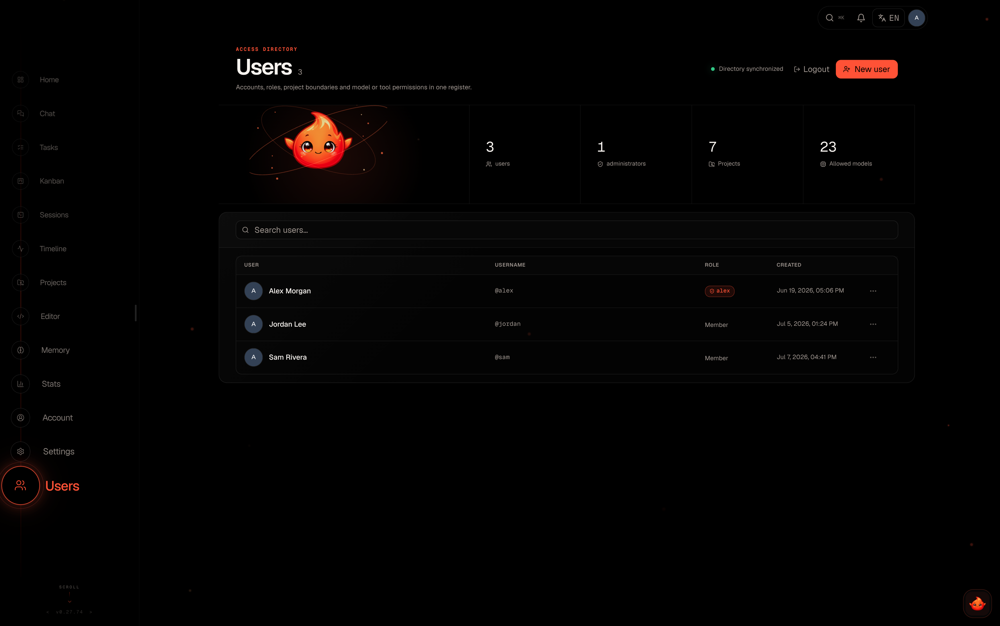

# Users & Access

Elowen is a personal AI agent that reasons, edits files, runs commands and works
across chat platforms on behalf of your users. An agent with that much reach has
to be locked down properly: every request is authenticated, every user gets
exactly the tools and models you grant them, and every action is scoped to a
project. This page is for the admin managing who can do what.

You always know who can do what — the [Users](web-ui) page shows each person's
effective tools at a glance — and the defaults are safe, so you can hand access
to a teammate without wiring anything up by hand.

## Authentication

Elowen uses **Bearer token** authentication on every API request except the
health check and login endpoints. The daemon exposes its REST API on `:4400`;
send the token on every call and it resolves to a user and a scope before
anything runs.

```http
Authorization: Bearer <token>
```

## Web UI auth (BFF proxy)

The web UI on `:4500` never sees the daemon token. It talks to a same-origin
`/api` BFF (backend-for-frontend) proxy backed by an **httpOnly session
cookie**, and the proxy injects the daemon bearer from the cookie server-side —
the powerful daemon token never reaches client JavaScript, so it can't be read
by an XSS payload or a browser extension.

## Token scopes

Not every token is equal. Elowen resolves two effective scopes so a spawned
agent can never act with your full rights.

| Scope | Purpose |
|-------|---------|
| `full` | Interactive user sessions (web UI, CLI) — full access |
| `agent` | Spawned workers, overseers, and pilots — a restricted allow-list, confined to their project |

Agent-scoped tokens are confined to their project: a worker can only close its
own tasks and cannot reach across to another project. Advisor credentials are
stored separately from login tokens but resolve to the owner's `full` access, so
rotating an advisor never invalidates the user's login session.

## Session token lifetime

Login tokens are not eternal. Every token carries a **time-to-live** — **30
days** by default, set globally under [Settings](configuration) → Security
(`security.tokenTtlDays`, minimum 1 day) — and the daemon rejects it once it
expires. On login the daemon returns the TTL alongside the token, so the web BFF
pins its httpOnly session cookie to exactly that window: cookie and token expire
together, no drift.

## Login & password policy

A successful login returns a bearer token. Login is **rate-limited to 10
attempts per 5 minutes per IP** (Elowen prefers the `x-real-ip` header over
`x-forwarded-for`), which blunts brute-force attempts.

Password policy:

- Minimum **8 characters**.
- Changing it requires the **current password** — a hijacked session can't
  silently rotate the password without knowing it.

You can set an initial admin at first boot with the `ELOWEN_BOOTSTRAP_USER` and
`ELOWEN_BOOTSTRAP_PASS` environment variables (see [Configuration](configuration)).

## RBAC: roles

Elowen ships **full role-based access control**. There are two roles:

| Role | Access |
|------|--------|
| **Admin** | Everything — all projects, all users, all settings |
| **Member** | Only assigned projects — tasks, sessions, activity, editor |

Roles are the coarse layer. The powerful part is what sits underneath them:
**each user can have a completely different set of tools and permissions.**



## Per-user tools & models

Beyond the admin/member role, an admin controls two allow-lists **per user** on
the [Users](web-ui) page:

- **Plugin grants (`granted_plugins`)** — a plugin marked `userGrantable` reaches
  nobody until an admin grants it to that account (admins have them all). This is
  how a shell is handed out: `terminal` is grant-gated, so an account without the
  grant has no `Bash` at all. Granting it means granting the host — a shell reads
  and writes any absolute path, so projects do not contain it.
- **Per-user tools (`disabled_tools`)** — turn individual brain tools off for a
  specific person. This SUBTRACTS from what the account already has; it cannot add
  a tool from a plugin that was never granted, and such a tool shows as
  *unavailable* in the modal rather than as something to switch on.
- **Per-user models (`allowed_execs`)** — restrict which executors that user may
  run, narrower than the global `allowedExecs` in [Settings](configuration). An
  empty list means "unrestricted within the global list" — adding entries
  NARROWS the user to just those, it does not widen anything.

The Users detail pane renders each user's live tool access as pills, so you see
the real, computed result of role + plugin grants + disabled tools without
reasoning it out.
Give one teammate a full engineering toolkit, another a chat-only account, all
from one pane, all auto-saved.

## Project assignment & visibility

Members don't see anything until you say so. Assignment is admin-only, done on
the [Users](web-ui) page.

- A member must be **explicitly assigned** to a project to work in it. An
  unassigned member sees a blank dashboard — safe by default.
- Assignment also **scopes visibility**: a member sees only the projects, tasks,
  sessions and activity for the projects they're on — work stays isolated
  between people who shouldn't see each other's repos.

Assignments are removed cleanly when a user is deleted, so you never leave
orphan grants behind.

## Granular tool permissions

Disabling a tool outright is the blunt instrument. The sharp one lives in
**Account → Elowen AI → Permission rules**: for the tools a user *does* have,
you decide per pattern whether a call **runs, asks, or is refused**:

| Action | Effect |
|--------|--------|
| **allow** | Runs immediately, no prompt |
| **ask** | Pauses for a human approval prompt where one is attached (owner chat); otherwise follows your unattended-asks setting |
| **deny** | Returns an error to the model — the call never runs |

Rules live in two pattern spaces. **`tools`** rules match a tool by **name**
(e.g. `Write`); **`bash`** rules match the **command string** of the shell tool
— so `git *` can be allowed while `rm *` is denied, even though both run through
the same `Bash` tool.

The built-in defaults are conservative but frictionless: read-only tools are
allowed, file edits (`Write`, `Edit`) **ask**, and shell commands **ask** except
for a small read-only allow-list (`git status`, `git diff`, `git log`, `ls`,
`cat`, `grep`, `pwd`, `which`). Your rules append **after** those defaults and
resolution is **last-match-wins** — any rule you add overrides a built-in. Put a
catch-all like `*` first, then narrow.

- **Self-service editor** — the Permission rules card lists your rules with an
  add row (pattern + allow/ask/deny); changes persist immediately.
- **"Always allow" writes a rule** — picking *Always allow* on an approval
  prompt appends the matching pattern (e.g. `git status --porcelain` →
  `git status*`), so grants you make in chat show up here.
- **Chaining can't be smuggled** — a shell line is split into simple commands
  and each is gated on its own, taking the most restrictive decision. An allow
  for the first program can't wave through `cat x && rm -rf ~`.

### YOLO mode

**YOLO** flips every `ask` to `allow` without prompting (a `deny` rule still
denies). Set your **persisted default** with the YOLO toggle in Account → Elowen
AI — it applies to new sessions. Inside a running `elowen chat` session the
**`/yolo`** command overrides it just for that session. Auto-approving tool runs
is a real security trade-off — hence the standing warning on the toggle.

### Unattended-asks (strict mode)

An `ask` only pauses when a human is parked on the approval prompt — the owner's
CLI or web chat. On an **unattended** turn (a chat platform, a cron run, a
spawned subagent) there's nobody to ask, so what happens is your call:

- **allow** (default) — an `ask` resolves to allow, keeping autonomous work
  moving.
- **deny** (strict mode) — an `ask` is refused outright: a hard safety opt-in
  that **YOLO never overrides.**

## Web push security

The push channel that powers [notifications](account-preferences) is scoped and
self-maintaining: **VAPID keys** are auto-generated on first boot and persisted
in the config store; the **private key never leaves the daemon** (the browser
only holds the public key); **dead subscriptions** (endpoints returning 404/410)
are pruned automatically; and subscription endpoints are **per-user and scoped
to the authenticated session** — a user only ever receives notifications for
their own work.

[Next: Troubleshooting](troubleshooting)
